# Network Fundaments (20%)

## Tabela of Contects

1.1 [Explain the role and function of network components]()
* 1.1.a [Routers]()\
1.1.b [Layer 2 and Layer 3 switches]() \
1.1.c [Next-generation firewalls and IPS]()\
1.1.d [Access points]()\
1.1.e [Controllers (Cisco DNA Center and WLC)]()\
1.1.f [Endpoints]()\
1.1.g [Servers]()\
1.1.h [PoE]()\

1.2 [Describe characteristics of network topology architectures]()
* 1.2.a [Two-tier]()\
1.2.b [Three-tier]()\
1.2.c [Spine-leaf]()\
1.2.d [WAN]()\
1.2.e [Small office/home office (SOHO)]()\
1.2.f [On-premise and cloud]()

1.3 [Compare physical interface and cabling types]()
* 1.3.a [Single-mode fiber, multimode fiber, copper]()\
1.3.b [Connections (Ethernet shared media and point-to-point)]()

1.4 [Identify interface and cable issues (collisions, errors, mismatch duplex, and/or speed)]()

1.5 [Compare TCP to UDP]()

1.6 [Configure and verify IPv4 addressing and subnetting]()

1.7 [Describe the need for private IPv4 addressing]()

1.8 [Configure and verify IPv6 addressing and prefix]()

1.9 [Describe IPv6 address types]()
* 1.9.a [Unicast (global, unique local, and link local)]()
1.9.b [Anycast]()\
1.9.c [Multicast]()\
1.9.d [Modified EUI 64]()

1.10 [Verify IP parameters for Client OS (Windows, Mac OS, Linux)]()\

1.11 [Describe wireless principles]()
* 1.11.a [Nonoverlapping Wi-Fi channels]()\
1.11.b [SSID]()\
1.11.c [RF]()\
1.11.d [Encryption]()

1.12 [Explain virtualization fundamentals (server virtualization, containers, and VRFs)]()

1.13 [Describe switching concepts]()\
1.14 [MAC learning and aging]()\
1.15 [Frame switching]()\
1.16 [Frame flooding]()\
1.17 [MAC address table]()

## Explain the role and function of network components

### Routers

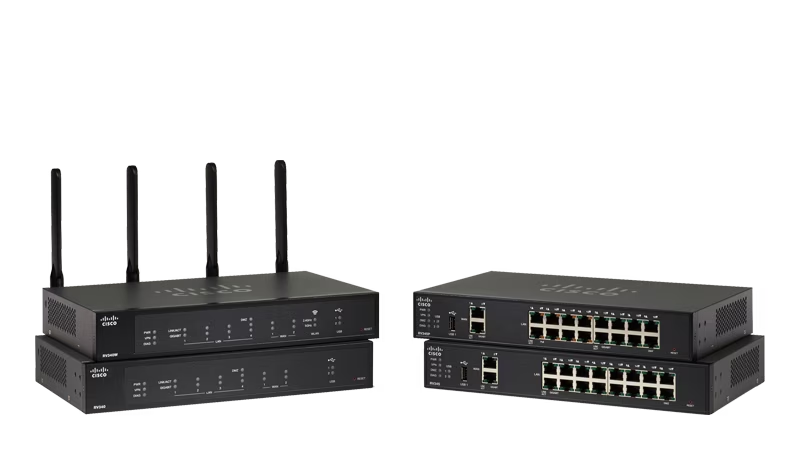

A router is a network device that routes packets from one network to another. It is usually connected to two or more different networks. When a packet comes to a router port, the router reads the address information in the packet to determine out which port the packet will be sent. For example, a router provides you with the internet access by connecting your LAN with the Internet.

#### NOTE 
A router is most commonly an OSI Layer 3 device, since its forwarding decision is based on the information of the OSI Layer 3 – the destination IP address. Routers divide broadcast domains, provide full duplex communication, and have traffic filtering capabilities.

If two hosts from different networks want to communicate, they will need a router in order to exchange data. Consider the following example:

We have a network of three hosts and a router. Note that each computer is on a different network. Host A wants to communicate with Host B and sends the packet with the Host B’s IP address (10.0.0.20) to the router. The router receives the packet, compares the packet’s destination IP address to the entries in its routing table and finds a match. It then sends the packet out the interface associated with the network 10.0.0.0/24. Only Host B will receive and process the packet. In fact, Host C will not even be aware that the communication took place.

### Layer 2 and Layer 3 switches

Switch ports are essential components of network communication processes in modern IT ecosystems. By forwarding data packets from one network segment or network device to another, they enable network connectivity and accessibility. However, not all switches are created equal. Choosing the right switch for your network comes down to one crucial decision: "Should I use a layer 2 or layer 3 switch?"

#### What is a layer 2 switch?

Layer 2 switches are traditional network switch ports that operate in the network data link layer or the "layer 2" of the open systems interconnection (OSI) model of network connection. Purely operating within the network's hardware layer, these switches forward date packets based on the MAC addresses specified.

Also know as multi-port bridges, layer 2 switches leverage hardware switching to handle a large amount of data within a single network segment or LAN. By default, most layer 2 switches use address resolution protocol (ARP) tables to enable network communication.

Being an advanced version of a network hub, a layer 2 switch depends on the packet switching mechanism to receive and forward data packets between network components that are physically attached to it. With full duplex transmission, these layer switches can communicate in unicast, multicast, and broadcast mode.

#### What is a layer 3 switch?

Layer 3 switches, also known as multi-layer switches, operate in the network layer or the "layer 3" of the OSI model. These switches process and transmit data packets based on the IP address of the source and destination devices.

A layer 3 switch can perform all the functionalities of a layer 2 switch along with static and dynamic routing in layer 3. This means the layer 3 switch can operate on both layer 2 and layer 3, and forwards packets based on its IP table along with ARP tables, between multiple network segments or subnets and different virtual LANs (VLANs).

#### The choice to use or not to use a layer 3 switch or router can be evaluated considering the following factors:

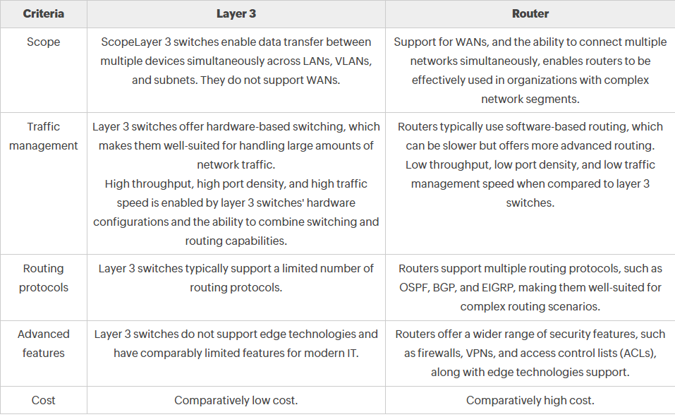!

#### Layer 2 vs. layer 3 switches: Choosing the right switch for your network

Now that we've understood the contrasting capabilities of layer 2 and layer 3 switches and routers, here's the big question: Which switch should you choose for your network?

Choosing between a layer 2 switch and a layer 3 switch depends on various networking factors including the size of your network, the number of devices connected, and your network's traffic pattern.

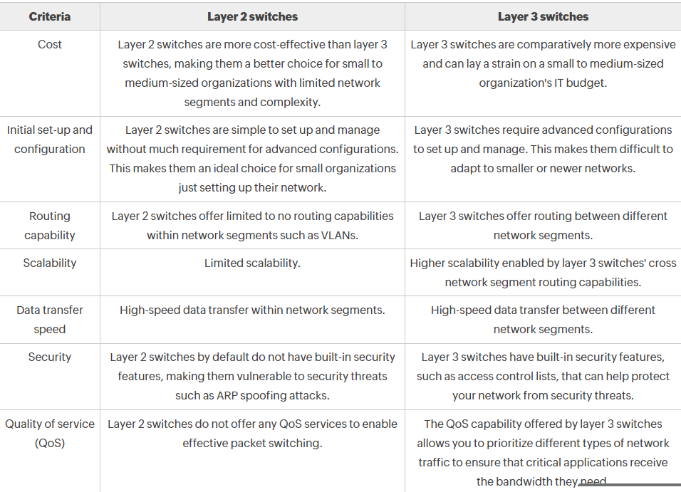

Depending on their network size and ecosystem set-up, organizations can choose between layer 2, layer 3 switches, and routers as shown below.

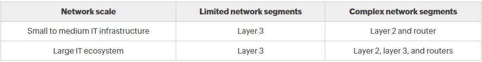

Small to medium-sized networks with a limited number of devices and a simple traffic pattern can efficiently manage with layer 2 switches. As discussed, these layer 2 switches are cost-effective, easy to set up, and can handle high-speed data transfers within a single network segment.

With that being said, small to medium-sized networks, and large, complex networks with multiple network segments and a more demanding traffic pattern need to utilize layer 3 switches and routers appropriately. This is suggested since layer 3 switches are capable of routing between network segments, providing advanced security features, and allowing for the implementation of quality of service (QoS).

### Next-generation firewalls and IPS

Next-generation firewalls: A traditional firewall provides stateful inspection of network traffic. It allows or blocks traffic based on state, port, and protocol, and filters traffic based on administrator-defined rules. In addition to access control, NGFWs can block modern threats such as advanced malware and application-layer attacks. According to Gartner's definition, a next-generation firewall must include:

* Standard firewall capabilities like stateful inspection

* Integrated intrusion prevention

* Application awareness and control to see and block risky apps

* Threat intelligence sources

* Upgrade paths to include future information feeds

* Techniques to address evolving security threats

In summary, a next-generation firewall includes additional features like application awareness and control, integrated intrusion prevention, and cloud-delivered threat intelligence.

**Here are the common features of most NGFWs:**

**Standard firewall features:** These include the traditional (first-generation) firewall functionalities such as stateful port/protocol inspection, Network Address Translation (NAT), and Virtual Private Network (VPN).

**Application identification and filtering:** This is the chief characteristic of NGFWs. This feature identifies and filters traffic based upon the specific applications, rather than just opening ports for all kinds of traffic. This prevents malicious applications and activity from using non-standard ports to avoid the firewall.

**SSL and SSH inspection:** NGFWs can even inspect SSL and SSH encrypted traffic. This feature decrypts traffic, makes sure the applications are allowed, checks other policies, and then re-encrypts the traffic. This provides additional protection from malicious applications and activity that tries to hide itself by using encryption to avoid the firewall.

**Intrusion prevention:** These are more intelligent capabilities and provide deeper traffic inspection to perform intrusion detection and prevention. Some of the NGFWs have built-in IPS functionality so that a stand-alone IPS might not be needed.

**Directory integration:** Most NGFWs include directory support (such as, Active Directory). For instance, they manage authorized applications based upon users and user groups.

**Malware filtering:** NGFWs can also provide reputation-based filtering to block applications that have a bad reputation. This functionality can check for phishing, viruses, and other malware sites and applications

**Intrusion Prevention System (IPS):** Cisco IOS Intrusion Prevention System (IPS) is an inline, deep-packet inspection feature that effectively mitigates a wide range of network attacks. IPS analyses network traffic, can report and take corrective action on traffic that it deems malicious or harmful. This can be implemented as an appliance, as a blade, or as a module in an ASA or IOS router. The primary method for identifying problem traffic is through signature matching.

**The following are true about IPS (Intruder Prevention System):**

1. It adds some amount of delay to the network traffic, as it scans each packet for any malicious content.

 2. Because the IPS is inline, it can normalize (manipulate or modify) traffic inline based on a current set of rules.

 3. Unlike IDS (Intruder Detection System), an IPS works inline. So, every packet goes through IPS before being forwarded.

 4. IPS/IDS sensors send out alerts if any suspicious event occurs. There are three main ways that are used widely for this purpose. These are:

    * Security device event exchange (SDEE)

    * Syslog

    * SNMP

 5. IPS Manager Express (IME) and Cisco Security Manager (CSM) are two methods where you get alerts via SDEE. IME can support up to 10 sensors, where as CSM can support up to 25 sensors.

 6. Intruder Prevention System (IPS): IPS analyses network traffic, can report and take corrective action on traffic that it deems malicious or harmful. This can be implemented as an appliance, as a blade, or as a module in an ASA or IOS router. The primary method for identifying problem traffic is through signature matching.

**Cisco Security Manager (CSM):** This is an enterprise-level configuration tool that you can use to manage most security devices.

**Cisco Security Intelligence Operations (SIO) Service:** The SIO researches and analyses threats and provides real-time updates on these threats. There is also an application for smart phones.

### Access points

An access point allows devices to connect to the wireless network without cables. A wireless network makes it easy to bring new devices online and provides flexible support to mobile workers.

An access point acts like an amplifier for network. While a router provides the bandwidth, an access point extends that bandwidth so that the network can support many devices, and those devices can access the network from farther away.

But an access point does more than simply extend Wi-Fi. It can also give useful data about the devices on the network, provide proactive security, and serve many other practical purposes.

Access points support different IEEE standards. Each standard is an amendment that was ratified over time. The standards operate on varying frequencies, deliver different bandwidth, and support different number of channels.

### Controllers (Cisco DNA Center and WLC)

**Cisco DNA Center** is the network management and command center for Cisco DNA. With this platform, IT can respond to changes and challenges faster and more intelligently. The Cisco DNA Center is a complete network management platform with integrated tools for network management, automation, virtualization, analytics and assurance, security, and Internet of Things connectivity. The DNA Center dashboard provides an intuitive and simple overview of network health and clear drill-down menus for quickly identifying and remediating issues.

**Some important points on Cisco DNA center**

* Cisco DNA Center is all about Automation

* Cisco DNA Center is based on something called Intent-Based Networking

* It is open and inclusive.

* The Cisco DNA Center dashboard provides 360-degree visibility

* We can vastly reduce deployment and provisioning times with Cisco DNA Center.

* Cisco DNA Center takes the guesswork out of network performance capabilities

* Cisco DNA Center detects and mitigates threats in real time.

* Lower costs

**WLC(Wireless LAN Controller):** Wireless networks have become a necessity today. Many corporate environments require deployment of wireless networks on a large scale. Cisco has come up with the concept of the Cisco Unified Wireless Network (CUWN) solution, which helps make it easier to manage such large scale deployments. WLC is a device that assumes a central role in the CUWN. Traditional roles of access points, such as association or authentication of wireless clients, are done by the WLC. Access points, called Lightweight Access Points (LAPs) in the unified environment, register themselves with a WLC and tunnel all the management and data packets to the WLCs, which then switch the packets between wireless clients and the wired portion of the network. All the configurations are done on the WLC. LAPs download the entire configuration from WLCs and act as a wireless interface to the clients.

**A wireless LAN (or WLAN) controller** is used in combination with the Lightweight Access Point Protocol (LWAPP) to manage light-weight access points in large quantities by the network administrator or network operations center. The wireless LAN controller is part of the Data Plane within the Cisco Wireless Model.

### Endpoints

Endpoints are remote computing devices that connect to a network and communicates back and forth with the other devices on the network.

Examples of endpoints include:

* Desktops

* Laptops

* Smartphones

* Tablets

* Servers

* Workstations

### Servers

### PoE

## Describe characteristics of network topology architectures

### What is Network Topology Architecture?

In tech, network topology architecture refers to an overall view of any organization’s network infrastructure. The terms network topology and network architecture are often used separately. Let’s know what these terms stand for!

**Network Topology:**

* Network topologies give us an overview of logical and physical network layouts  containing links and nodes. 
* The physical topology refers to the configuration of computers, cables, or other peripherals, etc. 
* The logical topology allows us to pass information between workstations.
* The different types of network topologies are:
    * Bus topology
    * Mesh topology
    * Star topology
    * Ring topology

**Network Architecture:**

* The network architecture tells us a detailed picture of resources and network layers.
* In other words, it shows us the overall design of a computer network.
* It presents the logical and structural layout of networking systems and the related hardware devices such as routers, switches, etc.

#### Types of Network Topology Architectures Here

There are various types of network topology architectures. We are going to discuss the characteristics of the following network topology architectures:

* Three-Tier Architecture
* Two-Tier Architecture
* Spine Leaf Architecture
* WAN Architecture
* SOHO Architecture
* On-Premise/Cloud Architecture

### Two-Tier Architecture:

The two-tier architecture is more popular architecture than three-tier architecture these days. 

* It has a collapsed core. It is called so because it has a blended or collapsed distribution layer and core layer.
* Therefore, the two-tier architecture consists of only 2 layers:
    1. Access Layer
    2. Collapsed Core Layer
* It is therefore simpler.

**Spine and leaf** is the most popular two-tier architecture.

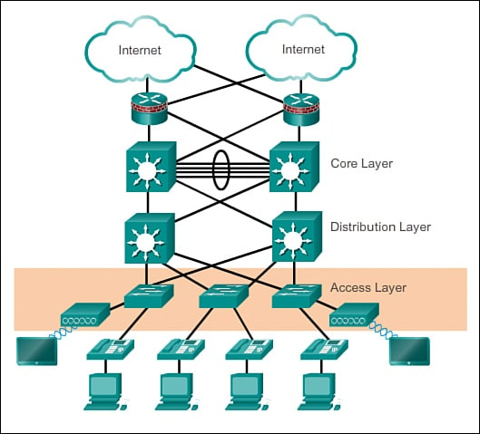

### Three-Tier Architecture

According to Cisco, networks have been divided into layers or tiers for better understanding. The three-tier architecture is one of the oldest and classic networking models.

As the name suggests, the three-tier architecture consists of the following 3 layers:

* Access Layer (bottom layer)
* Distribution Layer (middle layer)
* Core Layer (Topmost layer)

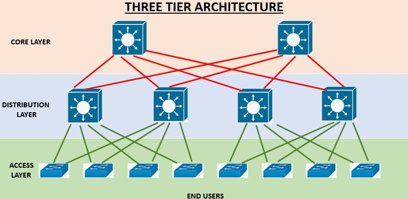

**Access Layer:**

* The access layer is the lowest layer in the 3-tier architecture. 
* It is also called as workstation layer.
* It is the closest layer to the end users.
* It consists of access switches.
* These switches connect users to the network.

**Distribution Layer:**

* It is the middle layer in the three-tier architecture.
* The distribution layer is also, sometimes, referred to as the aggregation layer.
* It performs quality of service and security work.
* It consists of multilayer switches.
* It moves the traffic from the access layer to the core layer.
* It aggregates LAN and WAN links.

**Core Layer:**

* It is the topmost layer in the three-tier architecture.
* The Core layer also has another name which is the backbone layer.
* It connects distribution layer devices.
* It performs high-speed transport of traffic.
* It is reliable and fault-tolerant.

### Spine Leaf Architecture

* Spine Leaf architecture is a two-layer or two-tier architecture.
* It is mostly used in data centers.
* It has low latency.
* It consists of two layers:
    * Spine Layer
    * Leaf Layer

**Spine Layer:**

* The spine layer is the top layer.
* The Spine layer consists of very intelligent devices such as Cisco Nexus 9000 devices.
* These devices have ACI Controller intelligence inside them.

**Leaf Layer:**

* It is the bottom layer in the spine leaf architecture.
* It consists of access switches.
* Each leaf is connected to every spine device.

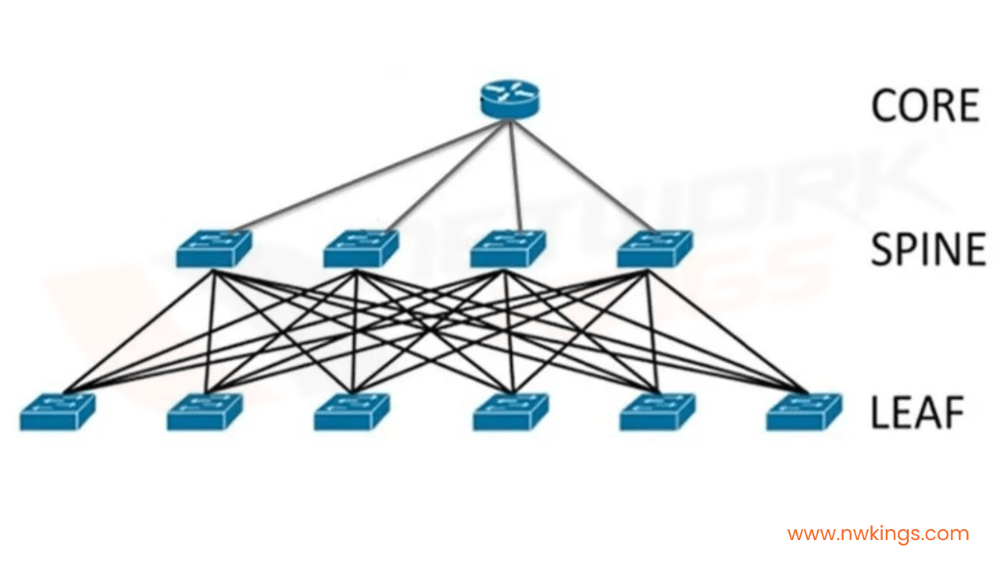

### Small Office/Home Office (SOHO) Architecture:

* The SOHO architecture consists of the simplest architecture. 
* As the name suggests, it is mostly used in homes and/or small enterprises.
* This type of architecture consists of three components:
    * A small switch
    * A router
    * Connected access devices such as printers, PCs, etc.
* Usually, a single device is used that acts as both a switch and router.
* The devices are hardwired into this router.

This router also acts as a firewall.

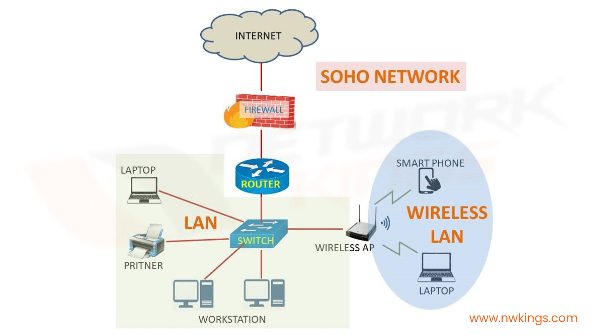

### Wide Area Network (WAN) Architecture:

Imagine this. You have a SOHO network at home and you’ve connected multiple access points. These access points are making wide-area network connections out to multiple **Internet Service Providers** (ISPs).

There are two types of connections formed in the WAN architecture:

* The Primary Connection:

First is the WAN connection formed by the access point using Digital Subscriber Loop (DSL).

* Emergency Connection:

The second is a low-cost WAN connection using an asymmetric DSL, meaning there is a difference between download and upload speeds. This is the connection to reach out to cloud resources.

These connections are referred to as dual-homed configurations. Such a connection is very strong because if one ISP connection fails, the second one takes the charge.

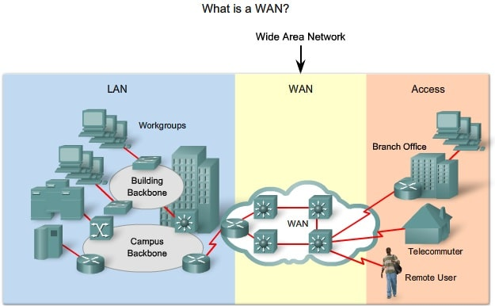

In today’s time, better client connectivity technologies are available in the market. These are:

**MPLS:**

* Multiprotocol Label Switching (MPLS) is a transportation technique for high-performance telecommunication networks.
* It transfers data from one network node to another node on short path labels. 
* MPLS can carry packets of various network protocols, therefore, called multiprotocol.

**Metro-Ethernet:**

* Metro Ethernet network is mostly used to connect clients to a large service network.
* Metro Ethernet provides multiple configuration options such as point-2-point, point-2-multipoint, multipoint-2-multipoint, etc.

**Internet VPN:**

* It consists of the following:
    * Dynamic Multipoint VPN (DMVPN)
    * Site-to-Site VPN
    * Client VPN
* **DMVPN** is dynamic, meaning it can build VPN connections when required and it can break them when not needed.
* Site-to-Site VPN links allow the creation of VPN links when sending protected data over a non-trusted network such as the Internet.
* **Client VPN** allows remote access to corporate resources.

### On-Premises and Cloud Architecture:

Cloud technologies have developed virtual service models. 

* SaaS:
Cloud architecture is more of an as-a-service model than a network topology. For example, if you’re using Google Docs on the cloud, you’re not aware of its network topology. This refers to as Software-as-a-Service (SaaS).

* PaaS:
If you’re working with Platform-as-a-Service (PaaS), you might be familiar with the cloud topology. You can access any development resource using PaaS such as Operating Systems to test out any application.

* IaaS:
When you’re setting up a cloud-based network topology, you’re using Infrastructure-as-a-Service (IaaS). Networks, servers, and firewalls are organized in the topology as virtualized components.

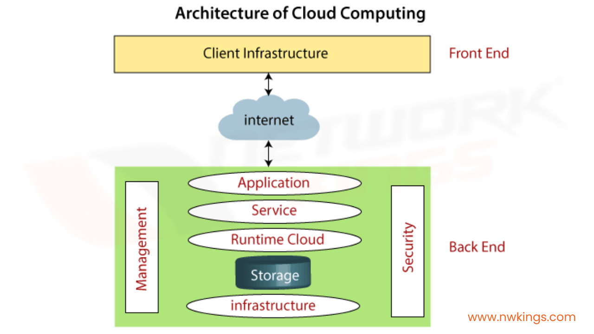

## Compare physical interface and cabling types

## Identify interface and cable issues (collisions, errors, mismatch duplex, and/or speed)

## Compare TCP to UDP

**TCP and UDP**
Two types of Internet Protocol (IP) are Transmission Control Protocol (TCP) and User Datagram Protocol (UDP). TCP is connection oriented and data can be sent bidirectional after establishment of a connection. UDP is a simpler, connectionless Internet protocol. Multiple messages are sent as packets in chunks using UDP. TCP uses sequence numbers for tracking the receipt of the packets at the destination. UDP is more like a telegram, and any packets that does not arrive at the destination can not be determined. This function has to be done by the application layer (or higher level protocols). Hence, it (UDP) is also known as connectionless protocol. A detailed comparison of both TCP and UDP protocols is given below

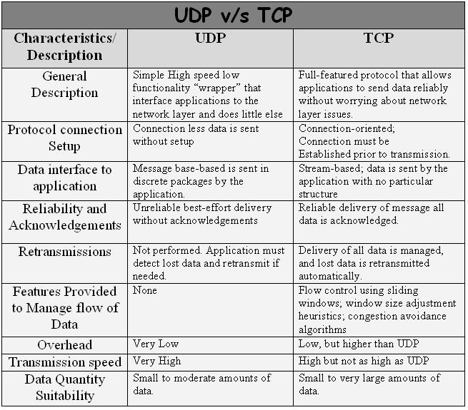

## Configure and verify IPv4 addressing and subnetting

**Address types( Unicast, Broadcast, Multicast and VLSM)**
In the IP version 4, every TCP/IP hosts are identified by the logical IP address. This IP address is the network layer address and also has no dependence on a Data link layer address. The unique IP address is necessary for the each network component and host which communicates with the help of TCP/IP and also can be allotted manually or with the help of DHCP. The types of the IPv4 addresses are unicast, multicast, broadcast and VLSM described below.

**Unicast:**
Unicast is the very most common form of the IP address. The unicast address is the address which identifies the unique node on the network. The unicast addressing available in the IPv4 typically implies to a single receiver or a single sender, however, it can be used in the both receiving and sending.

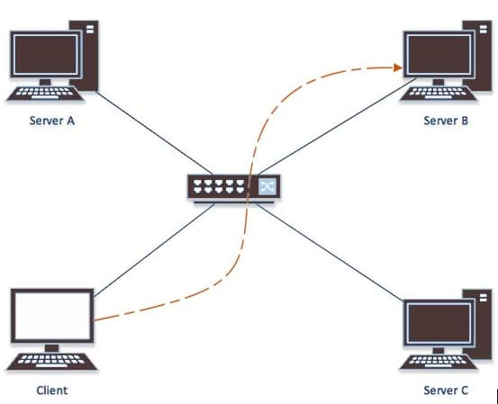

**Broadcast:**
The IPv4 uses the set of the broadcast addresses to give the one to everyone on a subnet delivery service. The packets are sent to the IPv4 broadcast addresses which are processed by the entire interfaces on a subnet. As shown in the below figure, the packet is addressed to the entire hosts in the network segment. Then the destination address field comprises of typical broadcast address of 255.255.255.255. When the host identifies the packet on a network, then it is bound to process that. See the diagram, the client sends the packet that is used by all servers.

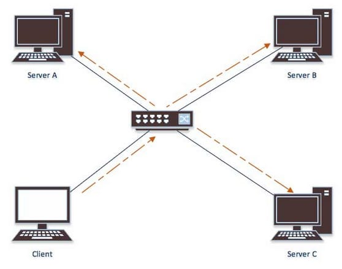

**Multicast:**
The IPv4 multicast addresses are mostly used for the single packet of one-to-many delivery. On the multicast enabled IPv4 intranet, the IPv4 packet addressed to the IPv4 multicast addresses are forwarded by the routers to a subnet on which there is a host listening to a traffic sent to an IPv4 multicast address. The IPv4 multicast offers an effective one-to-many service of delivery of various types of communication. The IPv4 multicast addresses are the one which defined by a class D internet address.

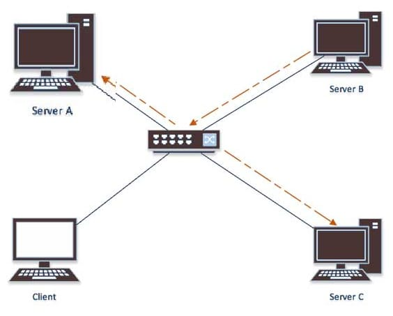

**VLSM:**
The internet service provider will face the situation where they require to allocate the IP subnets of the different sizes as per the need of the customer. One user can ask for a class C subnet of the 3 IP addresses and some users can ask for the 10 IPs. For the ISP, it is tough to divide an IP addresses into the fixed size subnets, instead they may like the subnets which results in the minimum wastage of the IP addresses. For that, the VLSM offers greater space and opportunity for at all.

The VLSM stands for the variable length subnet masking. This Subnetting is very similar to the traditional subnetting in which bits are borrowed to make the subnets. The subnetting is not the single pass activity. The VLSM is the technique which allows the network administrator to divide the IP address space into the subnets of various sizes, that is according to an individual requirements of the every network, unlike the simple same size of subnetting. On the other hand, the VLSM is simply the subnetting a subnet.

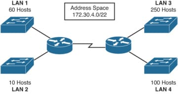

### ARP

The ARP stands for the address resolution protocol is the telecommunication protocol. It is used for the resolution of a network layer addresses into the link layer addresses, the critical function in the multiple access networks. This ARP is mostly used to convert the IP address to the physical address like Ethernet address. It has been implemented widely in the combinations of network as well as data link layer technology of the IPv4.

The layer 3 switches and networking devices use the ARP to map an IP addresses to addresses and to enable the IP packets to be sent across the networks. Prior the device sends the packet to a another device, it searches in its own address resolution protocol cache to view if there is any MAC address and its corresponding IP address for a destination device. In case, there is no entry, then the source device will send the broadcast message to the each network device. Every device will compare an IP address on its own. The only device with a matching IP address will give reply to a device which send the data with the packets that comprises of the MAC address for a device. Then the source device will add the MAC address of the destination device to its address resolution protocol table for the future reference, it creates the data link header as well as trailer which encapsulates the packets and also proceeds to the data transfer. The below diagram shows the broadcast as well as the response process of the ARP.

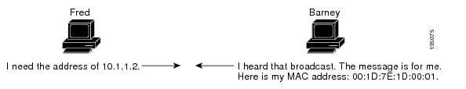

When a destination device lies on the remote network, which is beyond the other device, then the process is similar, except the device which send a data sends the ARP request for a default gateway's MAC address. After addressing is resolved and default gateway gets the packets, a default gateway broadcast an IP address of the destination over the network connected with that. The device device on the network of the destination device uses the ARP to acquire the destination device's MAC address and also delivers a packet. The ARP is enabled as default. Here the default system defines the CoPP policy rate, which limits the ARP broadcast packet bound to a supervisor module.

### DHCP relay and server

The dynamic host configuration protocol is the standardized networking protocol, which is used on the IP networks for the dynamically distributing the network configuration parameters like IP addresses for the services and interfaces. The DHCP server is the one which will reduce the need of the network administrator or any user to configure the settings manually.

The DHCP is the broadcast based protocol and by default its packet never passes via the routers. The DHCP relay gets any DHCP broadcast on a subnet and also forwards it to the particular IP address on the different subnet.

The DHCP supplies the network settings such as default gateway, DNS server and host IP address. When the DHCP clients and its associated servers don't reside on a same subnet or IP network, the DHCP relay agent agent will transfer the DHCP messages between that.

The relay agent will operate as an interface in between the DHCP clients and server. It listens for the client requests and also adds the vital configuration data as a client link information that is required by a server to allocate an address for a client. The below diagram shows the DHCPv4 request for the IPv4 address from the DHCP server.

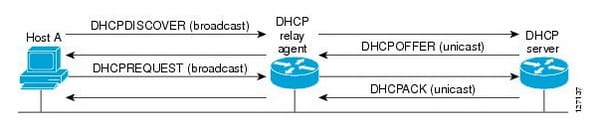
This helps to understand the steps needed to configure a DHCP relay function on an ACE. Every step has the CLI command need to complete the assigned tasks.

### DHCP protocol operations

The DHCP is the dynamic address allocation and also follows the concept of the address leasing. So that the addresses can also be used when the hosts are no longer require them. The DHCP operation measures an RTT- round trip time taken to discover the DHCP server and also to acquire the leased IP address from that. An SLA releases a leased address after the operation. Make use of the information from RTT to identify the performance level of the DHCP. There are 2 modes for the operation of DHCP. As default, DHCP operation sends the discovery packet on each available router IP interface. The DHCP relay agent is the any host which forward the DHCP packet between the server and clients. The relay agents are mostly used to forward requests as well as replies between servers and clients when they are not so same on the physical subnet. The relay agent will get the DHCP messages and afterwards it will create the new DHCP messages to send out to the other interface.

## Describe the need for private IPv4 addressing

The original design of the Internet intended that each host on every network should have a real, routable IP address. An organization that would like to access the Internet would complete some paperwork to describe its internal network and the number of hosts on it. The organization would then receive a number of IP addresses, according to its needs. But there was one huge problem with this concept – if each host on each network in the world was provided with an unique IP address, we would have run out of IP addresses a long time ago!

Therefore, the concept of private IP addressing was developed to address the IP address exhaustion problem. The private IP addresses can be used on the private network of any organization in the world and are not globally unique.

Consider the following example:

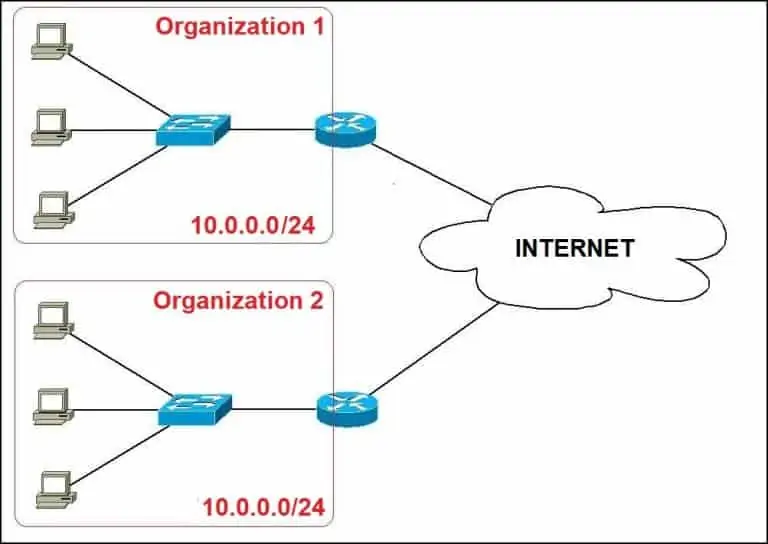

In the example above you can see that two unrelated organizations use the same private IP network (10.0.0.0/24) inside their respective internal networks. Because private IP addresses are not globally unique, both organizations can use private IP addresses from the same range. To access the Internet, the organizations can use a technology called Network Address Translation (NAT), which we will describe in the later lessons.

There are three ranges of addresses that can be used in a private network (e.g. your home LAN or office)

10.0.0.0 – 10.255.255.255
172.16.0.0 – 172.31.255.255
192.168.0.0 – 192.168.255.255
Internet routers are configured to discard any packets coming from the private IP address ranges, so these addresses are not routable on the Internet.

## Verify IP parameters for Client OS (Windows, Mac OS, Linux)

IP address verification is often the first step of any network problem troubleshooting. First of all, we check the ip address of the devices in the network and we verify ip reachability. To do this in different Client devices, we need to know how to verify IP parameters for Client OS for different Operating Systems. Here, we will learn these steps.

Linux (ifconfig)
Windows (ipconfig ipconfig/all)
MacOS (ifconfig?)

## Describe wireless principles

Radio Frequencies
Wireless technologies send data by using ranges of radio frequencies (RF) rather than physical cables. A range of frequencies is typically called a band.

The two most commonly used bands for wireless communications are 2.4 GHz band and the 5 GHz band. Inside the 2.4 GHz and 5 GHz bands, the radio frequencies are gathered into channels. In 5GHz there are no overlapping channels. But the 2.4 GHz band does include some overlapping channels. To avoid problems when you are setting up wireless access points in the 2.4 GHz band, you should use the non-overlapping channels: 1, 6, and 11.

The main differences between 2.4 GHz and 5 GHz are the range (coverage) and bandwidth (speed) that the bands provide. The 2.4 GHz band provides coverage at a longer range but the transmission of data is slow. The 5 GHz band provides less coverage but transmits data at faster speeds.

Over the years, many IEEE 802.11 standards have emerged to take advantage of new wireless technology that operates in the 2.4 GHz and 5 GHz bands.

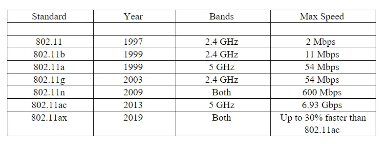

Service set identifier (SSID)
Each wireless network has a service set identifier (SSID), which is a string of characters used to uniquely identify that network.

## Explain virtualization fundamentals (server virtualization, containers, and VRFs)

