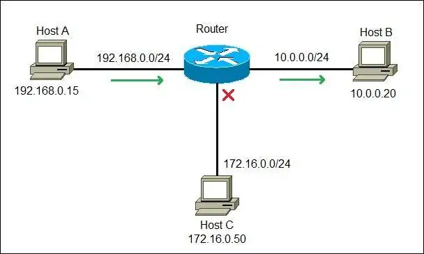

# Network Fundaments (20%)

## Tabela of Contects

1.1 [Explain the role and function of network components]()
* 1.1.a [Routers]()\
1.1.b [Layer 2 and Layer 3 switches]() \
1.1.c [Next-generation firewalls and IPS]()\
1.1.d [Access points]()\
1.1.e [Controllers (Cisco DNA Center and WLC)]()\
1.1.f [Endpoints]()\
1.1.g [Servers]()\
1.1.h [PoE]()\

1.2 [Describe characteristics of network topology architectures]()
* 1.2.a [Two-tier]()\
1.2.b [Three-tier]()\
1.2.c [Spine-leaf]()\
1.2.d [WAN]()\
1.2.e [Small office/home office (SOHO)]()\
1.2.f [On-premise and cloud]()

1.3 [Compare physical interface and cabling types]()
* 1.3.a [Single-mode fiber, multimode fiber, copper]()\
1.3.b [Connections (Ethernet shared media and point-to-point)]()

1.4 [Identify interface and cable issues (collisions, errors, mismatch duplex, and/or speed)]()

1.5 [Compare TCP to UDP]()

1.6 [Configure and verify IPv4 addressing and subnetting]()

1.7 [Describe the need for private IPv4 addressing]()

1.8 [Configure and verify IPv6 addressing and prefix]()

1.9 [Describe IPv6 address types]()
* 1.9.a [Unicast (global, unique local, and link local)]()
1.9.b [Anycast]()\
1.9.c [Multicast]()\
1.9.d [Modified EUI 64]()

1.10 [Verify IP parameters for Client OS (Windows, Mac OS, Linux)]()\

1.11 [Describe wireless principles]()
* 1.11.a [Nonoverlapping Wi-Fi channels]()\
1.11.b [SSID]()\
1.11.c [RF]()\
1.11.d [Encryption]()

1.12 [Explain virtualization fundamentals (server virtualization, containers, and VRFs)]()

1.13 [Describe switching concepts]()\
1.14 [MAC learning and aging]()\
1.15 [Frame switching]()\
1.16 [Frame flooding]()\
1.17 [MAC address table]()

## Explain the role and function of network components

### Routers

A router is a network device that routes packets from one network to another. It is usually connected to two or more different networks. When a packet comes to a router port, the router reads the address information in the packet to determine out which port the packet will be sent. For example, a router provides you with the internet access by connecting your LAN with the Internet.

#### NOTE 
A router is most commonly an OSI Layer 3 device, since its forwarding decision is based on the information of the OSI Layer 3 – the destination IP address. Routers divide broadcast domains, provide full duplex communication, and have traffic filtering capabilities.

If two hosts from different networks want to communicate, they will need a router in order to exchange data. Consider the following example:

We have a network of three hosts and a router. Note that each computer is on a different network. Host A wants to communicate with Host B and sends the packet with the Host B’s IP address (10.0.0.20) to the router. The router receives the packet, compares the packet’s destination IP address to the entries in its routing table and finds a match. It then sends the packet out the interface associated with the network 10.0.0.0/24. Only Host B will receive and process the packet. In fact, Host C will not even be aware that the communication took place.

### Layer 2 and Layer 3 switches

Switch ports are essential components of network communication processes in modern IT ecosystems. By forwarding data packets from one network segment or network device to another, they enable network connectivity and accessibility. However, not all switches are created equal. Choosing the right switch for your network comes down to one crucial decision: "Should I use a layer 2 or layer 3 switch?"

#### What is a layer 2 switch?

Layer 2 switches are traditional network switch ports that operate in the network data link layer or the "layer 2" of the open systems interconnection (OSI) model of network connection. Purely operating within the network's hardware layer, these switches forward date packets based on the MAC addresses specified.

Also know as multi-port bridges, layer 2 switches leverage hardware switching to handle a large amount of data within a single network segment or LAN. By default, most layer 2 switches use address resolution protocol (ARP) tables to enable network communication.

Being an advanced version of a network hub, a layer 2 switch depends on the packet switching mechanism to receive and forward data packets between network components that are physically attached to it. With full duplex transmission, these layer switches can communicate in unicast, multicast, and broadcast mode.

#### What is a layer 3 switch?

Layer 3 switches, also known as multi-layer switches, operate in the network layer or the "layer 3" of the OSI model. These switches process and transmit data packets based on the IP address of the source and destination devices.

A layer 3 switch can perform all the functionalities of a layer 2 switch along with static and dynamic routing in layer 3. This means the layer 3 switch can operate on both layer 2 and layer 3, and forwards packets based on its IP table along with ARP tables, between multiple network segments or subnets and different virtual LANs (VLANs).

#### The choice to use or not to use a layer 3 switch or router can be evaluated considering the following factors:

!

#### Layer 2 vs. layer 3 switches: Choosing the right switch for your network

Now that we've understood the contrasting capabilities of layer 2 and layer 3 switches and routers, here's the big question: Which switch should you choose for your network?

Choosing between a layer 2 switch and a layer 3 switch depends on various networking factors including the size of your network, the number of devices connected, and your network's traffic pattern.

Depending on their network size and ecosystem set-up, organizations can choose between layer 2, layer 3 switches, and routers as shown below.

Small to medium-sized networks with a limited number of devices and a simple traffic pattern can efficiently manage with layer 2 switches. As discussed, these layer 2 switches are cost-effective, easy to set up, and can handle high-speed data transfers within a single network segment.

With that being said, small to medium-sized networks, and large, complex networks with multiple network segments and a more demanding traffic pattern need to utilize layer 3 switches and routers appropriately. This is suggested since layer 3 switches are capable of routing between network segments, providing advanced security features, and allowing for the implementation of quality of service (QoS).

### Next-generation firewalls and IPS

### Access points

### Controllers (Cisco DNA Center and WLC)

### Endpoints

### Servers

### PoE

## Describe characteristics of network topology architectures

## Compare physical interface and cabling types

## Identify interface and cable issues (collisions, errors, mismatch duplex, and/or speed)

## Compare TCP to UDP

## Configure and verify IPv4 addressing and subnetting

## Describe the need for private IPv4 addressing

## Verify IP parameters for Client OS (Windows, Mac OS, Linux)

## Describe wireless principles

## Explain virtualization fundamentals (server virtualization, containers, and VRFs)

##

##