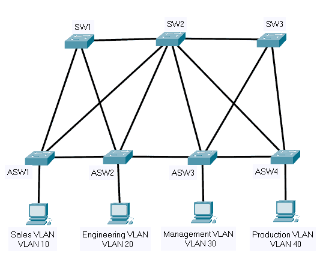

# Network Access (20%)

2.1 [Configure and verify VLANs (normal range) spanning multiple switches]()
* a) [Access ports (data and voice)]()
* b) [Default VLAN]()
* c) [InterVLAN connectivity]()

2.2 [Configure and verify interswitch connectivity]()
* a [Trunk ports]()
* b [802.1Q]()
* c [Native VLAN]()

2.3 [Configure and verify Layer 2 discovery protocols (Cisco Discovery Protocol and LLDP)]()

2.4 [Configure and verify (Layer 2/Layer 3) EtherChannel (LACP)]()

2.5 [Interpret basic operations of Rapid PVST+ Spanning Tree Protocol]()
* a) [Root port, root bridge (primary/secondary), and other port names]()
* b) [Port states (forwarding/blocking)]()
* c) [PortFast]()

2.6 [Describe Cisco Wireless Architectures and AP modes]()

2.7 [Describe physical infrastructure connections of WLAN components (AP, WLC, access/trunk ports, and LAG)]()

2.8 [Describe AP and WLC management access connections (Telnet, SSH, HTTP, HTTPS, console, and TACACS+/RADIUS)]()

2.9 [Interpret the wireless LAN GUI configuration for client connectivity, such as WLAN creation, security settings, QoS profiles, and advanced settings]()

## Configure and verify VLANs (normal range) spanning multiple switches

VLAN stands for a virtual local area network, additionally referred to as a Logical Network VLAN can logically create many virtual networks to split network broadcast traffic. VLANs are primarily based totally on logical connections, So it facilitates minimizing broadcasting traffic, and management work could be accomplished quickly.


VLANs also can enhance the network’s overall performance due to the fact VLANs make organizations of devices that communicate very frequently.

**Steps to Configure and Verify the Normal Range VLAN Spanning Multiple Switches:**

Step 1: Create a network topology with the help of two LAN networks, VLAN10 and VLAN20.Now configure and Verify the Normal range VLAN spanning multiple switches:


IP Addressing Table:


In the above representation, we can see that we have created two Virtual LANs. We have not configured switches yet, So if we try two Send PDU from one host to another then it will respond and send replies because switches are multicast devices.

In this experiment, we have to create a logical network :

**For example**, we have created two Virtual LANs groups vlan10 and vlan20 so we have to configure switches in such a way that we can communicate with devices that come under the VLANs group In VLAN20 if we ping PC3 IP address in PC0 then we’ll surely getting replies but if we try to ping the IP address of the different VLAN group then we get an error because it belongs from different VLAN group.

Step 2: Configure Switches and Separate VLANs:

CLI commands for creation of VLAN on cisco Switch0:


Configuring and Verifying an Interface for a VLAN:


Step 3: configure switches and separate VLANs:

CLI commands for creation of VLAN on cisco Switch1:


Step 4: After separating these two VLANs we need to verify the connection by pinging the IP address of the same Group:


## Configure and verify interswitch connectivity

## Configure and verify Layer 2 discovery protocols (Cisco Discovery Protocol and LLDP)

**CDP** or **Cisco Discovery Protocol** and **LLDP** or **Link Layer Discovery Protocol** allow different network devices to automatically discover each other.  CDP is proprietary while LLDP is open source.

What can a device learn about another device through CDP?

* Device Identifier – the hostname of the remote device
* Address – the IP and MAC address of the remote device
* Port – the port on the remote device that we are connected to
* Capabilities – the capabilities of the remote device
* Platform – the model and IOS version running on the remote device

I can ask a router or switch to tell me about the neighbors it learned about through CDP by typing show cdp neighbors.  I can view more details by typing show cdp neighbors detail.


The Local Interface is the port on the local device that connects to the neighboring device.  The Port ID is the interface of the neighboring device that connects to the local device.  We can also see the capabilities of the neighboring device.

In this case, our Switch connects from Port G0/0/23 to the neighboring Switch 2 Port G0/0/20.  We also know that the neighboring switch model is a C2960.

**CDP** Neighbors only tells us about directly connected devices.  A Cisco device won’t forward details about a neighbor to its other neighbors.  For security reasons, we should disable CDP on any interface that doesn’t need it.

How do we check CDP?

* We can check if CDP is running by typing show cdp. 
* We can check if cdp is running on an interface by typing show cdp interface <interface name>. 
* We can check statistics by typing show cdp traffic.


Our router tells us that CDP runs every 60 seconds.  That means that our router advertises itself to neighboring routers every 60 seconds. 

Our router also tells us that the holdtime is 180 seconds.  That means that if our router doesn’t receive a new CDP message from a neighboring router after 180 seconds, it removes it from its list of neighbors.

We can change the CDP time by typing

* **cdp timer <seconds>**
* **cdp holdtime <seconds>**
To enable LLDP, we type lldp run in global configuration mode.  By default, even after enabling LLDP, it stays disabled on all the interfaces.  We must manually enable it on any interface that requires it.

If we want an interface to stop sending LLDP messages, we can type no lldp transmit.  We can enable it by typing lldp transmit.  If we want an interface to ignore received LLDP messages, we type no lldp receive, and if we want to accept LLDP messages we type lldp receive.


I have configured LLDP on Interface G0/0/1.  Now the router will both send and receive LLDP messages on that interface.

We can view the LLDP status by typing show lldp.


We can view our LLDP neighbors by typing show lldp neighbors.  The output from show lldp neighbors is almost the same as the show cdp neighbors. 

The difference between CDP and LLDP is that LLDP does not identify the neighbor’s platform or IGMP capabilities.  Also, CDP lists a neighbor’s capabilities whether they are enabled or not, while LLDP only lists a neighbor’s capabilities when they are enabled.  If we want to see a device’s full capabilities under LLDP, we must type show lldp neighbors detail.

Like CDP, LLDP has a timer to send messages and a hold time after which it removes a neighbor from its list.

We can change the LLDP time by typing

* **lldp timer <seconds>**
* **lldp holdtime <seconds>**

## Configure and verify (Layer 2/Layer 3) EtherChannel (LACP)

EtherChannel is a port link aggregation technology in which many physical port links are classified into one logical link. Has the capability to rush many Ethernet lines into one virtual line on Cisco bias. It’s used to give high-speed links and redundancy. A maximum of 8 links can be added up to form a single logical link. Generally use this to increase the bandwidth of Subcaste 2 technologies.

To learn more about EtherChannel and its configuration refer to  EtherChannel in the Computer Network article.

**Steps to Configure and Verify Layer3 EtherChannel:**

**Step 1:** First open the cisco packet tracer desktop and create a network topology of the devices given below:


**Step 2:**Configure Switches with Etherchannel and IP addresses.


* Click on multilayer switch0 and go to CLI.
* Then, type these commands to configure EtherChannel 
```
Switch>en
Switch#conf t
Enter configuration commands, one per line.  End with CNTL/Z.
Switch(config)#int range Gig1/0/1-2
Switch(config-if-range)#no switchport
Switch(config-if-range)#
%LINEPROTO-5-UPDOWN: Line protocol on Interface 
GigabitEthernet1/0/1, changed state to down
%LINEPROTO-5-UPDOWN: Line protocol on Interface 
GigabitEthernet1/0/1, changed state to up
%LINEPROTO-5-UPDOWN: Line protocol on Interface 
GigabitEthernet1/0/2, changed state to down
%LINEPROTO-5-UPDOWN: Line protocol on Interface 
GigabitEthernet1/0/2, changed state to up
Switch(config-if-range)#int port-channel 1
Switch(config-if)#int port-channel 1
Switch(config-if)#no switchport
Switch(config-if)#exit
Switch(config)#int range Gig1/0/1-2

Switch(config-if-range)#channel-group 1 mode ?
 active     Enable LACP unconditionally
 auto       Enable PAgP only if a PAgP device is detected
 desirable  Enable PAgP unconditionally
 on         Enable Etherchannel only
 passive    Enable LACP only if a LACP device is detected
 
Switch(config-if-range)#channel-group 1 mode on
Switch(config-if-range)#
%LINK-5-CHANGED: Interface Port-channel1, changed state to up

%LINEPROTO-5-UPDOWN: Line protocol on Interface 
Port-channel1, changed state to up

Switch(config-if-range)#no switchport
Switch(config-if-range)#exit
Switch(config)#interface port-channel 1

Switch(config-if)#ip add 192.168.10.1 255.255.255.0
Switch(config-if)#
```

Step 3: Click on switch1 and follow the same procedure as switch0.

```
Switch>en
Switch#conf t
Enter configuration commands, one per line.  End with CNTL/Z.
Switch(config)#int range Gig1/0/1-2
Switch(config-if-range)#no switchport
Switch(config-if-range)#
%LINEPROTO-5-UPDOWN: Line protocol on Interface
 GigabitEthernet1/0/1, changed state to down
%LINEPROTO-5-UPDOWN: Line protocol on Interface
 GigabitEthernet1/0/1, changed state to up
%LINEPROTO-5-UPDOWN: Line protocol on Interface 
GigabitEthernet1/0/2, changed state to down
%LINEPROTO-5-UPDOWN: Line protocol on Interface 
GigabitEthernet1/0/2, changed state to up
Switch(config-if-range)#exit
Switch(config)#interface port-channel 1
Switch(config-if)#no switchport
Switch(config-if)#exit
Switch(config)#int range Gig1/0/1-2
Switch(config-if-range)#channel-group 1 mode on
Switch(config-if-range)#
%LINK-5-CHANGED: Interface Port-channel1, changed state to up
%LINEPROTO-5-UPDOWN: Line protocol on Interface Port-channel1, 
changed state to up
Switch(config-if-range)#exit
Switch(config)#in port-channel 1
Switch(config-if)#ip add 192.168.10.2 255.255.255.0
Switch(config-if)#
```

Step 4: Verify the EtherChannel summary and connection.

```
show etherchannel summary
```


**Step 5:** Checking the IP address of Port-channel 1 in multilayer switch0:


Checking the IP address of Port-channel 1 in multilayer switch0:


## Interpret basic operations of Rapid PVST+ Spanning Tree Protocol

**STP, Spanning Tree Protocol,** is enabled on all of the vendors’ switches by default. We have different Spanning Tree modes, both for Cisco proprietary and for open standard STP.

 

#### IEEE Open Standard Spanning Tree Modes

We have the following IEEE STP standards, which are used by all other vendors:

**Spanning Tree Protocol (STP) IEEE 802.1D** – the first and original implementation of the Spanning Tree Protocol standard. A single instance of spanning tree is allowed in the Local Area Network (LAN).

**Rapid Spanning Tree Protocol (RSTP) IEEE 802.1w** – improved version of 802.1D STP. It is faster for the network to converge. However, just like 802.1D STP, only a single instance of spanning tree is allowed in the Local Area Network (LAN).

**Multiple Spanning Tree Protocol (MSTP) IEEE 802.1s** – allows us to create multiple separate spanning-tree instances, and it enables us to map and allocate multiple VLANs to the instances.

 

#### Cisco Spanning Tree Modes
We have the following Cisco proprietary STP standards which are exclusively used by Cisco switches:

**Per VLAN Spanning Tree Plus (PVST+) Protocol** – Cisco-proprietary enhancement to the IEEE 802.1D STP, and it is the default spanning-tree version for Cisco switches. It enables us to create one instance of spanning-tree per VLAN.

**Rapid Per VLAN Spanning Tree Plus (RPVST+) Protocol** – Cisco-proprietary enhancement to the IEEE 802.1w RSTP. Similar to PVST+, it enables us to create a one spanning-tree instance per VLAN as well. Network convergence is also faster with RPVST+.

 

#### Single Spanning Tree vs Multiple Spanning Trees
With IEEE 802.1D STP and 802.1w RSTP standards, all of the VLANs will have one spanning-tree instance. Therefore, some will be taking suboptimal paths just like in the example topology below:



Since it is a single spanning-tree instance, there will be a single root bridge for all of the VLANs in the LAN. In this example, let’s say it’s SW1. All of the traffic will then be forwarded to SW1.

Our multiple spanning-tree modes, IEEE 802.1s MSTP, PVST+, and RPVST+, allow us to have various spanning-tree instances. These instances can take different paths through the network by having different root bridges, enabling load balancing to be possible. The traffic will be taking optimized paths for the same reason as well.

 

#### Multiple Spanning Tree Protocol (MSTP) Example

With the MSTP spanning-tree mode, we have one instance of spanning tree for each group of VLANs. Let’s say we have the following different departments in our office which are assigned with different VLANs:

* Sales Department – VLAN 10
* Engineering Department – VLAN 20
* Management Department – VLAN 30
* Production Department – VLAN 40


We can map the Sales and the Management departments to SW1 as their root bridge. For the Engineering and the Production departments, we can make SW2 their root bridge. Now, we have two instances of spanning tree running.

For the first instance, the traffic for VLAN 10 and VLAN 30 will be forwarded to SW1, and the links to SW2 will be blocked. In the second instance, the traffic for VLAN 20 and VLAN 40 will be forwarded to SW2 and will be blocked on SW1.

 

#### PVST+ and RPVST+ Example
PVST+ and RPVST+ Cisco spanning-tree modes are both Per VLAN spanning tree protocols. This means that every VLAN has a single instance of spanning tree. We’ll use this example topology again:


For example, we want the traffic from the Sales and the Management departments to be forwarded to their root bridge at SW2 and blocked on SW1. Also, the traffic from the Engineering and the Production departments will be forwarded to their root bridge at SW1, and SW2 will be in a blocked state.

There will be a total of four spanning-tree instances running, as we have four VLANs in the network. Assuming that we have 100 VLANs in our network, we will also have 100 spanning-tree instances. It would be consuming more resources as compared to grouping them like in MSTP.

#### The spanning-tree mode Command
We use the spanning-tree mode command to show the supported spanning-tree modes and to select the mode to use for the spanning tree configuration:

```
Switch(config)# spanning-tree mode ?

mst Multiple spanning tree mode

pvst Per-Vlan spanning tree mode

rapid-pvst Per-Vlan rapid spanning tree mode
```
## Describe Cisco Wireless Architectures and AP modes

We can use different Cisco wireless architectures in our network infrastructure to connect to a wired network and have a safe data transfer. Autonomous AP, Cloud-based, and Split-MAC wireless network architecture are the most common.

Autonomous AP Architecture
From the name itself, Autonomous Architecture means ‘in charge of everything.’ It is a standalone management Cisco Wireless Access Point architecture. The Autonomous AP handles all of the listed roles below:

* Approval of association requests
* Transmitter power management
* Radio Frequency (RF) management
* Basic Service Set (BSS) Management
 
You can see in the image below that there is a different VLAN running on the connections. Let us say VLAN A is for the office employees’ VLAN to connect to their company software. VLAN B is for guests that will have limited access. The Autonomous AP could broadcast two different SSIDs. With this setup, since the APs have all the tasks, you may need to log in to every AP to configure it, both on the initial design and every time you need to update the configuration, such as adding VLAN to support wireless clients.


AP management becomes complex because of the tedious task of logging in individually on every AP. To make it easier, Cisco introduced centralized management software solutions, such as:

* Cisco DNA (Digital Network Architecture) Center
* Cisco Prime Infrastructure
 

The tasks are still heavy on the Access Points. The only difference is the easier wireless network management since the software is installed on one of the computers, ideally the server. You will have a dashboard for easier visibility of the current configuration of the APs.

 

**Cloud-Based AP Architecture**

Network scalability is one of the biggest concerns for wireless architecture when a company is growing. As for the Autonomous AP architecture, scaling is possible, although it is more complicated. Cisco saw this issue and now introduced a cloud-based wireless architecture called the Cisco Meraki, a Cisco unified wireless network solution. Here are the key characteristics of a Cloud-based AP architecture:

* The software is not on the premise but in the server farms of the provider
* Management task of the AP is moved to the Cloud
* Only real-time data forwarding tasks are done by the AP


#### Split-MAC Architectures

Cloud-based wireless architecture and centralized management solutions improve Cisco wireless systems. However, the Access Points remain Autonomous. This means your wireless clients’ portability cannot seamlessly transfer from one Access Point to another. They have an independent network and SSID. The goal is to make the wireless network have flexible client roaming.

There are many things to consider when deploying multiple Autonomous APs in one area. The administrator must manage the area by working the transmit power to avoid overlapping. Aside from this, it would help if you also control the channels to prevent channel interference.

 

#### Wireless LAN Controller (WLC)

With Split-MAC architecture, we will need a Wireless LAN Controller (WLC). This will enable users to roam freely from one access point to another without disconnecting. This architecture offers Extended Service Set (ESS).

By using Wireless LAN Controllers, all of the management functions of the APs will be moved and centralized on the WLC. How is this different from cloud-based? With cloud-based, the APs are still autonomous. Although you can configure the APs easier, it does not include the management processing of the APs, and it simply collates the settings, making a good dashboard for a more straightforward configuration.

The Access Points will be on Lightweight Access Point (LAP) mode. Lightweight Access Points are APs that depend on a WLC to process the management tasks. A Lightweight Access Point Protocol (LAPP) is used for management.

 

**CAPWAP Tunnels**

CAPWAP stands for Control and Provisioning of Wireless Access Points. Wireless networks of WLC going to a LAP will have two CAPWAP Tunnels. The minimum requirement to build this tunnel is for the wireless LAN controllers to ping the management IP address of the Lightweight AP.


The CAPWAP Control Tunnel is responsible for CAPWAP Control messages, which are data packets used to configure and manage its operation. Has data encryption so that the corresponding LAP will be the only one connecting to its respective WLC. This uses UDP port 5246.

Data traffic traveling to and from the wireless clients are transported to the CAPWAP Data Tunnel. The packets here are not encrypted but are still protected with Datagram Transport Layer Security (DLTS) to secure wireless connectivity for wireless users. UDP 5427 is the port that this tunnel use.

## Describe physical infrastructure connections of WLAN components (AP, WLC, access/trunk ports, and LAG)

Physical infrastructure connections in a WLAN (Wireless Local Area Network) refer to the physical connections between various components of the network, including access points (APs), wireless LAN controllers (WLCs), access and trunk ports, and Link Aggregation (LAG).

1. **Access Points (APs)**: APs are the main components that provide wireless access to the network. They can be connected to the network through either a wired Ethernet connection or a wireless connection to a nearby AP.

2. **Wireless LAN Controllers (WLCs):** WLCs are central components in a WLAN that provide management and control for connected APs. They are typically connected to the network through a wired Ethernet connection.

3. **Access Ports:** Access ports are switch ports that provide a direct connection between a switch and an end device, such as a laptop or desktop computer. Access ports are typically configured as untagged members of a single VLAN.

4. **Trunk Ports:** Trunk ports are switch ports that provide a connection between switches and support the tagging of multiple VLANs. Trunk ports are used to connect APs to switches and WLCs.

5. **Link Aggregation (LAG):** LAG is a technology that allows multiple physical links to be aggregated together to form a single logical link, providing increased bandwidth and redundancy. LAG can be used to connect APs, WLCs, and switches to improve network performance and reliability.

## Interpret the wireless LAN GUI configuration for client connectivity, such as WLAN creation, security settings, QoS profiles, and advanced settings