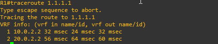

# IP Connectivity (25%)

## Tabela of Contects


3.1 [Interpret the components of routing table]()
* a [Routing protocol code]()
* b [Prefix]()
* c [Network mask]()
* d [Next hop]()
* e [Administrative distance]()
* f [Metric]()
* g [Gateway of last resort]()

3.2 [Determine how a router makes a forwarding decision by default]()
* a [Longest match]()
* b [Administrative distance]()
* c [Routing protocol metric]()

3.3 [Configure and verify IPv4 and IPv6 static routing]()
* a [Default route]()
* b [Network route]()
* c [Host route]()
* d [Floating static]()

3.4 [Configure and verify single area OSPFv2]()
* a [Neighbor adjacencies]()
* b [Point-to-point]()
* c [Broadcast (DR/BDR selection)]()
* d [Router ID]()

[3.5 Describe the purpose, functions, and concepts of first hop redundancy protocols]()

## Interpret the components of routing table

A routing table consists of entries to networks that are either directly connected, statically configured or dynamically learned. To view a routing table use the “show ip route” command.  You will be presented with something like the following:


### Prefix

A prefix is simply the network address. In a routing table, the prefix is the destination network address.  A prefix-length is just the shorthand way to express a subnet mask using CIDR notation.  If the subnet mask is 255.255.255.0 than the prefix-length is /24.


```
Reading the routing table from top to bottom you can see the prefixes and prefix-lengths for the destination networks:
0.0.0.0/0    The prefix is 0.0.0.0 and the prefix-length is /0
172.16.0.0/16    The prefix is 172.16.0.0 and the prefix-length is /16, but this isn't a route just a summary
172.16.1.0/24    The prefix is 172.16.1.0 and the prefix-length is /24
172.16.1.1/32    You got this
172.16.2.0/24    I'll show a couple more to make sure
172.16.3.0/24
172.16.4.0/28
192.168.0.0/16    The prefix is 192.168.0.0 and the prefix-length is /16
209.165.200.0/24
209.165.200.224/30
209.165.200.224/32
209.165.200.225/32    The prefix is 209.165.200.225 and the prefix-length is /32
209.165.200.228/30
209.165.200.232/30
209.165.200.233/32
```

### Network Mask

A prefix is simply the network address. A prefix-length is simply a shorthand way to express a network mask using CIDR notation.


* A network mask may also be called a subnet mask or netmask for short
* Let’s read a few of the entries in the routing table and determine their network masks:
    * 0.0.0.0/0
        * The prefix-length is /0, therefore the network mask is 0.0.0.0.
        * You may recognize this as the default route.
        * If no other entry in the routing table matches, then the packets will get routed out this default route.
        * The prefix-length is zero so it is the shortest prefix-length in the routing table and therefore 
the last option to be considered as a route.

    * 172.16.0.0/16
        * The prefix-length is /16, which means the network mask is 255.255.0.0
        * This is a summary route for the four 172.16.x.x networks on this device
        * Because it's a summary route it doesn't have a routing code or next hop.  It's helpful information describing how the routing table is organized.
    * 172.16.1.0/24
        * The prefix-length is /24 and the network mask is 255.255.255.0
    * 172.16.1.1/32
        * The prefix-length is /32 and the network mask is 255.255.255.255
        * This is the most specific prefix-length possible in IPv4
        * Being more specific than the /24 directly above, this route will be preferred for this specific IP address
    * Your turn!  What are the prefix-lengths below?  For extra credit, what are the network masks?
172.16.2.0/24
172.16.3.0/24
172.16.4.0/28
192.168.0.0/16
209.165.200.0/24
209.165.200.224/30
209.165.200.224/32
209.165.200.225/32
209.165.200.228/30
209.165.200.232/30
209.165.200.233/32

### Nexto-hop

Next hop identifies the IP address of the next router inline to forward the packet to.


* Connected networks and Local networks do not have a next hop
* The first next hop address in the routing table is for the RIP route to network 172.16.2.0/24.
* The next hop is 209.165.200.226
* The next hop to get to the network 172.16.3.0/24 is 209.165.200.226
* Looking at the RIP route to the 209.165.200.228/30 network, it's next hop is 209.165.200.226

### Rrouting protocol code

Routing protocol code identifies by which routing protocol each route was learned.


* Common routing protocol codes include:
    * C - connected
    * S - static
    * I - IGRP
    * R - RIP
    * B - BGP
    * D - EIGRP
    * EX - EIGRP external
    * O - OSPF
    * And more...

### Administrative distance

Administrative distance is what is used to select the best path when a router has two different paths to the same destination via two different routing protocols.


* Most routing protocols are not compatible with other protocols.
* In a network with multiple routing protocols, being able to select the best path between multiple protocols is critical.
* Administrative distance defines the reliability of a routing protocol.
* Each routing protocol is prioritized in order of most to least reliable (believable) with the help of an administrative distance value.
* IPv6 uses the same distances as IPv4.
* Default Administrative Distances:
### Metric

The metric is a value produced by the routing protocol's algorithm.  The metric value determines the best path to a destination network within a routing protocol.


* To determine the metric:
    * RIP uses hop count
    * EIGRP uses K values
    * OSPF uses reference bandwidth
* Metric is used to compare routes to a destination by the same routing protocol
* Lower values indicate preferred routes
* Examples:
    * In the diagram, RIP has 1 hop count to get to network 172.16.2.0/24.  It's the 1 in [120/1].
    * RIP has 2 hop counts to get to network 172.16.3.0/24 and 172.16.4.0/24. It's the 2 in [120/2].

### Gateway of last resort

Gateway of last resort is the default route configured on the router


* Default routes are used to direct packets addressed to networks not explicitly listed in the routing table.
* Default routes are invaluable in topologies where learning all the more specific networks is not desirable, as in case of stub networks, or not feasible due to limited system resources such as memory and processing power.
* You can use any of the following commands to configure the gateway of last resort:
    * ip default-gateway a.b.c.d
    * ip default-network a.b.c.d
    * ip route 0.0.0.0 0.0.0.0 a.b.c.d
* The interface must be up/up for the route to display in the routing table as the default route

## Determine how a router makes a forwarding decision by default

Static routing is a routing protocol that helps to keep your network organized and to optimize routing performance. It enables the router to assign a specific path to each network segment and to keep track of network changes. This helps to improve network stability and continuity. This adds security because a single administrator can only authorize routing to particular networks.

We are going to see how a router selects the best path for a packet, which is decided based on:

* Longest Prefix
* Lowest AD value
* Lowest Metric value
### Configuration:

Consider the topology:


In this Topology:

* R1 has a static route towards R2 for R6’s loopback interface and R2 and R6 are exchanging routers using EIGRP 100
* R1, R3, and R6 are exchanging networks using EIGRP 12345
* R1, R4, and R6 are exchanging networks using EIGRP 23
* R1, R5, and R6 are exchanging networks using OSPF.

We are going to ping R6’s loopback from R1 and check the packet’s path. First, we need to do some configuration:

### R1’s Configuration:
```
interface FastEthernet0/0
 ip address 10.0.0.1 255.255.255.252
 no shutdown

interface FastEthernet1/0
 ip address 10.0.1.1 255.255.255.252
 no shutdown

interface FastEthernet2/0
 ip address 10.0.2.1 255.255.255.252
 no shutdown

interface FastEthernet2/1
 ip address 10.0.3.1 255.255.255.252
 no shutdown

router eigrp 12345
 network 10.0.1.0 0.0.0.3

router eigrp 23
 network 10.0.2.0 0.0.0.3

router ospf 100
 network 10.0.3.0 0.0.0.3 area 0

ip route 1.1.1.1 0.0.0.0 f0/0
```
### R2’s Configuration:
```
interface FastEthernet0/0
 ip address 10.0.0.2 255.255.255.252
 no shutdown

interface FastEthernet1/0
 ip address 20.0.0.1 255.255.255.252
 no shutdown


router eigrp 100
 network 0.0.0.0
 passive-interface FastEthernet0/0
```
### R3’s Configuration:
```
interface FastEthernet0/0
 ip address 20.0.1.1 255.255.255.252
 no shutdown

interface FastEthernet1/0
 ip address 10.0.1.2 255.255.255.252
 no shutdown

router eigrp 12345
 network 0.0.0.0
```
### R4’s Configuration:
```
interface FastEthernet2/0
 ip address 10.0.2.2 255.255.255.252
 no shutdown

interface FastEthernet2/1
 bandwidth 1000
 ip address 20.0.2.1 255.255.255.252
 no shutdown


router eigrp 23
 network 0.0.0.0
```
### R5’s Configuration:
```
interface FastEthernet2/0
 ip address 20.0.3.1 255.255.255.252
 no shutdown
 
interface FastEthernet2/1
 ip address 10.0.3.2 255.255.255.252
 no shutdown

router ospf 100
 network 0.0.0.0 255.255.255.255 area 0
```
### R6’s Configuration:
```
interface Loopback1
 ip address 1.1.1.1 255.255.255.255

interface FastEthernet0/0
 ip address 20.0.1.2 255.255.255.252
 no shutdown
 
interface FastEthernet1/0
 ip address 20.0.0.2 255.255.255.252
 no shutdown
 
interface FastEthernet2/0
 ip address 20.0.3.2 255.255.255.252
 no shutdown
 
interface FastEthernet2/1
 ip address 20.0.2.2 255.255.255.252
 no shutdown
 
 router eigrp 100
 network 1.1.1.1 0.0.0.0
 network 20.0.0.0 0.0.0.3
 no auto-summary


router eigrp 12345
 network 1.1.1.1 0.0.0.0
 network 20.0.1.0 0.0.0.3
 no auto-summary


router eigrp 23
 network 1.1.1.1 0.0.0.0
 network 20.0.2.0 0.0.0.3
 no auto-summary


router ospf 100
 network 1.1.1.1 0.0.0.0 area 0
 network 20.0.3.0 0.0.0.3 area 0
 ```

 To check which path the packet is following we are going to use traceroute, but first, let’s check R1’s routing table:


As you can see for 1.1.1.1 we only have one route right now because the routing table only stores the best route.

### Traceroute:

```
traceroute 1.1.1.1
```


Right now, the packet is going through R1→R2→R6 which is the best route with the longest prefix match.

### We have now shut down R1’s f0/0 interface:
```
int f0/0
 shutdown
```
Now we traceroute:


Now the packet is following the path R1→R3→R6 because EIGRP has a lower AD value than OSPF and the EIGRP path through R1→R4→R6 has a higher metric value (increased it by lowering R4 f2/1 interface bandwidth).

We are currently shutting down R1’s f1/0 interface:
```
int f1/0
 shutdown
```

Now we traceroute again:



Now the packet is following the path R1→R4→R6 because EIGRP has a lower AD value than OSPF.

### We have now shut down R1’s f2/0 interface:

```
int f2/0
 shutdown
```
Now we traceroute again:


Now R1→R5→R6 is the path left for R1 to reach R6’s loopback.

## Configure and verify IPv4 and IPv6 static routing

1. Default route,

2. Network route,

3. Host route, and

4. Floating static

Configuring and verifying IPv4 and IPv6 static routing involves several steps, including defining the routes in the router's configuration and verifying that they are properly installed in the routing table.

A general outline of how to configure and verify each type of static route:

### 1. Default route:

* Configuration:
```
IPv4: "ip route 0.0.0.0 0.0.0.0 [next-hop-IP-address]"

IPv6: "ipv6 route ::/0 [next-hop-IPv6-address]"
```
Verification:
```
IPv4: "show ip route"

IPv6: "show ipv6 route"
```
### 2. Network route:

Configuration:
```
IPv4: "ip route [network-address] [subnet-mask] [next-hop-IP-address]"

IPv6: "ipv6 route [network-address]/[prefix-length] [next-hop-IPv6-address]"
```
Verification:
```
IPv4: "show ip route [network-address]"

IPv6: "show ipv6 route [network-address]"
```
### 3. Host route:

Configuration:
```
IPv4: "ip route [host-IP-address] 255.255.255.255 [next-hop-IP-address]"

IPv6: "ipv6 route [host-IPv6-address]/128 [next-hop-IPv6-address]"
```
Verification:
```
IPv4: "show ip route [host-IP-address]"

IPv6: "show ipv6 route [host-IPv6-address]"
```
### 4. Floating static route:

Configuration:
```
IPv4: "ip route [network-address] [subnet-mask] [next-hop-IP-address] [administrative-distance]"

IPv6: "ipv6 route [network-address]/[prefix-length] [next-hop-IPv6-address] [administrative-distance]"
```
Verification:
```
IPv4: "show ip route [network-address]"

IPv6: "show ipv6 route [network-address]"
```
## Configure and verify single area OSPFv2

Open Shortest Path First (OSPF) is a link-state routing protocol that is used to find the distance between two endpoints of a network, as well as the best path between them and the routers in the network, which can be updated by the router itself using link-state information that it receives from other routers in the network on a regular basis or via multicasting procedures such as OSPF area 0 multicast messages, OSPF hello packets or router advertisements The RAs are sent out periodically by a router to advertise its capabilities and other information about the router’s neighbor routers in the OSPF areas. 

### Steps to Configure Single-Area OSPF Version 2:

#### Step 1: First, we have to create a network topology of the devices listed below:


#### Step 2: After creating the network topology we have to assign IPv4 addresses, subnet mask, and default gateway to Host (PCs) according to the IP addressing table given below.

**IP Addressing Table of PCs**


To configure PCs follow these steps:

* Click on PC0 then go to desktop.
* Then, IP configuration, and there you’ll find IPv4 configuration.
* Add IPv4 address, subnet mask, and default gateway according to the IP addressing table given above.
* Repeat this procedure with PC1 and PC2 and configure all PCs.

#### Step 3:  Configuring Routers with IP addresses and default gateway.

**IP addressing table for routers:**


* To configure router0, click on router0.
* Go to config.
* then configure the router0 with the help of the IP addressing table given above.
* to make sure to turn on the port.
* and repeat the same procedure with router1 and router2 and hence all of the devices will be configured.

#### Step 3: Configure OSPFv2 in a single area

Now we have to add commands to configure the routers to open the shortest path first

1. Router0

* Type these commands in CLI of router0.
```
Router(config-if)#
Router(config-if)#router ospf 1
Router(config-router)#network 192.168.1.0 0.0.0.255 area 0
Router(config-router)#network 192.168.12.0 0.0.0.3 area 0
Router(config-router)#network 192.168.13.0 0.0.0.3 area 0
Router(config-router)#exit
Router(config)#

Router(config)#int lo0
Router(config-if)#ip address 1.1.1.1 255.255.255.255
Router(config-if)#end
Router#
%SYS-5-CONFIG_I: Configured from console by console
Router#copy run start
Destination filename [startup-config]? 
Building configuration...
[OK]
```
#### 2. Router1

```
Router(config)#router ospf 1
Router(config-router)#network 192.168.2.0 0.0.0.255 area 0
Router(config-router)#network 192.168.12.0 0.0.0.3 area 0
Router(config-router)#network 192.168.23.0 0.0.0.3 area 0
Router(config-router)#exit
Router(config)#
Router(config)#int lo0
Router(config-if)#ip address 2.2.2.2 255.255.255.255
Router(config-if)#end
Router#
%SYS-5-CONFIG_I: Configured from console by console
Router#copy run start
Destination filename [startup-config]? 
Building configuration...
[OK]
```
#### 3. Router3

```
Router(config)#router ospf 1
Router(config-router)#network 192.168.3.0 0.0.0.255 area 0
Router(config-router)#network 192.168.13.0 0.0.0.3 area 0
Router(config-router)#network 192.168.23.0 0.0.0.3 area 0
Router(config-router)#exit
Router(config)#
Router(config)#int lo0
Router(config-if)#ip address 2.2.2.2 255.255.255.255
Router(config-if)#end
Router#
%SYS-5-CONFIG_I: Configured from console by console
Router#copy run start
Destination filename [startup-config]? 
Building configuration...
[OK]
```

#### Step 4: Now we have to verify the network by executing these experiments we’ll send PDU packet from PC0 to PC1:

We will use the ping command to verify the network connection:

* Click on PC0 and go to the command prompt.
* Then, type ping 192.168.2.3.


## Describe the purpose, functions, and concepts of first hop redundancy protocols

In every host within the organization’s network, there should be a need for a router as the default gateway for every host to connect to the Internet. But what if the gateway router goes offline or the default gateway IP is changed during configuration?

Replacing the gateway router will cause a longer service interruption to the users within the organization, and that is not a reactive way to handle the issue. This is where FHRP will take place.

The below diagram is an example of a network topology without FHRP implementation:


### What is First Hop Redundancy Protocol (FHRP)?

First Hop Redundancy Protocol (FHRP) is a hop redundancy protocol that is designed to provide redundancy to the gateway router within the organization’s network by the use of a virtual IP address and virtual MAC address.

To implement FHRP, there should be two or more routers that will be used as a gateway router. The virtual IP address and virtual MAC address will be used on both the router. The virtual IP address will be the default gateway IP address for all the devices inside the organization’s network. One router will be used as an active router (gateway router), and the other router will be standby. If the active router goes offline, the standby router will take its place to be the gateway router for all the hosts.

The below diagram is an example of network topology with FHRP implemented:


### First Hop Redundancy Protocol (FHRP) Options

We have three ways to implement FHRP. These are by using the following First Hop Redundancy Protocols:

#### 1. Hot Standby Router Protocol (HSRP)
HSRP, or Hot Standby Router Protocol, is a Cisco-proprietary router redundancy protocol that enables a cluster of routers to cooperate, and all routers are willing to be a default router. All the routers within the cluster will have the same virtual IP address and virtual mac address.

 

The Two Hot Standby Router Protocol (HSRP) Router States:

* **Active Router–** the router that actively sends and receives a packet to the host within the organization. It is the default gateway router. Only one active router will be selected among the cluster of routers.
* **Standby Router–** the router/s that in case the incumbent active router will go offline, among the standby router will be chosen as the active router.
 

If the active router goes offline, router failover will occur. These changes will not affect the hosts. The host keeps the same IP address and MAC address setting. The default gateway IP address will be the same still on all hosts. There will be no changes on the host’s ARP table as the gateway router’s virtual MAC address will be the same. Changes in failover only happen on router and switch, and hosts are not affected.

 

NOTE
Preemption in HSRP is not enabled by default. Preemption must be configured manually on the router.
 

#### 2.Virtual Router Redundancy Protocol (VRRP)
VRRP, Virtual Router Redundancy Protocol, is a vendor-neutral redundancy protocol that groups a cluster of physical routers (two or more routers) to produce a new single virtual router. It enables redundancy by assigning the same virtual gateway IP address and MAC address on all physical routers within the VRRP group. Currently, VRRP is at version 2. It almost has the same concept as HSRP. The only difference is that preemption is enabled by default on VRRP, while on HSRP, it needs to be configured manually.

 

Two states of Virtual Router Redundancy Protocol (VRRP):

* Master Router– It is the current default gateway of all the hosts within the organization. It is actively sending and receiving packets to the hosts.
* Backup Router – The backup router will take the role of the master router during the failover or when the master router goes offline.
 

NOTE
VRRPv3 supports IPv6 and is more scalable than VRRPv2.
 

#### 3.Gateway Load Balancing Protocol (GLBP)
As compared to HSRP and VRRP, Gateway Load Balancing Protocol is a bit different. With GLBP, routers within the group are allowed to do load balancing. To put it simply, all the traffic that is transmitted to the default gateway IP address will be load-balanced one at a time or in a round-robin manner among the routers within the group. GLBP has the same state as HSRP, which is called active and standby. The mechanism of GLBP’s active and standby state is the same as HSRP’s active and standby state.

