# IP Services (10%)

## Tabela of Contest


4.1 [Configure and verify inside source NAT using static and pools]()

4.2 [Configure and verify NTP operating in a client and server mode]()

4.3 [Explain the role of DHCP and DNS within the network]()

4.4 [Explain the function of SNMP in network operations]()

4.5 [Describe the use of syslog features including facilities and levels]()

4.6 [Configure and verify DHCP client and relay]()

4.7 [Explain the forwarding per-hop behavior (PHB) for QoS such as classification, marking, queuing, congestion, policing, shaping]()

4.8 [Configure network devices for remote access using SSH]()

4.9 [Describe the capabilities and function of TFTP/FTP in the network]()

## Configure and verify inside source NAT using static and pools

NAT or Network Address Translation was a tool created to help the world conserve the very scarce IPv4 addresses until IPv6 was invented.

Three tools were developed to slow the consumption of IPv4 addresses

* NAT
* Private IP addresses
* CIDR or Classless Interdomain Routing
NAT works with private IP addresses.

NAT works through a router.  In my network, my ISP assigned me only one IP address – 201.201.201.201.  This address is given to the public facing interface on my router.  I have multiple computers that need to access the internet through the router, but their addresses start with 10.  How can they communicate?

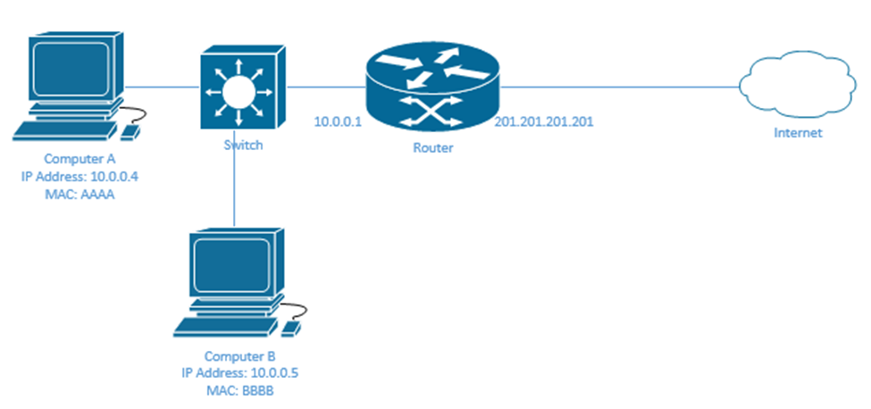

Well, the router must map each external IP address with an internal IP address.  Now, if the router had many external IP addresses (enough to provide each internal device with one), we would create a static NAT.

In the following example, I have three internal devices and three external IP addresses assigned to the router.  They are trying to access a host on the internet with the IP address 5.5.5.5.  Inside the router, I can create a Static NAT Table

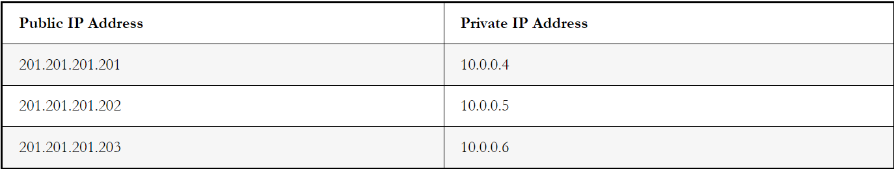

Let’s look the process when Computer A wants to send a message to a device on the internet with the IP address 5.5.5.5?

* Computer A realizes that its IP address is 10.0.0.4 and that 5.5.5.5 is in a different subnet.  Therefore, it sends its packet to the router’s LAN IP address, 10.0.0.1.  We already learned how frames are routed through a local network.
* The source IP on the packet is 10.0.0.4 and the destination IP is 5.5.5.5
* The router checks the Static NAT Table.  It finds out that public IP 10.0.0.4 is mapped to 201.201.201.201.
* The router changes the source IP address to 201.201.201.201 and forwards it out of its external interface.  We already learned how the router finds the route to an external network.
* The server at 5.5.5.5 receives the packet.
* The server replies to Computer A, but it puts the destination address as 201.201.201.201, because it doesn’t know about the 10.0.0.4 IP address.  It has no visibility inside the 10.0.0.0/24 network on the left.
* The router receives the reply on its external interface.
* It checks the table and finds that 201.201.201.201 is mapped to 10.0.0.4.
* It changes the destination IP address to 10.0.0.4 and forwards the packet to Computer A through its internal interface.

Cisco calls the private IP addresses inside local IP addresses, and the public IP addresses inside global IP addresses.  The external device IP addresses are called outside global IP addresses.

We are only worried about changing the IP address of our internal devices, not the external ones.  It is possible to create a NAT for external devices but that isn’t a concern in the CCNA.

We must configure the static NAT on each interface that will see traffic involving the NAT.  We need at least two interfaces – an inside and an outside.

Enter the interface configuration and type ip nat inside or ip nat outside depending on whether the interface is inside or outside the local network.

Go back to global configuration mode and type ip nat inside source static <inside local IP address> <inside global IP address> for each static IP mapping.

My configuration would look like this

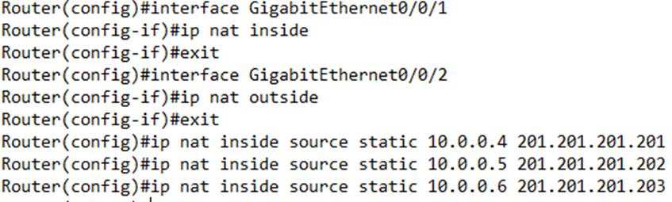

I can verify the NAT static mappings by typing show ip nat translations.  I can verify the statistics by typing show ip nat statistics.

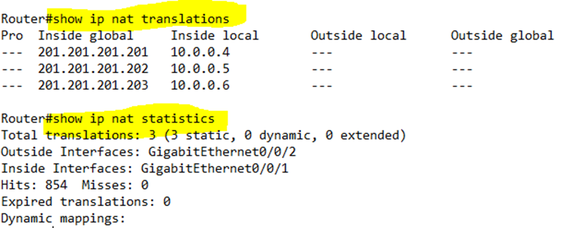

he hits tells us how many packets have been translated by NAT.

The problem with this example is that IPv4 addresses are scarce.  We might have hundreds of computers, but our ISP is unwilling to provide us with hundreds of IP addresses.  Thus, we can use a dynamic NAT.  How does it work?

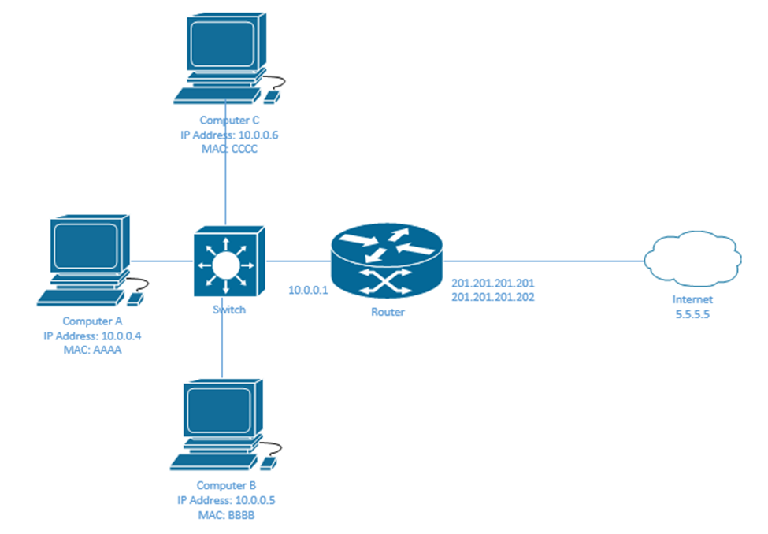

I only have two public IP addresses, but at least three internal devices.  Thus, I don’t map any IP addresses to any devices.

I instead create a NAT Pool, which contains my available public IP addresses.

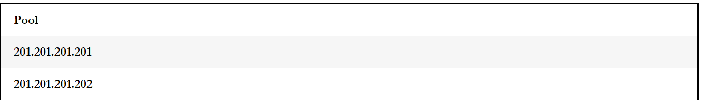

My NAT table is empty

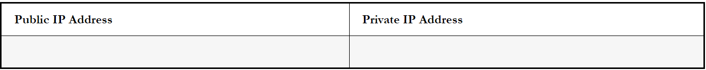

* If computer A wants to send a message to 5.5.5.5, it again realizes that the destination is not in its subnet.  It creates a packet and sends it to the router.
* The router realizes that Computer A needs a public IP address.  It chooses an IP address from the pool and assigns it to Computer A.  Now my NAT table has an entry and there is one IP address left in the pool.

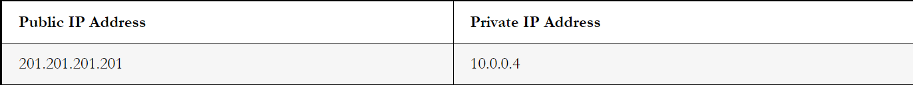

* Like before, the router changes the source IP address of packets coming from Computer A to the public IP of 201.201.201.201.  It also changes the destination IP address of packets travelling to Computer A from 201.201.201.201 to 10.0.0.4 and forwards them out of its local interface

We can configure a dynamic NAT like a static NAT.

Again, we enter the interface configuration and type ip nat inside or ip nat outside depending on whether the interface is inside or outside.

We must create an ACL (Access Control List) that matches the local IP addresses whose traffic should be translated by NAT.  We will learn more about ACLs later.

We establish a NAT Pool by typing ip nat pool <Pool Name> <First IP Address> <Last IP Address> netmask <subnet mask>.

Finally, we create the NAT by typing ip nat inside source list <ACL Number> pool <Pool Name>, where ACL Number is the number of the ACL we created earlier, and the Pool Name is the name of the Pool we created earlier.

In my example, we set G0/0/1 as the inside NAT interface, and G0/0/2 as the outside NAT interface.  We created ACL 1 to permit access to 10.0.0.4 through 10.0.0.6.  The router recognizes that internal devices with IP addresses 10.0.0.4 through 10.0.0.6 match ACL 1.

Then we created a NAT pool with the range of 201.201.201.201 to 201.201.201.202 and called it mainpool.

Then we told the router to use ACL 1 and the NAT pool mainpool.  Now the router knows that traffic entering G0/0/1 from devices 10.0.0.4 through 10.0.0.6 should be assigned an IP address from the range of 201.201.201.201 to 201.201.201.202 if it is leaving the G0/0/2 interface.

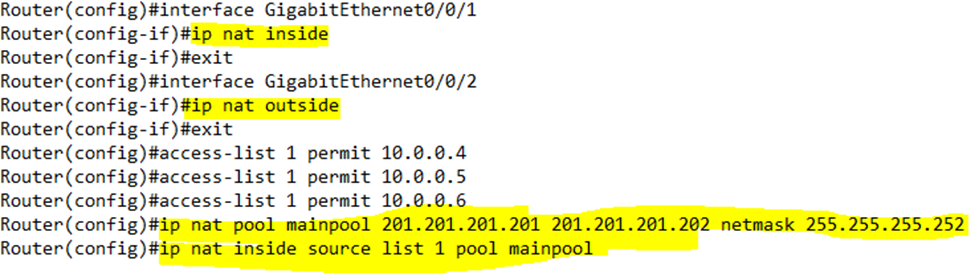

I can verify the NAT dynamic mappings by typing show ip nat translations.  I can verify the statistics by typing show ip nat statistics.

Note that until the router begins to exchange traffic, there will be no dynamic mappings and the show ip nat translations command will return nothing.

The statistics show two misses counters.  The first counter tracks missed packets across all forms of NAT in the router, while the second counter tracks missed packets among the specific NAT dynamic pool we created.

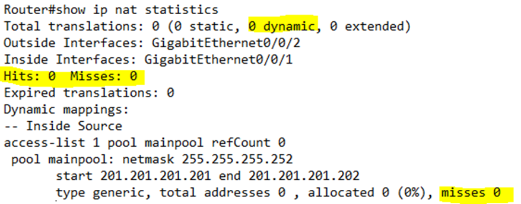

After we start exchanging traffic, we see that our router assigned both IP addresses in the pool, and that it exchanged some traffic.

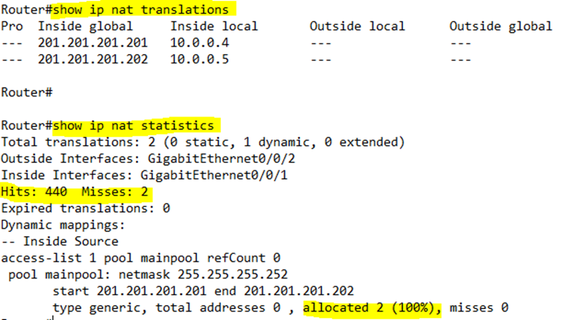

Notice that I have two misses in the first counter but none in the second counter.  The first time 10.0.0.4 sent a packet, the router received the packet but didn’t have a NAT IP address allocated to it, so it dropped the packet and created a mapping.  Thus, it registered a miss.  The first time 10.0.0.5 sent a packet, the router did the same thing.  The second time 10.0.0.4 and 10.0.0.5 sent packets, the router already had a mapping, so it was able to forward their traffic.

If the router notices that an IP address from the pool hasn’t been in use for a while, it returns it to the pool so that it can be given to another device.  But if all the addresses are in use and another device wants to send traffic out to the internet, it must wait until an address becomes available.  This could take seconds or minutes or even days.  What if we have a large office with hundreds of employees who need to access the internet, and only two IP addresses? 

We can use NAT Overload also known as Port Address Translation, or PAT.

In my next example, I only have one public IP address and three computers that want to talk at the same time.

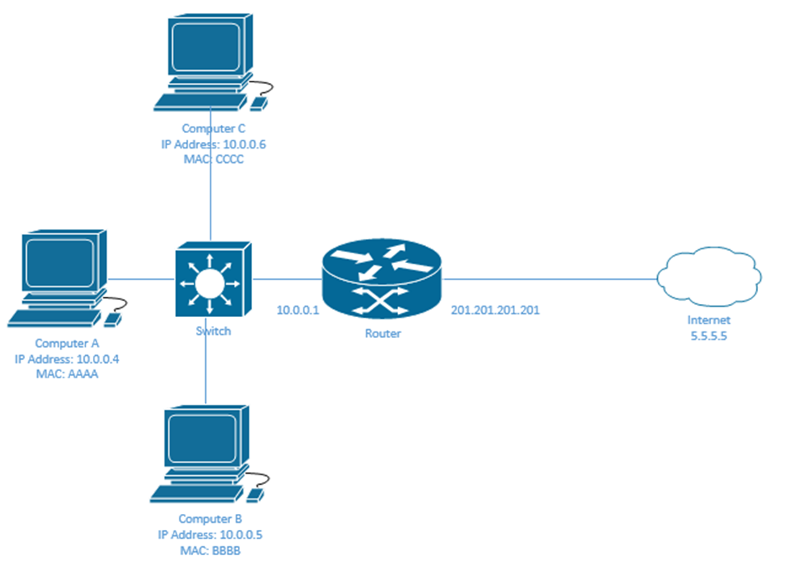

Now I need to look at the IP port used by each device.  Let’s say that each computer is attempting to access a website on Port 80.  The full address of the website is 5.5.5.5:80.

Computer A, B, and C realize that 5.5.5.5 is not in their subnet so they send their traffic to the router.  Their addresses are

* Computer A – 10.0.0.4:80
* Computer B – 10.0.0.5:80
* Computer C – 10.0.0.6:80

The router only has one address – 201.201.201.201.  Thus, it creates the following mapping

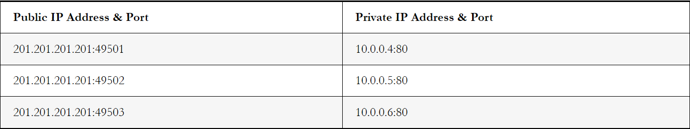

The router gave each local device the same IP address but a different port.  It chose ports 49501 to 49503, which are ports that aren’t used for common applications.  The actual port numbers aren’t too important.

When the router receives traffic from 10.0.0.4:80, it knows to change its source IP address/port to 201.201.201.201:49501, and when the router receives traffic with a destination of 201.201.201.201:49501, it changes its destination/port to 10.0.0.4:80.

What if Computer A is also sending traffic over HTTPS (port 443)?  The router assigns it the same external IP address and another port.  Remember, the router assigns a port when it sees traffic that requires it.  It doesn’t do so proactively.  Now our table looks like this.

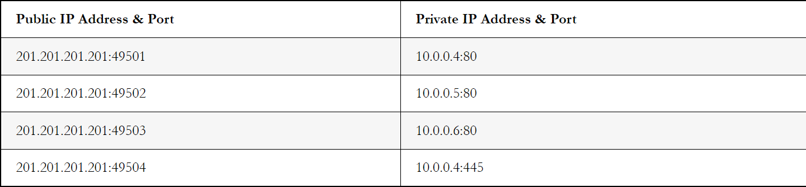

Using NAT Overload, we can map tens of thousands of ports to one IP address.  A single computer on our local network might use between 5 and 15 ports.  Thus, we can support thousands of computers with one public IP address.

We can configure NAT overload like dynamic NAT.

Again, we enter the interface configuration and type ip nat inside or ip nat outside depending on whether the interface is inside or outside.

We must create an ACL that matches the local IP addresses whose traffic should be translated by NAT.

Finally, we create the NAT by typing ip nat inside source list <ACL Number> interface <Interface> overload, where ACL Number is the number of the ACL we created earlier, and the Interface is the external interface that NAT will operate on.  NAT will automatically use the IP address of the interface that it is assigned to.

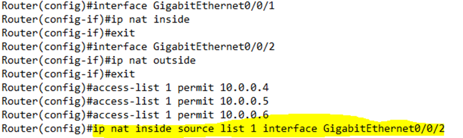

I can verify the NAT overload mappings by typing show ip nat translations.  I can verify the statistics by typing show ip nat statistics.

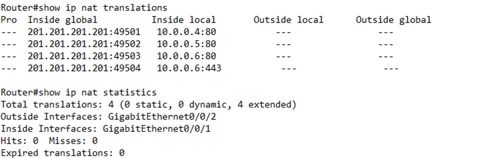

What could possibly go wrong?

* We have the wrong inside and outside commands applied to each interface.  For example, we set our inside interface as an outside interface.  Or we set an interface as inside but it isn’t connected to the LAN.
* We don’t have the correct range of IP addresses configured.
* We don’t have the correct ACL configured, or an internal address that should have its packets translated is not part of the ACL.
* The pool has run out of IP addresses in dynamic NAT.
* We configured PAT but did not choose the correct interface.
* We have another ACL that is blocking the traffic.
* We created the NAT correctly, but no traffic is coming to the router for some other reason.
First make sure that the packet is leaving the user’s computer and reaching the correct internal interface on the router.  Then make sure that the router has a correct NAT translation using the show commands.  Then make sure that the router is transporting the packets out of the correct interface.

## Configure and verify NTP operating in a client and server mode

Network Time Protocol (NTP) is a protocol for synchronizing computer clocks on a network. This protocol is an application protocol responsible for synchronizing hosts on a TCP/IP network. NTP synchronizes the time of day between a number of distributed time servers and clients whereas many applications require synchronized time. An NTP server typically receives time from an authoritative time source. Like an atomic clock connected to a time server, it then distributes that time over the network.

To read more about NTP, please refer to the article Network Time Protocol (NTP).

**Steps to Configure and Verify NTP Operating in a client & server mode in cisco packet tracer:**

### Step 1: First, open the cisco packet tracer desktop and select the devices given below:

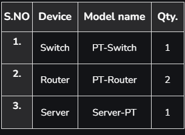

**IP Addressing Table**

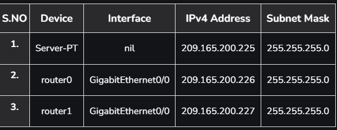

* Then, create a network topology as shown below the image.
* Use an Automatic connecting cable to connect the devices with others.

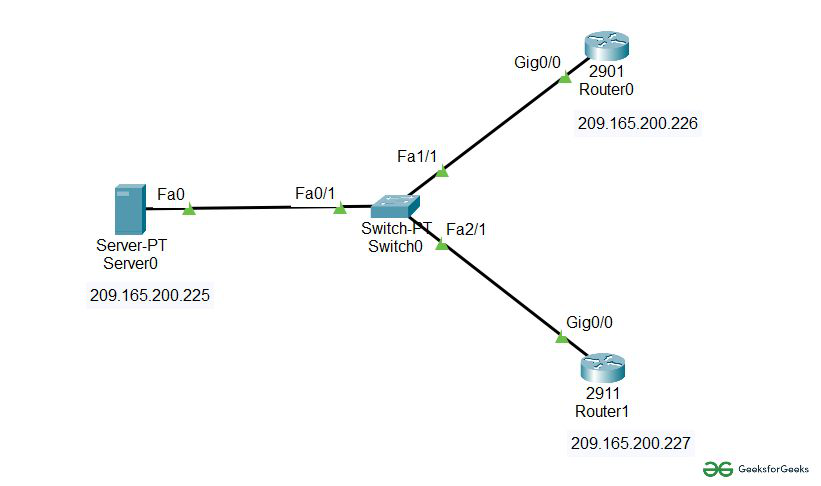

Step 2: Configure the Server, and both routers with IPv4 address and Subnet Mask according to the IP addressing table above.

* To assign an IP address to a device, click on the device.
* Then, go to desktop and then IP configuration and there you will IPv4 configuration.
* Fill IPv4 address and subnet mask.


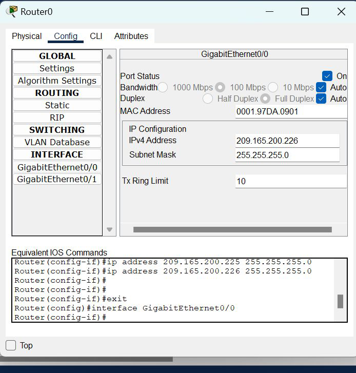

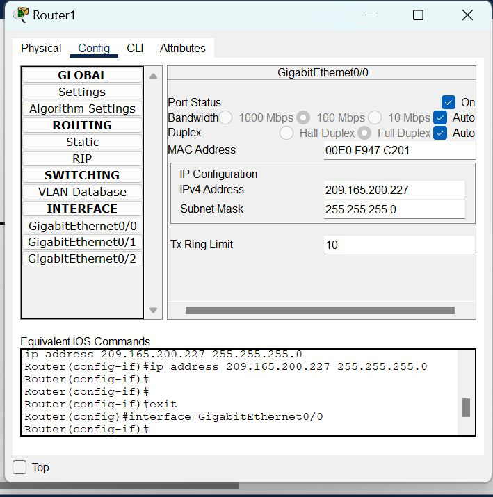

### Step 3: Verify the NTP server configuration by pinging the IP address of the server in Router0 and Router1.

* Click on router0 and go to CLI
* To check the configuration of the NTP server type ping 200.165.200.225
* As we can see in the below images we are getting a 100% success rate.

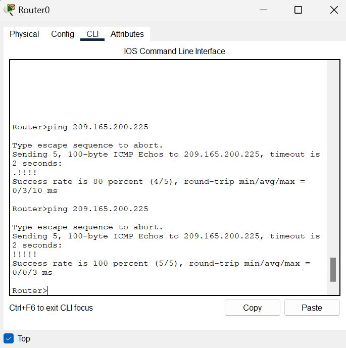

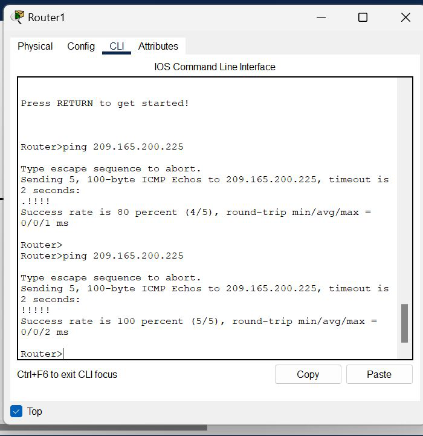

### Step 4: Now we have to configure router0 and router1 as NTP clients.

We will use NTP server command to specify an NTP server in global configuration mode

**CLI command :**

```
Router>en
Router#conf t
Enter configuration commands, one per line.  End with CNTL/Z.
Router(config)#ntp server 209.165.200.225
```
* Repeat the same procedure with Router1
* Now NTP status is enabled and we can check it with the show ntp status command

### Step 5: Verify NTP settings

Check the clock settings on Router0 and Router1 to check whether they are synchronized or not.
**For router0**

```
Router#show clock detail
19:30:42.376 UTC Wed Jun 22 2022
Time source is NTP
```

**For router1**
```
Router#show clock detail
19:30:42.376 UTC Wed Jun 22 2022
Time source is NTP
```
### Check the NTP status

* Use the show ntp status command to check whether the clock is synchronized or not.
```
Router#show ntp status
Clock is synchronized, stratum 16, reference is 209.165.200.225
nominal freq is 250.0000 Hz, actual freq is 249.9990 Hz,
 precision is 2*24
reference time is 1D4B418D.0000023C 
(14:15:41.572 UTC Sat Oct 14 2051)
clock offset is 0.00 msec, root delay is 0.00  msec
root dispersion is 54.97 msec, peer dispersion is 0.12 msec.
loopfilter state is 'CTRL' (Normal Controlled Loop), 
drift is - 0.000001193 s/s system poll interval is 4, 
last update was 7 sec ago.
Router#
```


## Explain the role of DHCP and DNS within the network

**DHCP (Dynamic Host Configuration Protocol)** is a protocol used to dynamically assign IP addresses to network devices. It allows network administrators to manage and automate the assignment of IP addresses, reducing the need for manual configuration of each device on the network.

When a device connects to a network that uses DHCP, it sends a broadcast request for an IP address. The DHCP server receives the request, assigns an IP address to the device, and returns the IP address along with other information, such as the subnet mask, default gateway, and DNS server information. The device then uses this information to configure its network settings and communicate with other devices on the network.

**DNS (Domain Name System)** is a protocol used to map domain names to IP addresses. It allows users to access websites and other Internet resources using memorable domain names, rather than having to remember the IP address of each resource.

When a user enters a domain name into their web browser, the browser sends a request to the DNS server to resolve the domain name to an IP address. The DNS server then returns the IP address for the requested domain, allowing the browser to connect to the website or resource.

DNS is a hierarchical system, with multiple levels of servers working together to resolve domain names to IP addresses. The servers at the top level of the hierarchy, known as root servers, maintain information about the different top-level domains (TLDs) such as .com, .org, and .net. Lower-level servers, known as authoritative servers, maintain information about the specific domain names within each TLD.

### Role of DHCP and DNS within the network

The role of DHCP and DNS within a network is to dynamically assign IP addresses to network devices and resolve domain names to IP addresses, respectively.

DHCP provides a convenient way for network administrators to manage the assignment of IP addresses to devices on the network. When a device connects to the network, it sends a broadcast request for an IP address, which is then assigned by the DHCP server. This eliminates the need for manual configuration of IP addresses on each device and ensures that IP addresses are unique and not duplicated within the network.

DNS provides a way to translate human-readable domain names into IP addresses, allowing users to access websites and other Internet resources using memorable names. This eliminates the need for users to remember the IP addresses of every website or resource they access, and also provides a scalable way to manage the assignment of names to IP addresses for the entire Internet.

In summary, DHCP and DNS play crucial roles in managing IP addresses and domain names within a network, enabling efficient communication and ease of use for users accessing network resources.

## Explain the function of SNMP in network operations

Simple Network Management Protocol (SNMP) is an application layer protocol that is used for network device management. This protocol can collects and manipulate valuable network information from switches, routers, servers, printers, and other network-attached devices.

An SNMP-managed network consists of two components:

* Network management station (NMS) – the software which runs on the administrative computer. This software gathers SNMP data by requiring the devices on the network to disclose certain information. Devices can also inform the NMS about problems they are experiencing by sending an SNMP alert (called a trap).
* Agent – the software which runs on managed devices and reports information via SNMP to the NMS.

Consider the following example:

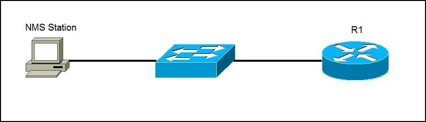

The router R1 is configured to send SNMP traps to the NMS Station. If a problem occurs, the router will send an SNMP trap to Host A. For example, if there is a port security violation on R1, the router will send the SNMP trap, notifying that there has been a potential security breach on the network.

    NOTE
    SNMP agents use a UDP port 161, while the manager uses a UDP port 162. The current SNMP version is SNMPv3. The prior versions, SNMPv1 and SNMPv2 are considered obsolete and should not be used.

## Describe the use of syslog features including facilities and levels

**Syslog** is a standard for message logging. Syslog messages are generated on Cisco devices whenever an event takes place – for example, when an interface goes down or a port security violation occurs.

Syslog is a term used to describe a standard. It is also used to describe the protocol developed for that standard. The syslog protocol was developed for UNIX systems in the 1980s but was first documented as RFC 3164 by IETF in 2001. Syslog uses UDP port 514 to send event notification messages across IP networks to event message collectors, as shown in the figure.

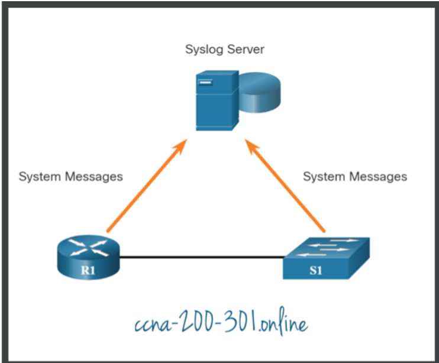

Many networking devices support syslog, including: routers, switches, application servers, firewalls, and other network appliances. The syslog protocol allows networking devices to send their system messages across the network to syslog servers.

There are several different syslog server software packages for Windows and UNIX. Many of them are freeware.

The syslog logging service provides three primary functions, as follows:

* The ability to gather logging information for monitoring and troubleshooting
* The ability to select the type of logging information that is captured
* The ability to specify the destinations of captured syslog messages

### Syslog Operation

On Cisco network devices, the syslog protocol starts by sending system messages and debug output to a local logging process that is internal to the device. How the logging process manages these messages and outputs is based on device configurations. For example, syslog messages may be sent across the network to an external syslog server. These messages can be retrieved without needing to access the actual device. Log messages and outputs stored on the external server can be pulled into various reports for easier reading.

Alternatively, syslog messages may be sent to an internal buffer. Messages sent to the internal buffer are only viewable through the CLI of the device.

Finally, the network administrator may specify that only certain types of system messages be sent to various destinations. For example, the device may be configured to forward all system messages to an external syslog server. However, debug-level messages are forwarded to the internal buffer and are only accessible by the administrator from the CLI.

As shown in the figure, popular destinations for syslog messages include the following:

* Logging buffer (RAM inside a router or switch)
* Console line
* Terminal line
* Syslog server

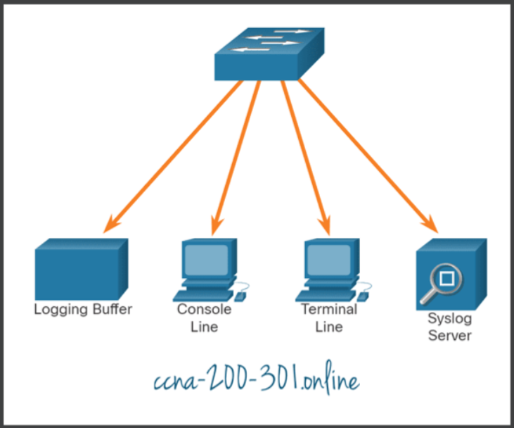

It is possible to remotely monitor system messages by viewing the logs on a syslog server, or by accessing the device through Telnet, SSH, or through the console port.

### Syslog Message Format

Cisco devices produce syslog messages as a result of network events. Every syslog message contains a severity level and a facility.

The smaller numerical levels are the more critical syslog alarms. The severity level of the messages can be set to control where each type of message is displayed (i.e. on the console or the other destinations). The complete list of syslog levels is shown in the table.

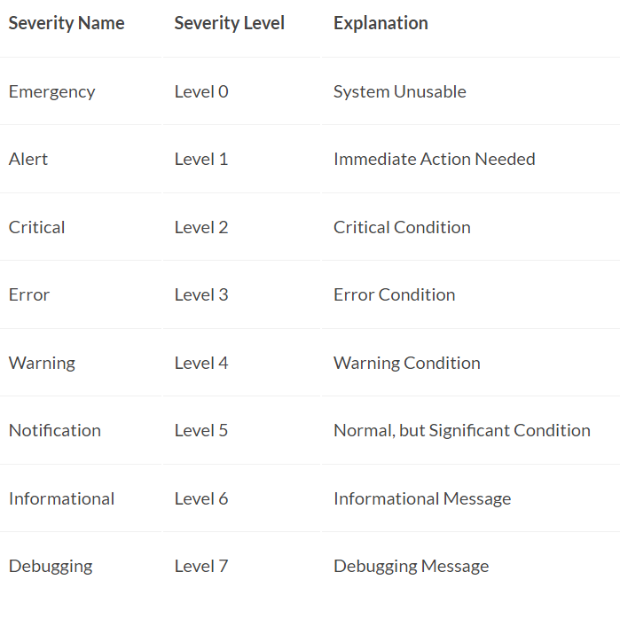

Each syslog level has its own meaning:

* Warning Level 4 – Emergency Level 0: These messages are error messages about software or hardware malfunctions; these types of messages mean that the functionality of the device is affected. The severity of the issue determines the actual syslog level applied.
* Notification Level 5: This notifications level is for normal, but significant events. For example, interface up or down transitions, and system restart messages are displayed at the notifications level.
* Informational Level 6: This is a normal information message that does not affect device functionality. For example, when a Cisco device is booting, you might see the following informational message: %LICENSE-6-EULA_ACCEPT_ALL: The Right to Use End User License Agreement is accepted.
* Debugging Level 7: This level indicates that the messages are output generated from issuing various debug commands.

### Syslog Facilities

In addition to specifying the severity, syslog messages also contain information on the facility. Syslog facilities are service identifiers that identify and categorize system state data for error and event message reporting. The logging facility options that are available are specific to the networking device. For example, Cisco 2960 Series switches running Cisco IOS Release 15.0(2) and Cisco 1941 routers running Cisco IOS Release 15.2(4) support 24 facility options that are categorized into 12 facility types.

Some common syslog message facility codes reported on Cisco IOS routers include:

* IF – Identifies that the syslog message was generated by an interface.
* IP – Identifies that the syslog message was generated by IP.
* OSPF – Identifies that the syslog message was generated by the OSPF routing protocol.
* SYS – Identifies that the syslog message was generated by the device operating system.
* IPSEC – Identifies that the syslog message was generated by the IP Security encryption protocol.

By default, the format of syslog messages on the Cisco IOS Software is as follows:
```
%facility-severity-MNEMONIC: description
```
For example, sample output on a Cisco switch for an EtherChannel link changing state to up is:
```
%LINK-3-UPDOWN: Interface Port-channel1, changed state to up
```
Here the facility is LINK and the severity level is 3, with a MNEMONIC of UPDOWN.

The most common messages are link up and down messages, and messages that a device produces when it exits from configuration mode. If ACL logging is configured, the device generates syslog messages when packets match a parameter condition.

### Configure Syslog Timestamp

By default, log messages are not timestamped. In the example, the R1 GigabitEthernet 0/0/0 interface is shutdown. The message logged to the console does not identify when the interface state was changed. Log messages should be timestamped so that when they are sent to another destination, such as a Syslog server, there is record of when the message was generated.

Use the command service timestamps log datetime to force logged events to display the date and time. As shown in the command output, when the R1 GigabitEthernet 0/0/0 interface is reactivated, the log messages now contain the date and time.
```
R1# configure terminal
R1(config)# interface g0/0/0
R1(config-if)# shutdown
%LINK-5-CHANGED: Interface GigabitEthernet0/0/0, changed state to administratively down
%LINEPROTO-5-UPDOWN: Line protocol on Interface GigabitEthernet0/0/0, changed state to down
R1(config-if)# exit
R1(config)# service timestamps log datetime
R1(config)# interface g0/0/0
R1(config-if)# no shutdown
*Mar  1 11:52:42: %LINK-3-UPDOWN: Interface GigabitEthernet0/0/0, changed state to down
*Mar  1 11:52:45: %LINK-3-UPDOWN: Interface GigabitEthernet0/0/0, changed state to up
*Mar  1 11:52:46: %LINEPROTO-5-UPDOWN: Line protocol on Interface GigabitEthernet0/0/0, 
changed state to up
R1(config-if)#
```
    Note: When using the datetime keyword, the clock on the networking device must be set, either manually or through NTP, as previously discussed.

## Configure and verify DHCP client and relay

## Explain the forwarding per-hop behavior (PHB) for QoS such as classification, marking, queuing, congestion, policing, shaping

Forwarding Per-Hop Behavior (PHB) is a mechanism used in Quality of Service (QoS) to control the behavior of packets as they traverse a network. The following are some of the key components of PHB:

1. **Classification:** This is the process of categorizing network traffic into different groups based on specific criteria such as IP address, protocol, port, or application type.

2. **Marking:** This is the process of setting a marking or tag on a packet, indicating its priority level or class. Marking is typically done at the edge of the network and is used by the network devices to make QoS decisions.

3. **Queuing:** This is the process of holding packets in a queue and scheduling their transmission based on their priority. Queuing algorithms, such as Weighted Fair Queuing (WFQ), ensure that high-priority packets are transmitted before low-priority packets.

4. **Congestion:** This occurs when the network becomes congested and there is not enough bandwidth to handle all the traffic. PHB includes mechanisms, such as Random Early Detection (RED), to help manage congestion by discarding low-priority packets before high-priority packets.

5. **Policing:** This is the process of monitoring network traffic and enforcing specified traffic rate limits. If a packet exceeds the specified rate limit, it can be discarded or marked with a lower priority.

6. **Shaping:** This is the process of controlling the rate at which packets are transmitted into the network. This helps to ensure that the network does not become congested and that all packets are transmitted in a timely manner.

The combination of these components in PHB helps to ensure that network traffic is managed in a way that meets the needs of the different applications and users, while also maintaining network performance and stability.

### Configuration example

A basic example of configuring Quality of Service (QoS) using Forwarding Per-Hop Behavior (PHB) on a Cisco IOS router:

1. Classify traffic:
```
class-map match-all HTTP
match access-group 101
!
access-list 101 permit tcp any any eq 80
```
In this example, we have created a class map named "HTTP" that matches all traffic matching access-group 101. Access-group 101 permits TCP traffic with destination port 80.

2. Mark traffic:
```
policy-map MARK-HTTP
class HTTP
set dscp af21
!
```
In this example, we have created a policy map named "MARK-HTTP" that marks all traffic matching the "HTTP" class with Differentiated Services Code Point (DSCP) value of "af21".

3. Apply the policy-map:
```
interface FastEthernet0/0
service-policy output MARK-HTTP
!
```
In this example, we have applied the "MARK-HTTP" policy map to FastEthernet0/0 interface for outbound traffic.

4. Configure queuing:
```
interface FastEthernet0/0
priority-queue out
```
In this example, we have enabled priority queuing on the FastEthernet0/0 interface for outbound traffic. This allows high-priority packets to be transmitted before low-priority packets.

In actual practice, one needs to understand the network communication requirements fully before implementation of Forwarding PHB.

## Configure network devices for remote access using SSH

One of the most popular way to access a Cisco router remotely is using Telnet but it is an unsecured method as the data is sent unencrypted. If a bad person grabs data from a Telnet session, he can see details like a user’s username and password, giving them access to your router.

SSH (Secure Shell) is a secure method for remote access as it includes authentication and encryption. To do this, it uses a RSA public/private keypair. In this tutorial we are going to learn how to configure SSH for R1 to accept remote SSH access with the topology below.

### Configuration

The first thing we need to do is generating a RSA keypair. The name of the RSA keypair will be the hostname and domain name of the router so we have to configure these two things first.

1. Configure a hostname for the router
```
Router(config)#hostname R1
```
2. Configure a domain name
```
R1(config)#ip domain-name 9tut.com
```
3. Generate the RSA keypair

This RSA keypair will be used to encrypt the SSH packets with the crypto key generate rsa command.
```
R1(config)#crypto key generate rsa
The name for the keys will be: R1.9tut.com
Choose the size of the key modulus in the range of 360 to 4096 for your
  General Purpose Keys. Choosing a key modulus greater than 512 may take
  a few minutes.

How many bits in the modulus [512]: 2048
% Generating 2048 bit RSA keys, keys will be non-exportable...
[OK] (elapsed time was 3 seconds)
```

The message that is displayed right after we enter this command: “The name for the keys will be: R1.9tut.com”, which combines the hostname of the router along with the domain name we configured to get the name of the encryption key generated; this is why we have to configure hostname and domain name first.

The router also asks to choose a size of modulus for the key we are about to generate. The higher the modulus, the stronger the encryption of the key. For our example, we’ll use a modulus of 2048 which is safe nowadays.

4. Configure VTY lines to use SSH only (Telnet will be refused)

R1(config)#line vty 0 4
R1(config-line)#transport input ssh
R1(config-line)#login local
If for some reasons we still want to allow Telnet along with SSH then we can use the “transport input ssh telnet” instead.

5. Create a username/password in local database on the router

R1(config)#username admin password password_SSH

### Verification

1. SSH from another Cisco device

Cisco routers also support a simple SSH client via CLI so we can connect to R1 easily. On R2 we can use the “ssh” command to SSH to R1:
```
R2#ssh -l admin 192.168.12.1
Password: ************ //type "password_SSH' here
R1>
```

“-l” means we will provide the username (“admin” in this case) along with this parameter.

Yes! we can now SSH to R1!

2. SSH from a computer

A normal computer usually has not supported SSH Client so we need to install one. One of the most popular and free SSH Client software is Putty so we should download and use it.

## Describe the capabilities and function of TFTP/FTP in the network

FTP (File Transfer Protocol)
FTP is a network protocol used to transfer files from one computer to another over a TCP network. Like Telnet, it uses a client-network architecture, which means that a user has to have an FTP client installed to access the FTP server running on a remote machine. After establishing the FTP connection, the user can download or upload files to and from the FTP server.

Consider the following example:

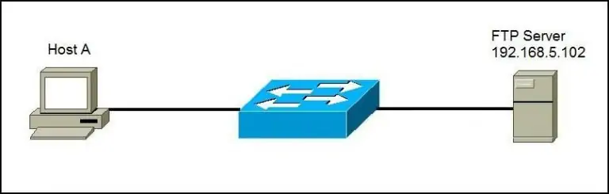

A user wants to transfer files from Host A to the FTP server. The user will start an FTP client program (in this example, Filezilla), and initiate the connection:

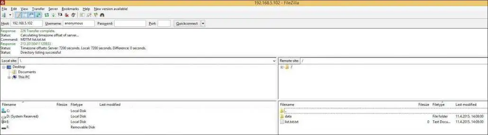

n the example above, the anonymous authentication was used, so the user was not asked to provide the password. The client can now transfer files from and to the FTP server using the graphical interface.

    NOTE
    FTP uses two TCP ports: port 20 for sending data and port 21 for sending control commands. The protocol supports the use of authentication, but like Telnet, all data is sent in clear text, including usernames and passwords.

### TFTP (Trivial File Protocol)

TFTP is a network protocol used to transfer files between remote machines. It is a simple version of FTP, lacking some of the more advanced features FTP offers, but requiring less resources than FTP.

Because of it’s simplicity TFTP can be used only to send and receive files. This protocol is not widely used today, but it still can be used to save and restore a router configuration or to backup an IOS image.

Consider the following example:

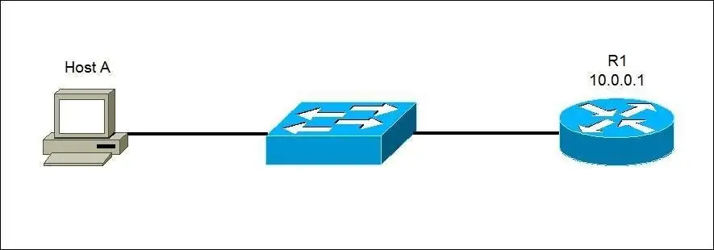

A user wants to transfer files from Host A to the router R1. R1 is a Cisco device and it has a TFTP server installed. The user will start an TFTP client program and initiate the data transfer.

    NOTE
    TFTP doesn’t support user authentication and sends all data in clear text. It uses UDP port 69 for communication.