# Security Fundamentals (15%)

## Tabela of content

5.1 [Define key security concepts (threats, vulnerabilities, exploits, and mitigation techniques)]()

5.2 [Describe security program elements (user awareness, training, and physical access control)]()

5.3 [Configure and verify device access control using local passwords]()

5.4 [Describe security password policies elements, such as management, complexity, and password alternatives (multifactor authentication, certificates, and biometrics)]()

5.5. [Describe IPsec remote access and site-to-site VPNs]()

5.6 [Configure and verify access control lists]()

5.7 [Configure Layer 2 security features (DHCP snooping, dynamic ARP inspection, and port security)]()

5.8 [Differentiate authentication, authorization, and accounting concepts]()

5.9 [Describe wireless security protocols (WPA, WPA2, and WPA3)]()

5.10 [Configure WLAN using WPA2 PSK using the GUI]()

### Define key security concepts (threats, vulnerabilities, exploits, and mitigation techniques)

The key to a good security policy is to keep the bad people out, but also to avoid inconveniencing the legitimate users.  The cost of the security should not be greater than the risk caused by a lack of security.  We must always remember that if the security policy stops a business from operating efficiently, it will not be effective.

An enterprise network is complicated

* We have thousands to hundreds of thousands of users and thousands to hundreds of thousands to millions of different devices spread across multiple locations.
* Users have different roles, and each role requires access to different resources.
* Some users want to work from home or from the road, but they need to connect to the enterprise network.
* Users might want to use their personal devices on the network, including laptops and smartphones.
* The enterprise network may need to exchange data with other networks such as the government, vendors, or customers.
* There are many different network devices from many different vendors.
* Parts of the network are in different states or countries.  Each state or country may have different laws about how data is stored or transmitted. 

A weakness in our network is called a vulnerability.  Somebody can take advantage of a vulnerability to penetrate our network.  They do so with a malicious tool called an exploit.  An exploit is a tool that is used against a vulnerability.  The scenario where a person uses an exploit to take advantage of a vulnerability is called a threat.

We can reduce the risk that a threat poses by using a mitigation technique.  But first, we must identify the threat.

For example, if a router has a flaw in its firmware that might be a vulnerability.  A tool that can be used to enter the router without permission, by taking advantage of the firmware flaw is an exploit.  If a hacker uses this tool, that is a threat.  We might install a firewall or upgrade the router’s operating system as a mitigation technique.

How can we secure the whole network when we have

* Different types of equipment such as Routers, Switches, Wireless Access Points and Controllers
* Different models of equipment
* Different ages of equipment each of which may be running a different version of the firmware or operating system
We might not even know what all the different threats are.  Before we can secure the network, we must first understand what all the components are and where the vulnerabilities lie.  That means

* Identify the physical location of every device and how it connects to other devices

* Identify the logical connections of every device including IP addresses, virtual ports, and VLANS

* Identify the make, model, and serial number of every device.  Identify the operating system version running on every device.  If a vulnerability arises in an operating system that we are using, we can patch it.

There are many types of attacks.  For the CCNA, it is important to understand them in general terms, but for the real world, it is important to know exactly what they are.  This chapter goes into a lot more detail than you’re expected to know.

One type of threat is called spoofing.  Each device within the network assumes that the other devices are who they say they are.  If a device says that it has a specific IP address and MAC address other devices assume that it is telling the truth. 

In a spoofing threat, a rogue device can change its IP address or MAC address so that it matches that of a legitimate device and then send traffic as that device.  Devices receiving the traffic will assume that it originated from a legitimate device.

Recall that each network device is assigned a unique IP address.  Two network devices can communicate over a WAN or public network if they know each other’s IP addresses.  A hacker can intercept their communication by changing his machine’s IP address to match that of one of the devices.  This method takes special skill and control/modification of network routers, because

* Most network devices/computers will detect the IP address conflict.
* The device whose IP address is spoofed will not receive any traffic because it is being intercepted by the hacker’s computer.  The hacker’s computer must pretend to be the legitimate computer and carry on the communication.
* To remain undetected, the hacker will have to intercept the IP traffic through the router and then forward it to the legitimate recipient.

A broadcast IP address is a special type of IP address that exists in every network.  The broadcast address allows a device to send a single message to all the IP addresses on that network.  One type of broadcast message is known as an “echo”.  Devices receiving the “echo” message reply to the sending device.

In a Smurf Attack, the hacker forges the “from” portion of the echo message so that it appears to have come from another system.  The device whose address appears in the “from” portion will receive all the replies.  Depending on the size of the network, and the number of echo messages sent, that device could receive hundreds or thousands of replies.

There are millions of web servers operating on the internet (which host websites).  If a hacker wants to bring down a web server, the hacker would flood that server with massive amounts of traffic.  The web server would then be unable to respond to legitimate traffic, and ordinary users would be unable to visit the website.  This is known as denial of service.  Services other than websites exist on the internet (credit card processing, databases, etc.), and all are vulnerable to DoS.

There are many types of DoS attacks

* SYN flooding.  When a user wants to connect to a web server, a three-way handshake (SYN, SYN/ACK, ACK) process occurs between the two computers. 
    * The user sends a SYN message to the server; the server responds with a SYN/ACK message to the user, and the user responds with an ACK message to the server
    * In SYN flooding, the hacker imitates a legitimate user and sends more SYN requests than the web server can handle.  The web server responds with the SYN/ACK response, but the hacker does not complete the third part by sending the SYN.
    * The server keeps a connection open waiting for an ACK message that never arrives.  The server can only keep a limited number of connections open.  If all of them are waiting for ACK messages that will never arrive, then the server won’t be able to establish connections with legitimate users

* Fragmenting.  When data travels over the internet, the sending computer breaks it down into pieces known as packets.  The packets may take different routes to reach their destination.  The receiving computer puts the packets back together.  The data in each packet should not overlap.
    * In a fragmenting attack, the hacker send data to the server, but puts overlapping data into each packet
    * The server attempts to put the data back together but can’t.  If the operating system isn’t equipped to recognize this attack and discard the bad packets, then it will crash.

How to prevent Denial of Service

* Most DoS attacks are preventable now.  Why?  A hacker will not have enough bandwidth to bring down a large web service.  Major websites such as Google, Facebook, eBay, etc. use distributed server farms consisting of millions of servers, with redundant pathways to the internet.  A hacker will not have enough capacity to overload their systems.

* Most enterprise systems contain firewalls that can easily detect and block DoS attacks.  If a substantial amount of illegitimate traffic appears to be originating from a single source, it can simply be turned off.

* For a small monthly fee, services such as CloudFlare offer large-scale cloud-based firewalls to protect smaller websites from DoS attacks (which they normally could not afford).

* A company should never be a victim to the same attack twice.  After the first attack, they must investigate and configure their systems 
so that it never happens again.  The most common types of attacks are well documented, and systems are available to prevent them.

**Distributed Denial of Service** was invented after DoS stopped working (due to improvements in internet infrastructure). 

With DDoS, a hacker infects thousands (or hundreds of thousands) of computers (or other IP devices such as cameras) and uses all of them to send traffic to a web server that he wants to crash.  These computers are known as bots and together they form a botnet.  Since the traffic appears legitimate (and is in fact originating from hundreds of thousands of different sources, in different geographic locations, with different internet service providers, and different computer types), it is difficult to filter or prevent.

The botnet operator will continue to acquire additional bots, to grow his botnet.  The operator might lease his network of bots to a person or organization that wants to bring down a website (for revenge, competition, or other reasons).

An **Amplified DDoS** attack happens when the hacker’s request is much smaller than the victim’s response.  For example, the hacker is requesting a copy of a webpage.  The request may be a few bytes in size, but the response is the entire webpage, which may be several megabytes.  If the hacker has a way to divert the response to another destination, he can launch an attack with little bandwidth.

A **Reflective DDoS** attack is when the hacker forges the destination address of his request to that of the victim.  The victim server sees requests for web pages that are coming from itself.  Therefore, the victim begins sending traffic back to itself.

In a **Man-in-the-Middle** attack, a hacker inserts himself between the sender and recipient of an electronic communication.  Keep in mind that more than 60% of internet traffic is machine generated (one computer talking to another with no human interaction).

Consider that Alice and Bob are two hypothetical internet users having an encrypted conversation.  They could be two humans, or it could be that Alice is an online banking user and Bob is the bank.  The purpose of the communication is irrelevant.  Consider that the hacker, Eve, wants to spy on them.

Alice and Bob’s messages pass through a central server.  Depending on Alice and Bob’s geographical locations, the messages may pass through many servers, routers, switches, fiber optic cables, and copper lines.  The internet is fragmented, and different parts are owned by different companies.  If Alice is in New York and Bob is in Los Angeles, the traffic must pass through many states, and many internet service providers.

* If the traffic between Alice and Bob is unencrypted, and Eve can obtain access to one of the servers, routers, switches, or physical connections, then Eve can spy on the conversation.

* If the traffic is unencrypted, but Alice does not have access to one of the servers that the connection travels through, Eve could trick Alice into sending messages addressed to Bob to her instead (by corrupting/modifying Alice’s address book).  Eve would do the same to Bob.  In Alice’s address book, Eve replaces Bob’s address with her own.  In Bob’s address book, Alice replaces Alice’s address with her own.  Alice sends messages to Eve thinking she is sending them to Bob, and Bob sends messages to Eve thinking he is sending them to Alice.  Now Eve can read Alice’s messages and forward them to Bob.  Eve can also read Bob’s messages and forward them to Alice.  Neither Alice nor Bob is aware that Eve is reading their communications.

* If the communication is encrypted and uses public key cryptography (such as Apple iMessage), a man-in-the-middle attack is more difficult.  Users encrypt messages with public keys (which they obtain from a central directory).  If Alice wants to send a message to Bob, she obtains Bob’s public key from Apple, encrypts the message, and sends it to Bob.  Bob uses his private key (which only he knows) to decrypt the message.  If Eve can intercept the message, she could perform a man-in-the-middle attack
    * We will discuss public key cryptography in more depth later, but in general consider this
        * A private key can only decrypt a message.  A user keeps his private key secret.
        * The user generates a public key from his private key.  He gives the public key to everybody who wants to send him a message.  The public key can only encrypt a message.
    * Eve generates her own public and private keys
    * She hacks into the central directory and changes Bob’s public key to her own
    * Alice decides to send a message to Bob.  She checks the directory for Bob’s public key, and receives what she thinks is Bob’s public key (but is in fact Eve’s public key)
    * Alice sends the message to Eve (thinking she is sending it to Bob)
    * Eve decrypts the message, reads it, and then encrypts it with Bob’s public key
    * Eve sends the message to Bob
    * Bob receives the message, thinking it came from Alice and decrypts it with his own private key
    * Eve does the same thing with Alice’s public key so that she can intercept messages that Bob is sending to Alice

A hacker can use a Man-in-the-Middle attack to poison the ARP.  The hacker must send the last ARP message to be successful.

Computer A has IP address 10.0.0.4 and MAC address AAAA.  It wants to learn the MAC address of Computer B, so it sends an ARP Request, which is broadcast over the entire network.  The ARP message says, “if you’re IP address is 10.0.0.5, what is your MAC address”.  The hacker’s computer is on the bottom and has an IP address of 10.0.0.6 and a MAC address of HHHH. 

Computer B will respond to tell Computer A that it’s IP address is 10.0.0.5, but Computer H (the hacker’s computer) will respond afterwards to tell it that the MAC address is HHHH.  Computer B won’t know that Computer H did this.  Computer A will address traffic intended for Computer B to Computer H.

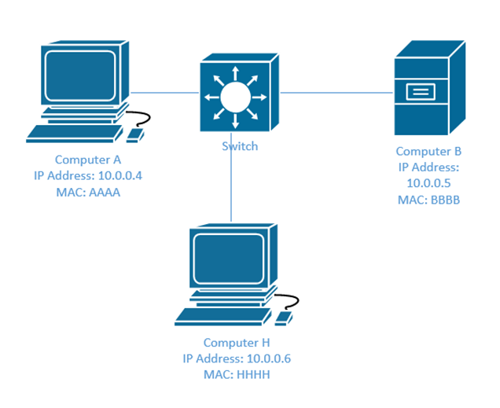

If a hacker wants to identify areas to attack, he can perform a reconnaissance attack.  Many legitimate tools such as nslookup and ping can also be used by a hacker to discover open ports and other vulnerable systems.  Once a hacker has discovered the vulnerabilities, he can plan a further attack.

What is a buffer?  The buffer is kind of like a lineup at airport security.  The flow of passengers is not steady.  When there are more passengers than security guards, a long lineup develops.  If the airport doesn’t have enough room to hold all the passengers, they might have to wait outside.

The buffer is the same.  Consider a web server or other computing device.  Information is coming in over a wire.  Sometimes the information is coming in quickly, and sometimes it is coming in slowly.  The server must take each piece of data and process it somewhere.  When the levels of traffic are high, the server can’t process all of it in real time.  Thus, all data first enters a buffer, where it lines up to be processed.  The server takes data from the buffer at a steady rate.

* For example, the traffic ranges from 0.5GB/s to 2GB/s
* The server can process data at 1GB/s
* If the traffic is 1GB/s or less, the server can process the traffic in real time.  The traffic passes through the buffer but doesn’t spend any time there.
* If the traffic is more than 1GB/s, the server can’t process the traffic in real time.  The buffer starts to fill up.
The buffer has limited capacity.  If the buffer fills up, then it should reject additional data.  For example, if the buffer has a capacity of 10GB, and data comes in at a rate of 2GB/s, but the computer can only process 1GB/s, then after 10 seconds, the buffer will be full.

The buffer may be designed to hold specific sizes of data.  For example, a buffer may be designed to store IP addresses.  Recall that an IP address is 12 digits.  If a hacker sends a piece of data that is larger than what the buffer expects, a buffer overflow results.  For example, if the IP address is 12 digits, and the hacker sends 14 digits, a buffer overflow could result.

In 2014, a major exploit known as Heartbleed caused security vulnerabilities across millions of websites, including Facebook, Google, and Revenue Canada.  How did it work?

* Websites encrypt their data with an algorithm known as SSL
* A developer created an app called OpenSSL, which makes it easy for web developers to implement SSL in their website, using minimal code
* Millions of websites, including millions of the worlds largest websites used the OpenSSL app
* When a user visits a website, a connection is created.  The user’s computer and the web server keep the connection open for as long as necessary (but for no longer than necessary).  To preserve resources, the server closes the connection when it is no longer required.  It checks if the user is still present through a method known as a “heartbeat”, which is the electronic equivalent of asking the user “are you there?” ever minute.  If the user says “yes”, the connection stays open.  If the user doesn’t reply, the server closes the connection.
Every minute, the user’s computer sends a small random amount of data to the web server.  The user’s computer sends the web server the length of the data as well.
For example, the user’s computer might send “sdkjfasfjksdlfskldflskdf” length:24
The web server sends the data back.  Thus, the web server and the user’s computer know that both are still online and agree to keep the connection active.
In fact, the server stores the data in a buffer and gives it an address (the address is the spot where the data starts).  To return the data to the user, the server locates the data at that address, and counts the number of spaces based on the length it was provided.  If the data’s address starts at position 40 in the buffer, then the server will start reading at position and count another 23 position.  Thus, the server will return the data from position 40 to position 63.
A hacker found out that OpenSSL didn’t verify the accuracy the length that the user’s computer provided.
Thus, a hacker could send a small amount of data such as “aaa” and a large length such as length:4523
The server would store “aaa” in memory and then send back 4523 bits of data, starting with “aaa”.  If aaa started at position 40, the server would reply with the data from position 40 to position 4562.  What kind of data is stored in the other positions?  Anything is possible.
If the hacker repeated these steps, eventually he would receive most of the contents of the server’s memory, which could include encryption keys and private banking information.
This bug could have been easily prevented with a few lines of code to verify the length of the data.
Once discovered, it was quickly patched.  But hackers had been using the security hole to steal data undetected for over two years.
How to prevent

Proper code and error handling in programs.  The buffer overflow happens because the computer receives data in an unexpected format and doesn’t know what to do.  Buffer overflows can be prevented by writing good code that checks for errors and refuses to accept data that does not meet the required format.  A program shouldn’t crash when it receives invalid data; it should simply reject it.
The correct data has an expected format (length, character type, contents, format, etc.)
In pseudocode, write an “if” statement.  If the data doesn’t match the expected format, then reject the data.
Malware is any type of malicious application.  There are many types of malware.

A virus is an unauthorized program that causes undesired activity.  A virus is not a standalone program, but instead it latches on to another legitimate program.  When the legitimate program runs, so does the virus.

Viruses typically infect executable programs such as programs with extensions of .exe.  Viruses can also infect documents, such as Microsoft Word documents or Microsoft Excel spreadsheets.  These are known as macro viruses.  Current versions of Microsoft Office disable macros by default (a user can open a Microsoft Office document file without allowing the macro to execute).

Viruses can enter automatically through backdoors.  A user could inadvertently introduce a virus by clicking on attachments or downloading files from the internet.

The damage that a virus does is called the payload.  Viruses can cause a wide range of effects from being simply a nuisance to deleting files.  Viruses that infect industrial control systems can cause millions of dollars in damage.  Viruses that infect medical equipment can put lives at risk.

A virus can be detected and prevented using an antivirus program.  An antivirus program has two methods of detecting viruses

Definitions:  A definition is a specific “fingerprint” of the virus.  An antivirus program may contain hundreds of thousands of virus definitions.  It scans each new file introduced into the computer against the definitions.  If the attributes of a file match a definition, then the antivirus program knows that it has located a virus (and knows which virus it has located).

To develop the antivirus definitions, the antivirus software manufacturer must first obtain copies of the virus and create the definition.  That means that some computers have already been infected with the virus by the time the definition has been created.  Thus, definitions do not provide complete protection against viruses.

A polymorphic virus is one that attempts to change its code.  Each time the virus runs, the code changes slightly, but the damage that it causes remains the same.  A polymorphic virus attempts to hide from antivirus definitions.

Heuristics.  A heuristic is a type of artificial intelligence.  It allows the antivirus program to determine whether a specific program is legitimate or not, based on its behavior.  For example, a program that attempts to modify critical system files is likely not legitimate.

The latest generation antivirus programs share data with the cloud.  For example, Norton Antivirus automatically collects data regarding suspicious applications from users.  This data is sent to a response center for further analysis.  Norton Antivirus then updates all user programs with the results.  By sharing data with the cloud, antivirus programs can detect viruses faster.
The most famous computer viruses have been

ILOVEYOU.  Released in 2000, ILOVEYOU was transmitted via e-mail with a subject line of “I love you”.  It overwrote system files and personal files, before spreading through e-mail.  It caused $15 billion in damage.
MyDoom.  Similar, to ILOVEYOU, MyDoom spread via e-mail in 2004.  It is estimated that 25% of all e-mails sent in 2004 were infected with MyDoom.  It caused $38 billion in damage.
Stuxnet.  Stuxnet is a special kind of virus because it infected the firmware of a USB drive.  The firmware of a USB drive is not typically accessible to the computer or to an antivirus program – it’s considered “read only” memory and allows the USB drive to read/write data from/to the computer.

The Stuxnet virus contained a second virus inside of it.  When the USB drive was inserted into a PLC (an industrial control system), the second virus infected the PLC.  Stuxnet only infected Siemens S7 PLCs.

Stuxnet was used to infect industrial control systems that were “air gapped” (not connected to the internet or to any network).

Stuxnet was unusual because
It took advantage of multiple zero-day exploits (security holes that are unknown to the software manufacturers).  A zero-day exploit is considered valuable to a virus manufacturer/hacker, and to use several in the same virus is highly unusual.  Zero-day exploits are quickly patched by manufacturers once discovered and can’t be reused.  A zero-day exploit could be worth up to a million dollars.  To use several million dollars worth of zero-day exploits in a virus that brings the creator no financial reward is highly unusual.
It limited its infection to only specific types of computers and PLCs.  Most virus manufacturers do not want to limit the damage that they cause.
It is estimated that Stuxnet took between three man-years and fifteen man-years to prepare.  Development of Stuxnet required advanced knowledge of the Windows operating system, USB firmware, and Siemens PLCs.
Crypto-malware and ransomware are closely related.  Crypto-malware is a type of virus or malicious program that encrypts data on a computer.

The malware can be introduced through e-mail or downloaded files.  The malware usually encrypts user documents, videos, photos, and music.  It does not usually encrypt system files.

The distribution of crypto-malware is usually automated, although people or organizations can be specifically targeted.  It should be noted that after the crypto-malware has infected the computer, then the author is able to view the contents of the computer.  At that point, he can make an assessment as to how high of a ransom to charge.  For example, if an ordinary person was targeted, the ransom might be low, but if a hospital was targeted, then the ransom might be high.

After infection, the computer operates as normal, but the user is provided with a message that their files have been encrypted.  The malware usually instructs the user to pay a ransom to unlock the files.  The ransom must typically be paid in bitcoin.

There are two types of crypto-malware

Crypto-malware that pretend to encrypt the files.  They change the file extension to something random, but do not encrypt the file.  When the extension is changed back to the original, the files revert to normal.  These forms of crypto-malware are extremely rare.
Crypto-malware that encrypt the files.  After the files are encrypted, the key is sent to a central server.  The user receives the decryption key after paying the ransom.  Some forms of crypto-malware do not provide the option to decrypt the files, either because they are misconfigured or because the intention is to prevent a user from accessing his files.
Ransomware is an extension of crypto-malware, in that it instructs the user to pay a ransom in exchange for unlocking the files.

Typically, the user is instructed to visit a TOR website, where they are provided further instructions.  TOR websites are generally able to hide their location, although law enforcement agencies have developed methods to identify them.  The user is instructed to pay the ransom with cryptocurrency (untraceable currency) such as bitcoin. 

In most cases, the hackers provide the victim with the tool to decrypt their files upon receipt of payment.  In some cases, the hackers do not.

The ransom amounts have ranged from the equivalent of $500 to $20,000 depending on the person or organization that was affected.  Many organizations pay the ransom and don’t publicly admit that they have been hacked.

How to prevent ransomware

Proper user education to teach users how to identify potential ransomware delivered via e-mail, and to not open unusual attachments.
Block e-mail attachments that contain macro-enabled Microsoft Word and Excel documents.
Regularly install Windows operating system security updates
How to defeat ransomware once infected

Attempt to restore data from backup or from the Volume Shadow Copy.  This only works if the organization has backed up their data, and only the data that was backed up can be restored.  This is not effective against newer versions of ransomware, which delete the Volume Shadow Copy. 
Attempt to decrypt the ransomware.  Police forces in the EU have been able to provide victims with assistance in decrypting some forms of ransomware.  Some versions of ransomware use weak encryption that can be broken through brute force or other techniques.
Pay the ransom.  In earlier cases, it was almost certain that the hackers would automatically (or manually) provide the decryption key upon payment of the ransom.  In more recent cases, this is not guaranteed because there are many copycat ransomware viruses created by people with very little knowledge or infrastructure.  Ransomware developers have franchised their operation to “script kiddies” who are simply distributing the ransomware and collecting payments.  There are also versions of ransomware that have been put out by nation-states to cause political disruption; this type of malware only destroys data but is disguised as ransomware.
Notable infections

In 2019, Jackson County, Georgia paid $400,000 to remove ransomware from their computers.
University of Calgary paid $20,000 to decrypt computers infected by ransomware in 2017.  The FBI later charged two people in Iran with spreading the virus, which infected computers at health care providers and other organizations.
Notable ransomware

CryptoLocker was transmitted over e-mail as a ZIP file.  Inside the e-mail was an executable disguised as a PDF.  The decryption key was sent to a remote server.  A victim could pay a ransom and receive a decryption key automatically.  The creators of CrytoLocker made an estimated $27 million.  In 2014, security firm FireEye was able to obtain the database of decryption keys, allowing victims to decrypt their files for free.
WannaCry took advantage of a zero-day exploit in the Windows Server Message Block.  WannaCry infected computers that had not patched the Windows Server Message Block vulnerability.  The average ransom amount was $600.  Over 200,000 computers were infected, with losses estimated at over $4 billion.
Unlike other forms of ransomware, Petya encrypted the master boot record of a Windows computer.  This caused the entire computer hard drive to be encrypted.  Another version, known as NotPetya was targeted towards Ukrainian government entities and critical infrastructure.  NotPetya quickly spread to other computers worldwide and could not be decrypted.  It is believed that NotPetya was created by the Russian government.
The difference between a worm and a virus is that the worm replicates by itself, whereas the virus must attach itself to a legitimate file.  The virus only runs when the legitimate file runs.

Worms can generally spread over a network from computer to computer, by themselves.  They take advantage of security holes.

Examples of worms

SQL Slammer took advantage of a buffer overflow bug in Microsoft SQL Server.  The worm would randomly generate IP addresses and then send itself to those IP addresses.  If the IP addresses belonged to computers that were running an unpatched version of SQL Server, then the worm would be successful in infecting them.  The worm caused many internet routers to crash, and reboot.  Each time the routers rebooted, they would resend routing updates to each other, which would cause internet traffic congestion.  SQL Slammer was exceptional in that it fit inside a single data packet.
A trojan is a legitimate program that hides an illegitimate program.  A user must install the trojan and/or give it permission before it can take effect.  Trojan is named after the Trojan horse.

Trojans can hide in many programs including toolbars, screensavers, games, and other applications.

Examples of Trojans

FinFisher (FinSpy), which is developed by Lench IT Solutions plc.  This trojan is used to infect Windows computers and all brands of phones.  It travels through e-mail, links, and security flaws in popular programs.  Many antivirus programs are unable to detect it.

FinFisher is sold to law enforcement agencies and dictatorships, some of which are accused of numerous human rights violations.
A rootkit provides unauthorized administrative level access to a computer by changing its operating system and attempting to bypass its security functions. 

There are five types of rootkits

Firmware.  A firmware rootkit hides inside the device firmware (such as the BIOS, video card controller, router, network card, or hard drive controller).  The device firmware is not typically scanned by (and is out of reach of) antivirus programs.  While manufacturers such as HP have introduced BIOS integrity features that check for changes to the BIOS firmware, rootkits can infect other components such as the graphics card or hard drive.

Virtual.  A virtual rootkit is also known as a hypervisor rootkit.  It operates between the processor and the operating system.  It intercepts calls made by the operating system, like a “man-in-the-middle” attack.  The result is that the processor believes that it is talking to the operating system and the operating system believes that it is taking to the processor, but, both are talking to the rootkit.  The rootkit sends everything it learns to a central server.

Kernel.  A kernel rootkit runs on a computer with the highest privileges (the same privileges as the operating system) by replacing parts of the operating system core and device drivers.  A kernel rootkit can’t be detected by an antivirus program because the rootkit is acting like part of the legitimate operating system.

Library.  A library level rootkit replaces legitimate operating system DLLs with fake ones.  A library is a set of code/functions that an application can reference (a software developer will include different DLLs with their application so that they don’t have to rewrite thousands of lines of code).  When an application references code in an infected DLL, the rootkit will also run.

Application Level.  An application level rootkit replaces application files with fake versions.  The application may need to run at an elevated level in order to cause damage.
Examples of rootkits

LoJack.  LoJack is a legitimate rootkit that comes preinstalled in the BIOS of some laptops.  If the laptop is lost or stolen and later connected to the internet, LoJack will report the location of the laptop to a server.  LoJack is designed to remain on the laptop even if its hard disk drive is erased or replaced.

Sony BMG.  In 2005, Sony installed a rootkit known as XCP (Extended Copy Protection) on music CD’s that it released.  When users attempted to play the CD’s through their computer, the rootkit created security vulnerabilities.  The intention of the rootkit was to prevent people from copying music off the CD’s, but the rootkit created security holes and hid in the background.

Sony was forced to recall all unsold music CDs and faced multiple class-action lawsuits.
A keylogger records each key that a user presses.  It may also take screenshots, activate the webcam, or activate the microphone without the knowledge or consent of the user.

The keylogger reports all data back to a central source or records the data on the computer for further retrieval.  Data may be sent via

Email
FTP
Wireless/Bluetooth to a nearby receiver
A keylogger may have legitimate purposes if installed by an employer or law enforcement agency.  Some antivirus programs will detect keyloggers created by law enforcement and some will deliberately ignore them.

A keylogger may be used to invade the privacy of another person (stalking) or it may be used for financial gain (the logged data is analysed to obtain online banking passwords, e-mail passwords, etc.).

The keylogger may be introduced into a system through another type of malware such as a virus or trojan.

Whether the keylogger can be detected by an antivirus program depends on where it runs.  Keyloggers that run in the operating system kernel or through a hypervisor may be undetectable.

Keyloggers can also be hardware-based

Keyboard keylogger device (USB device that sits between the keyboard cable and the computer).  A keyboard’s circuitry can be covertly modified to include a keylogger.
Wireless keyboard sniffer (device that can intercept signals between a wireless keyboard and the dongle; this device functions when the connection is not encrypted or where the encryption method can be easily broken)
How to prevent keyloggers

It is difficult, if not impossible to detect a hardware based keylogger, especially one that is embedded into the device circuitry.  Keeping computer hardware physically secure is the best defense.  In addition, the use of multi-factor authentication methods can keep accounts secure even when the usernames and passwords are compromised.
Most software-based keyloggers are detectable by antivirus programs.  Some software-based keyloggers that take advantage of zero-day exploits or that operate on the firmware, kernel, or hypervisor level cannot be detected.
Adware is software that shows advertisements.  The advertisements may appear as pop-ups, videos, or audio.  Adware may be included in legitimate software programs such as games, music applications, or other applications.  Typically, adware is bundled with low-quality applications.  The advertisements are also of low quality as most legitimate advertisers do not want to be associated with this type of exploitation.

Adware can also be installed without the user’s consent when introduced as part of a computer virus or trojan.

Adware can hijack legitimate website advertisements.  When a user visits a legitimate website, the adware swaps advertisements placed by the website owner with advertisements sold by the adware publisher.  Thus, the revenue from the advertisements is diverted to the adware publisher without the knowledge of the user or website owner.

It may be difficult or impossible to remove adware.  Adware may spy on a user’s activity or browsing history.  The adware publisher may sell this data to market research firms or use it to show the user more relevant advertising.

It is illegal to install or distribute adware without the consent of the user.  In addition, the user must have an opportunity to remove the adware.  There is no specific anti-adware law, but Section 5 of the Federal Trade Commission Act prohibits “unfair or deceptive acts”.  The Federal Trade Commission (FTC) is empowered to commence civil actions against publishers who distribute adware.

Spyware is software that spies on a user’s activity.  Spyware can include keyloggers but can also include components that take screenshots or videos, activate the webcam or microphone, and/or copy files.

The distribution of spyware can be prosecuted under the Computer Fraud & Abuse Act, as further discussed in this book.  It can be further prosecuted under harassment and stalking laws if the behavior amounts to such.

A logic bomb is a program that is installed by a legitimate user.  The logic bomb appears to be legitimate.  The logic bomb remains dormant until activated by a specific date/time or event.  In Windows, the logic bomb can be programmed to activate in the Event Scheduler.

The logic bomb can steal data, delete data, or cause other harmful actions.  Logic bombs are commonly installed by disgruntled system administrators.  After the system administrator is fired or quits, the logic bomb activates and damages the company’s systems.

Social engineering is the attempt to use psychological methods to manipulate individuals into providing confidential information or access to systems.

Unlike malware, social engineering relies on human emotion

Wanting to be liked
Fear
Wanting to help
Intimidation
Familiarity
Hostility
A good book on social engineering is Social Engineering: The Art of Human Hacking by Christopher Hadnagy.

Why do social engineering attempts work?  There are many reasons.

Authority
The person on the other end of the phone call/in person acts with authority.  People are afraid to challenge those who appear to be in a position of authority (such as members of senior management).
Authority can be established by confidence, tone of voice, clothing, and/or uniforms.
People are afraid to challenge authority because of perceived negative consequences (getting fired)
The consequences do not have to be explicitly stated by the thief.  They can be implied, or the user might simply assume what they are based on the alleged authority.
Social engineering authority attacks can be prevented by enforcing policy against all users, regardless of their position.  The company must create a culture where verifying the identity of another person is encouraged, regardless of that person’s position.
For example, the thief could pretend to be a member of senior management and convince the victim that she could lose her job if she does not comply.  The thief could demand that the victim provide him with corporate financial information, or wire money to a third party.

Intimidation
Intimidation uses the threat or idea of negative consequences if the person fails to comply.
The thief does not have to make any direct threats, but instead may cause the victim to believe that negative consequences will occur (or the victim may assume that negative consequences will occur if they fail to comply).
For example, the thief could pretend to be a police officer and convince the victim that she will be arrested if she does not comply.  The thief demands that the victim disclose sensitive data relevant to an investigation.

Consensus
Consensus involves a group-decision.
If a social engineer is unable to convince a specific person to perform an action, he could attempt to convince others in that person’s social circle.  Those other people could convince the victim to proceed.
For example, the thief could convince the victim that her co-workers completed the same action.

Scarcity
Scarcity means that something is unavailable or in limited supply.
If the victim values something that is scarce, they may forgo normal procedures and fall into the trap to obtain that item.
For example, the victim wants a rare (sold out) toy at Christmas time.  The thief convinces her that he can supply the toy if she provides him with her credit card/banking information (which he uses fraudulently).  The victim never receives the toy.

Familiarity
The victim feels familiar with the situation and proceeds because nothing seems out of place. 
The thief can convince the victim to focus on ideas that are familiar, by dropping names, projects, or other tasks into the conversation. 
Although the victim does not know the thief, she is led to believe that he is a legitimate co-worker.

Trust
The victim trusts the thief and proceeds with their own free will. 
The victim believes that the person they are talking to or the site that they have visited is legitimate. 
The thief may take time to build this trust, especially with a high-value target.  The greater the victim trusts the thief, the more the victim will be willing to do.

Urgency
Urgency is like scarcity
Urgency builds on the idea that there is a limited time to act.
People hate losing money more than they hate not making money.
For example, the victim could be told that money is about to be withdrawn from their bank account and they only have a few minutes to stop it (by providing their banking information to the thief).  Normally, the victim would take their time to check that the person they are speaking with is legitimate but bypasses these risk controls because of the urgency.
Phishing is the attempt to obtain sensitive data by pretending to be a trusted entity.  Phishing usually occurs through e-mail or telephone.  Phishing is usually sent as a mass e-mail to thousands or millions of people.

Typically, a user will receive an e-mail asking them to sign in to their bank account or other account (PayPal, eBay, Amazon).  The e-mail is fake, and the website that the e-mail leads to is fake (but appears to be real).

Typical phishing e-mails will say

Your account has been compromised and you must log in to correct the issue
Your account will be suspended if you don’t log in
You have received a large payment (Interac eTransfer) and you must log in to accept the money
The hacker may register a domain that looks like the legitimate one.  For example, the user may register www.paypa1.com instead of www.paypal.com.  Or the hacker may register a domain that is completely unrelated to the original website and attach a subdomain that looks like the legitimate site.  For example, the hacker registers fakewebsite.com and attaches the “www.paypal” subdomain to it, making www.paypal.com.fakewebsite.com.  The users will see the first part of the URL “www.paypal.com” and think they are on a legitimate site, even though the user’s browser went to fakewebsite.com.

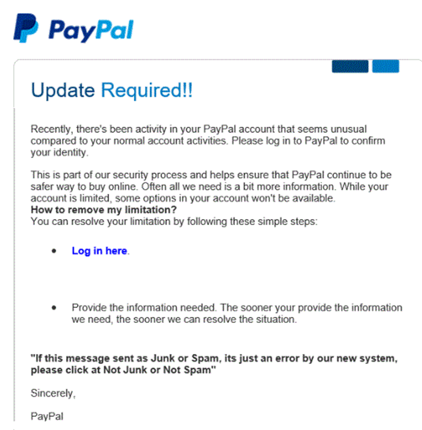

How do we prevent phishing?

Proper user education to identify suspicious e-mails. 
Knowledge that legitimate e-mails from banks and other sites will contain the user’s full name while phishing e-mails will not (unless the sender has access to the user’s data)
Phishing e-mails and/or websites may (but not always) contain poor grammar or spelling
Phishing websites will not contain the correct URL.  Users should always check that they have visited the correct URL.
Automated systems that detect and filter phishing e-mails.  These systems are built into most web browsers and e-mail systems and verify that the e-mails originated from legitimate sources and that the websites are legitimate.
Spear Phishing is like phishing, but it targets specific groups or people.  The more precise the targeting, the higher the response rate.

A normal phishing attack could target millions of users.  For example,

A hacker could send a fake e-mail appearing to be from Bank of America to 1,000,000 e-mail addresses
From those 1,000,000 addresses, only 250,000 might work
The SPAM filter would block 200,000 from those 250,000
From the 50,000 only 10,000 might have accounts at Bank of America
80% of those users might be smart enough to detect the phishing scam, in which case only 2,000 people respond
The attack is shut down early on, and many users are unable to respond, so the hackers only collect data from 500 users
The success rate is about 0.005%.  Although it is low, the return on investment might be high.  It may cost the hackers a few hundred dollars out the e-mail, but they might be able to collect at least $100 from each user (for a total of $50,000).
In spear phishing, the hackers identify specific customers of Bank of America for example.  They may use a list stolen from the bank.  The hackers customize the e-mail to include the name and other personally identifying information of each recipient.  As a result, the SPAM filter will be less likely to identify the e-mail as SPAM, and the user will be more likely to respond.

Whaling is like Phishing, but targets high-value individuals such as celebrities, CEOs or other executives.  Whaling is specifically targeted to the high-value individual.  Whaling takes more effort to execute, but the response rate is higher, and the amount of money stolen from each user is higher.  Many high-net worth individuals have access to credit cards with high limits.

Another scheme involves a scammer visiting a store such as Best Buy and attempting to illegally purchase expensive electronics in the name of a celebrity on credit.  The scammer disappears with the electronics and the store is never paid.  The store should have verified that the buyer legitimately represents the celebrity.

How do we prevent whaling?

Proper user education
100% identity verification of the person who is seeking information.
A high-net worth individual should understand that he is at much higher risk of exploitation either through fraud or extortion schemes.  This person should employ people who specialize in detecting and preventing these threats.
Vishing or VoIP Phishing and Smishing or SMS Phishing are forms of phishing that use a VoIP phone or SMS messages.  Smishing is particularly dangerous, because although we can block many types of malicious e-mails, it is difficult to block SMS messages – they contain very little metadata (except for the date and sender, all SMS messages look the same).

Pharming is a form of phishing where we redirect a legitimate website’s traffic to an illegitimate website.

In a watering hole attack, a thief plants a form of malware on a frequently visited website.  The users visit the website and download the malware.

A watering hole attack typically takes advantage of a zero-day exploit.  It allows malware to download in the background without any indication to the user.

How to prevent

Proper antivirus can prevent many watering hole attacks
Website operators should ensure that their servers and code are up to date
Watering hole attacks that take advantage of zero-day exploits cannot be prevented
In cross-site scripting, a user includes script as part of their input in a web form or link.  There are three types

Non-persistent XSS attack, where the script is executed by the web server immediately and sent back to the browser
For example, a hacker sends a user a link to a legitimate online banking website, but the link includes some code that executes (through the website) in the user’s browser.  The script copies the user’s login credentials and sends them to the hacker.
Persistent XSS attack, where the script is stored by the web server and executed against others
For example, a hacker posts a YouTube comment and includes some HTML (which includes links and photographs to an ecommerce site).  The HTML executes in each visitor’s web browser, and all visitors see the comment (including the links and photographs).  This is unlikely to happen on YouTube because data is sanitized, but it is certainly possible on other websites.
DOM-based XSS attack, where the script is executed by the browser
How to prevent

Proper input validation in web forms both on the web browser side and on the server side
Remove or filter all script characters from web forms, including “<”, “;”, and “|”
Use anti-XSS libraries such as ANTIXSS
Use Content Security Policy in the website
In cryptography the data is encrypted.  Hackers try to decrypt it.  There are many ways, but all cryptographic attacks can be prevented.  Some of the attacks include

Birthday.  Consider a set of values (not necessarily unique values), .  In any set , the possibility that at least two values are identical is .  If we have a set of two values, then the possibility that they are identical is .  As the set grows, the possibility that two entries will be identical also grows.  This idea came from the fact that in a room of 30 people, there is at least a 50% chance that two of them share a birthday.
Known Plain Text/Cipher Text.  If the hacker can intercept a portion of the plain text communication and the corresponding portion of the cipher, he can use cryptanalysis to decrypt the algorithm.  The hacker does not require the entire communication, only a portion.  Good encryption algorithms can mitigate this threat because they use large keys.

Rainbow Tables.  Recall that it is bad security practice to store passwords in plain text.  Passwords are typically hashed, and the hash is stored (the hash is not reversible). 

But a hacker could generate a dictionary of passwords (common and uncommon) and calculate the corresponding hash for each one.  This dictionary is known as a rainbow table.  The hacker could then steal a hash and look up the corresponding password for each one.

Rainbow tables are readily available on the internet for passwords up to eight characters (every possible combination!) and rainbow tables of even longer passwords can be computed.

To prevent the use of rainbow table attacks, modern password hash functions incorporate a ‘salt’.  The salt is a random set of characters appended to the end of each password before the hash is calculated.  The hash and the salt are stored in plain text.  If the hash database is compromised, the hacker would have to regenerate each rainbow table incorporating the salt into every password to make any sense of it.  This would be practically impossible.

Dictionary.  A Dictionary attack uses a list of predetermined passwords and brute force to guess the password.  The dictionary could consist of common words in the English language, especially common passwords such as “password”, “12345678”, and “abcd”.

A hacker could create a custom dictionary based on the user account that he is trying to hack into.  For example, the dictionary could be customized to include the names of the user’s children, pets, vehicles, etc..

Many organizations force users to choose complex passwords.  Password complexity could include
Not reusing the same password
Including upper case letters, lower case letters, numbers, and special characters
Ensuring that the password meets a minimum length
Not using a person’s name, address, or username in the password

Yet, it is still possible to create a custom dictionary based on the password complexity requirements.  For example, if the user’s password was ‘donkey’, then a complicated password might be ‘D0nkey!’.  Users tend to substitute @ for a, 0 for o, 1 for l, and so forth in a predictable manner.

A dictionary attack can be prevented by limiting the amount of password attempts a user has before his account is locked out.  Of course, the dictionary attack could occur offline, or the hacker may have a way to bypass the incorrect password attempt count.


Brute Force.  A brute force attack is like a dictionary attack, except that the system attempts every password combination possible (based on the character set), starting from the letter a and working its way up until the password is guessed.  For example, the system will guess the password ‘sdfsfgdgsdfsdfd’, and then the next password would be ‘sdfsfgdgsdfsdfe’

The length of time for a brute force attack to be successful depends on the computing power available (how many passwords can be attempted every second) and the length of the password (how many passwords need to be attempted).

An online brute force attack is when the brute force occurs against a live computer.  For example, consider Active Directory, a Microsoft system that stores user accounts on a central server.  When a user attempts to log in to an Active Directory-based computer, the computer validates the login credentials with the server.  On a successful login, the computer caches the correct credentials on the local computer.  If the computer is later offline (or off the local network), the user can still log in (the computer validates the login with the cached credentials).

In an online attack, the hacker would brute force the computer’s login while it is connected to the Active Directory server.  This attack would likely be unsuccessful because the server would notice the incorrect logins and disable the account.
In an offline attack, the hacker would brute force the computer’s login while it is not connected to the Active Directory server.  This attack may or may not be successful depending on the length and complexity of the password.

How to prevent

Offline attacks can’t be prevented.  Where possible, secure equipment so that it is not stolen.  Stolen equipment is more susceptible to offline attacks.
Enforce stronger password requirements (including special characters, numbers, upper/lower case letters).
Enforce a timer that delays the entry of passwords.  This can be accomplished at the software or hardware level, by hashing the password multiple times.
Offline data can be encrypted with a strong algorithm that takes several seconds to validate the password.  This would be a minor inconvenience to a user entering an incorrect password, but would substantially slow down a brute force attack.

### Describe security program elements (user awareness, training, and physical access control)

Users are not experts at security and hackers are always looking for new ways to exploit them.  We need to train people so that they can recognize and report security threats.

The best security program has

User Awareness – We make users aware that threats exist so that they can be vigilant.
User Training – We teach users how to formally detect threats.  A user training policy should apply to any user who has access to our network.  Users must be encouraged to report potential security threats.

One new way that organizations train users is to send them fake phishing e-mails and see if they respond or provide their credentials.  If they do, then they are warned that they clicked on a link that could have come from a hacker, so that they learn how to recognize similar threats in the future. 

Even the most highly trained security analysts are vulnerable to phishing attacks, especially when the attacker is sophisticated.  We are all human, and social engineering is designed to work on weak human emotions.
Physical Access Control – We keep people out of the places that they shouldn’t be.  Keeping network and server infrastructure physically secure is important because a person with physical access can
Physically damage the equipment by powering it off or removing the hard disk drives
Gain console access to network equipment.  Most Cisco switches and routers can be physically reset by a user with physical access, regardless of the type of security on the device.
Connect unauthorized devices such as USB drives to servers, routers, and switches.
With a physical access control system, we use an electronic system to keep track of who entered, where they entered, and what time they entered.  We can restrict the areas that each person can access, and we can restrict the time of day that they can access an area.

Tailgaiting is an attempt to obtain unauthorized access to a physical facility. 

Many offices, industrial facilities, and data centers are controlled via electronic proximity card and/or biometric locks.  When a legitimate user unlocks an entrance with their access card and/or biometric lock, an intruder can follow them into the building.  Tailgaiting works because

A person might hold the door open for a person who is walking behind him (doing otherwise might be considered rude)
A person might not wait to verify that the door closed and locked behind him, and another person might follow him.  The door lock might not work properly, in which case the door does not fully close.

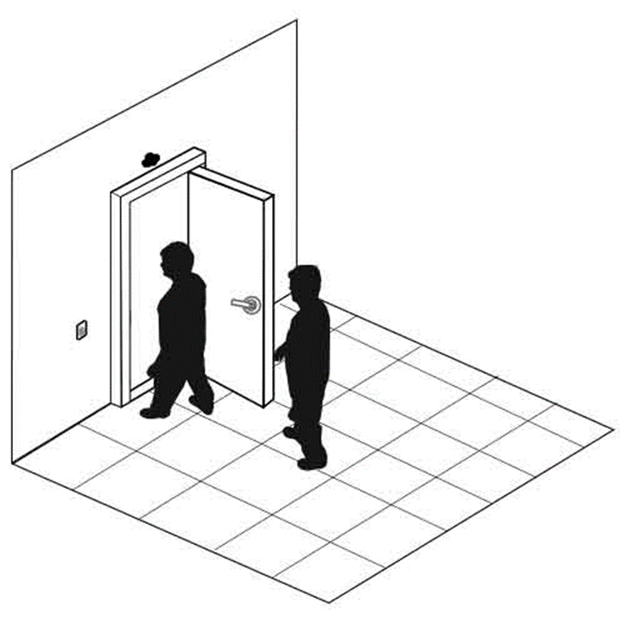

How to prevent

Proper user education to enforce the use of access cards and prohibit tailgating.  Users should know that not holding the door is not considered rude.
Install a security guard at each entrance or monitor entrances with security cameras
In more extreme cases, installation of man trap doors might be necessary.  A man trap door allows only one person to enter at a time.  The man trap door contains cameras with artificial intelligence to detect the number of people inside and permits entry to only one individual at a time.

A Fence or Gate or Cage keeps people out or keeps people in.  For example, a tool storage area inside a building/warehouse might be fenced in.

Consider

Who you are trying to stop.  A chain-link fence can be cut with wire cutters easily.  Even a barbed wire fence can be cut.  Fences are good for slowing down random people who are trying to climb over but are not so good for vehicles or sneaky people.  In those cases, a concrete wall may be required.
An electric fence is more effective at keep people out but may introduce unwanted legal liability.  An electric fence must have clear signage that identifies it as such.  It should also be separated from the public by a normal fence so that people cannot inadvertently contact it.
Whether the fence is opaque or transparent (chain link).  The fence may need to be opaque so that people can’t see inside.
The height of the fence.  A tall fence may stop people from climbing or seeing over it, but it is irrelevant if people can cut through the fence or fly drones into the facility.
Fences can be used in combination.  The fence provides a buffer zone.  It slows people down.  By the time a person has penetrated the fence, security will have been able to intercept them.  The fence can be monitored with cameras, security patrols, and sensors.
Inside a building, chain link fencing can be used to set up cages for controlled physical access. It is cheaper to build a cage than a physical room.

A security guard is a human who provides security.  The security guards may be stationed in key areas, may walk around, or may drive patrol vehicles.

Proper training is important.  A security guard who is not vigilant will not be effective.  Security guards who use excessive force, are disrespectful, or are perceived to be incompetent, will cost the company money, introduce legal liability, and damage its reputation.

Security guards may be outsourced from a company like G4S or Guarda.  There is no good reason to outsource, except for cost.  When renting security guards, it is important to ensure that the security company sends the same people each time, so that they become familiar with the premises.  Many companies outsource security so that they do not have to risk legal liability in the event that a security guard acts inappropriately.

A larger organization may be able to better train an internal security force, even with as few as 50 security guards.

The security guard’s most important tool is his brain.  Security guards also have other tools like guns, handcuffs, batons, and pepper spray, depending on the state/province that they are in.  The organization must decide if it should risk the liability and cost of training to supply security guards with weapons.

Artificial intelligence is no substitute for a human brain.  It is important to ensure that the security guard is aware of his surroundings.  A security guard who is complacent may be worse than no security guard at all.  Security guards are human and can be manipulated through social engineering techniques.

In general, a security guard is not a law enforcement officer.  A security guard is entitled to

Enforce the law when seeing an actual commission of a crime on the organization’s property
Use reasonable force to protect himself or another human being from physical harm or death
Use reasonable force to protect the physical property of his organization
Detain an individual who the security guard knows has committed a felony (an indictable offense in Canada), and promptly turn him to a law enforcement agent
Use reasonable force to prevent a trespasser from entering a secured facility
Security guards may also have dogs that can detect for food, drugs, or explosives.  Like a weapon, the use of a dog can also subject the organization to serious legal liability.

A security guard also keeps track of visitors

Signs visitors in and out
Verifies that the visitors are legitimate
Ensures that visitors have been briefed on the organization’s security and safety policies and that they are wearing appropriate personal protective equipment (PPE), if required
Escorts visitors to the appropriate locations
An alarm is necessary to protect critical assets.  The two main types of alarms

Intruder alarm – detects intrusions
Environmental alarm – detects a fire, flood, high temperatures, etc.
The alarm will have multiple components

Sensor.  The sensor detects an event
Motion Sensor detects motion, which could indicate the presence of an unauthorized person
Glass Break Sensor detects if glass has been broken based on the specific sound frequency that broken glass makes
Door/Window Contact detects if a door/window is closed or if has been opened.  The sensor consists of a magnet that sits on the door/window and a contact that sits on the door/window frame.  This creates a closed circuit.  When opened, the door/window breaks the circuit, and an alarm activates
Smoke Detector detects for the presence of smoke but can also sound a false alarm.  It can be triggered by dusty conditions.
Flood Detector detects moisture content.  This may be installed in a server room.
Thermostat detects temperatures that are too high or too low.  High temperatures can lead to equipment damage.  Cold temperatures can cause water pipes to burst.
Controls.  The controls allow the alarm to be programmed.  The controls collect data from the sensors and decide if an abnormal event has occurred, in which case the alarm is triggered.  The controls send an alert to another device.
Alerts.  The alarm must make an alert, or else it will have no purpose.  It must notify somebody that an abnormal condition is present.  Some forms of alerts
Siren/Flashing Lights can scare intruders but are by themselves just a nuisance.  Some intruders will ignore the alarms, especially when there are many false alarms.  A police department will probably not respond to an audible alarm unless they are specifically notified that a crime is in progress.
Alert on a control panel.  The alarm can notify a monitoring station so that the responsible people can verify that the alarm is real and take additional action such as calling the police, calling for emergency services, or dispatching a security guard to investigate.
Automated phone call/email/SMS alert to the responsible people
When an alarm is triggered, a security guard might first review the surveillance cameras in the relevant areas to determine if there is a problem.  The security guard would then physically investigate the areas and act as appropriate.  If nothing out of the ordinary is present, the security guard may turn off the alarm and record his findings.

An alarm system can be divided into multiple zones.  Each zone is subject to its own rules.  For example, a zone can be always armed, or it can be armed at night.  A server room might always be armed unless somebody needs to access it.  An office might only be armed at night when nobody is present.

When an alarm is in an armed state, any sensor activity will trigger an alarm.

The control system for an alarm must be in a physically secure room.  The control system must itself be alarmed (connected to a tamper-detecting sensor), so that any attempt to disable it is detected.

### Configure and verify device access control using local passwords

Remember that there are three ways to access a Cisco router: Telnet, SSH, and Console.  And remember that when we create a local account, the password is stored on the router.

The old way to store passwords was in plain text.  If we made a back up of the configuration, or if we chose to show the configuration on the router, the password would appear.

To avoid this, in the global configuration, we should type service password-encryption.  This command encrypts the passwords that were created with the following commands

The console password created with the password <password> command
The console username/password combination created with the username <name> password <password> command
The enable password created with the enable password <password> command
In my example, I chose a password called “blueberries”.

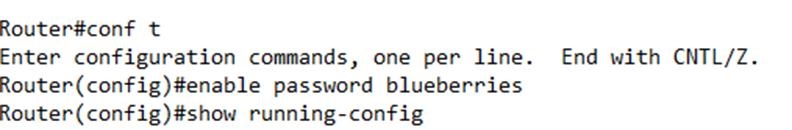

When I show my configuration, the password is stored in plain text

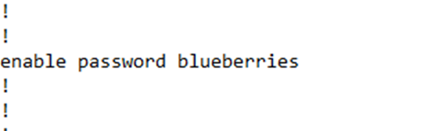

If I go back and enable the password encryption

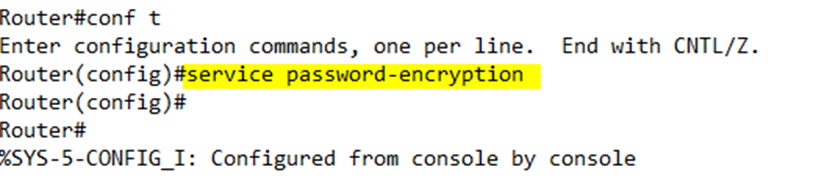

I see that my password has been changed to something encrypted.  I also see the number “7” in front of the password.  The “7” tells the router that the password has been encrypted, so that it knows that the random text that follows isn’t actually the password.

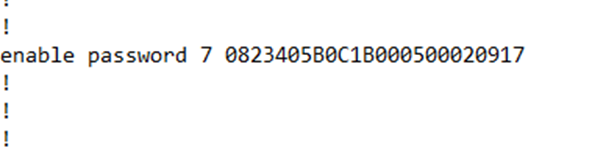

We can disable the encryption by typing no service password-encryption, but the router will not automatically decrypt the existing encrypted passwords – we would still need to change the password for it to be decrypted.

It is easy to reverse engineer the encrypted password that is created with this command via tools on the internet that use rainbow tables.

When setting the enable password, use the enable secret <password> command instead of the enable password <password> command.  Why?  The secret command encrypts the password.  How does it work?

When you create the password, the router hashes the password.  It puts it through a one-way math equation that results in some random text.  It is generally not possible to reverse this equation.  The hash equation (or algorithm) is called MD5, but two other forms of hashes are available – SHA-256 and Scrypt.  Both are more secure than MD5.
The router stores the password hash.
When you try to log in, the router puts the password that you entered through the same hash equation.
The router compares the hashe it just calculated with the hash that it is storing and if they match, then the router knows you entered the correct password.
If you want to choose a different encryption method, type

enable algorithm-type sha256 secret <password> for SHA-256
enable algorithm-type scrypt secret <password> for Scrypt
On a router, I can configure both an enable password and an enable secret, but I can’t configure multiple enable secrets using different algorithms.  If both are configured, the enable password command must have a different password than the enable secret command.  If both are configured, the user is expected to enter the enable secret password – the router won’t accept the enable password password.

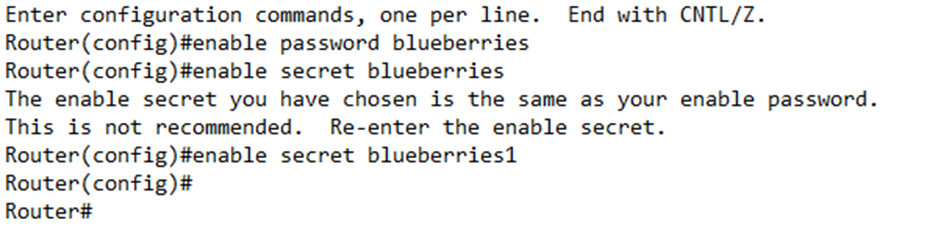

In my configuration, the secret is stored as “enable secret” and has a “5” in front of it.  Notice that the secret is more complicated – it contains special characters that the password doesn’t have, even though we encrypted the password.

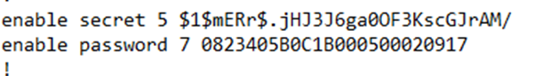

We can change any password by just typing the command again.  For example, to change the enable secret, we would just type in enable secret <password> in the global configuration mode.

We can go one step further and restrict logins from specific IP addresses.  If we know that logins to our router originate from a specific IP address or subnet, we can create a “permit” ACL.  For example, if my logins originate from 192.168.5.0 to 192.168.5.255, I would create an ACL that says

access-list 10 permit 192.168.5.0 0.0.0.255

I could go back to my router configuration and add the access-class command.  In particular, I would write

access-class 10 in

This command verifies that the user’s Telnet or SSH connection originates through the network specified by the ACL list number 10.  Remember that a user can also connect to my router and then use it to Telnet or SSH into another router.  I could write

access-class 10 out

The “out” in this command restricts connections to the network specified by ACL list number 10.  The out command checks the IP address of the device that you’re trying to connect to against the ACL, not the IP address of the device that you’re trying to connect from.

Remember that this happens in the “line vty” or “line aux” configuration.  Below, I’ve configured an ACL, and then entered the “line vty 0 4” configuration to add that ACL to it.

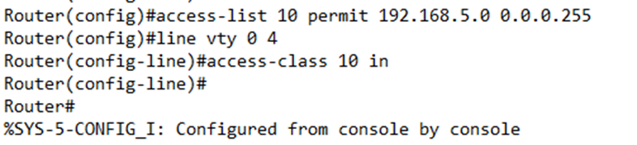

If we look at the configuration, it now shows an ACL present on the line vty 0 4 section.

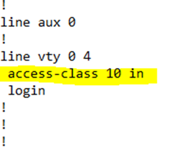


### Describe security password policies elements, such as management, complexity, and password alternatives (multifactor authentication, certificates, and biometrics)

One strategy is to use strong passwords.  This is known as password complexity.

A password policy may require a user to have capital letters, numbers, special symbols and/or lowercase letters in their password
A user cannot repeat a character
A user cannot use a dictionary word or their name in the password
The password must have a minimum length
Passwords that are easy to guess represent security risks because they can be broken by brute force.

We can manage user passwords centrally through an Active Directory or RADIUS server.  A good password policy

Requires users to choose complex passwords
Requires users to change their passwords often (at least every three months)
Locks a user account if the password is entered incorrectly several times in a short period
But even complex passwords can be guessed or seen by unauthorized users.  As phishing and social engineering attacks grow more complex, it is more likely that a user will be tricked into giving up his credentials without realizing it.  How can we keep our network safe if the hackers can trick our users into handing over their passwords?  There are three ways

Multifactor authentication
Certificates
Biometrics
Multifactor authentication means having to provide more than just your username and password.  The principles of multifactor authentication (formally two-factor authentication) are important.  The three main factors are Something You Are, Something You Have, and Something You Know.  Basic authentication methods combine Something You Have (a username/access card) with either Something You Know (a password) or Something You Are (biometric).

Something You Are – something you are refers to a biometric identity such as facial recognition, fingerprints, voice recognition, or a retinal scan.  Select the best type of biometric for your environment.  A construction site or hospital may have employees with gloves or
Something You Have – something you have refers to a smartcard, identification card, or username; it could also refer to a randomly generated password (such as an RSA SecurID or authenticator app)
Something You Know – something you know refers to a password or PIN
Somewhere You Are – somewhere you are refers to your physical location.  In the case of connecting to the internet, somewhere you are is your IP address.  If a hacker compromises a username/password and logs in through a computer or network location that is not recognized, then the login may be denied.  Websites have sophisticated ways of detecting users – IP address, web browser version, computer version, date/time of the login, other user behaviors.  If the username/login is correct, but the other factors aren’t it could be that the account was compromised, or it could be that the user is travelling/bought a new computer.  The site can ask the user for additional verification (such as through an automated phone call)
Something You Do – something you do is an observation of the user’s action’s or behaviors.  In Windows a user can choose a picture password; in an Android phone the user can interact with a pattern.
Instead of entering a username and password, a user can present a certificate to the authentication server.  A certificate is a digital file that confirms the identity of a user or device.  A certificate must be signed by a certification authority.  IEEE 802.1X is a standard for Network Access Control.  It allows a device to authenticate when connecting to a LAN or WAN.

There are three devices in the protocol

The supplicant is the device that chooses to connect to the LAN/WAN.  It could be a laptop, desktop, smartphone, tablet, or other computing device
The authenticator is a network device that allows/denies access.  It could be a switch, a router, a firewall, or a proxy server.
The authentication server is a server that decides whether a device should be granted access
The procedure works as follows

The supplicant connects to the network
The authenticator (switch) detects the new supplicant and automatically sets the port to an unauthenticated status.  Only traffic related to 802.1X is permitted.
The authenticator sends frames to the supplicant.  These frames demand that the supplicant provide credentials such as a user ID.  The frames are sent on the local network segment to a specific address (01:80:C2:00:00:03).  The supplicant listens for messages on this address.
The supplicant replies to the message with an EAP-Response Identity frame
The authenticator sends the supplicant’s response to an authentication server
The authentication server and the supplicant negotiate an authentication method.  The server and the supplicant may support different methods and must agree on one that both understand.  The negotiation methods are transported through the authenticator.
The authentication server attempts to authenticate the suppliant.  If successful, the authenticator changes the port status to authorized.  If unsuccessful, the authenticator keeps the port status as unauthorized.
When the supplicant logs off or is disconnected, the authenticator changes the port status back to unauthorized.  When the supplicant logs off, it sends an EAPOL-Logoff message to the authenticator.

Biometrics are used in combination with other devices to provide an additional layer of authentication.  These include

Facial recognition
Finger print reader
Voice recognition
Palm reader
Retinal scan
A biometric reader takes a photograph of a human body part and then converts it into a mathematical model.  For example, a fingerprint reader understands the bumps and ridges on a fingerprint and compares their relative sizes.  There are many different algorithms and each one is different.

Not every scan is perfect.  Most biometrics have a false positive because of the algorithm.  The false positive rate for a fingerprint sensor is approximately 1 in 50,000.

A biometric reader does not (and cannot) create a pixel-by-pixel comparison of a person.  Imagine taking a photograph of your face 100 times.  Each photo will be slightly different.  The lighting, the reflection, the angle of your head, and the position of your hair will be slightly different each time.

What are some pros and cons of the different biometric devices?

Fingerprints
A fingerprint scanner maps a person’s fingerprint and converts it into a mathematical signature.  This signature is stored.
It later compares new scans to the original mathematical signature.
Advanced fingerprint scanners can verify that a real finger has been scanned (as opposed to a mold of a finger)
Fingerprint scanners are cheaper than other biometric sensors
Retinal Scan
A retinal scan uses a laser to examine the blood vessels in the back of the eye
Retinal scans are unpopular because they require a user to have a laser shined into his eye; the user must also put his eye up against the sensor
Iris
An iris scan photographs the front of the eye from a distance
Iris scanners are more popular than retinal scanners
Voice Recognition
Voice recognition is hard to implement
Voice recognition sensors have a high rate of false positives and false negatives
Facial Recognition
Facial recognition scans features that are present on the user’s face
Facial recognition systems work well


### Describe IPsec remote access and site-to-site VPNs

Both Site to site VPN and Remote access VPN are the types of VPN which stands for Virtual Private Network. Site-to-Site VPN is also known as Router-to-Router VPN. In site to site VPN, IPsec security method is used to create an encrypted tunnel from one customer network to remote site of the customer. Multiple users are not allowed in Site-to-Site VPN. 

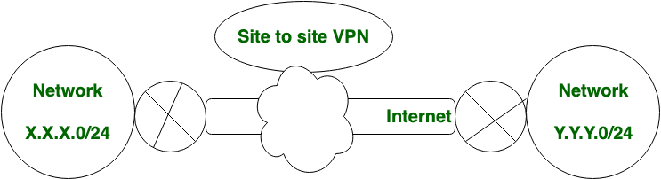

Advantages:

* Provides a secure connection between two or more networks.
* Enables users to access resources located in another location or office.
* Encrypts traffic between networks to enhance security.
* Offers a cost-effective solution for interconnecting networks.
* Provides a high level of network performance and reliability.

Disadvantages:
* Requires more complex configuration and management than remote access VPNs.
* May require additional hardware and software components to implement.

In Remote Access VPN, Individual users are connected to the private network and It allows the technique to access the services and resources of that private network remotely. It is most suitable for the business and home users. In remote access VPN, multiple users are allowed.

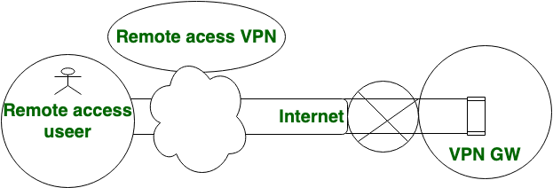

#### Remote Access VPN:
**Advantages:**

* Enables secure access to a private network from a remote location or device.
* Allows remote workers to access company resources securely.
* Provides a flexible solution that can be accessed from anywhere with an internet connection.
* Requires less complex configuration and management than site-to-site VPNs.
* Provides a high level of user privacy and data protection.

**Disadvantages:**

* May be slower than site-to-site VPN due to the use of encryption and additional network traffic.
* May require additional software components to be installed on the user’s device.
* May require additional user training and support to ensure proper use.

**Similarities between site-to-site VPN and remote access VPN:**

*  Both site-to-site VPN and remote access VPN use encryption protocols to secure data transmissions over the internet.
* Both site-to-site VPN and remote access VPN can be used to access internal network resources from outside the organization’s network.
* Both site-to-site VPN and remote access VPN provide a secure connection between the user and the organization’s network, protecting against unauthorized access and cyber attacks.
* Both site-to-site VPN and remote access VPN require a form of user authentication to access the network, ensuring that only authorized users are granted access.
* Both site-to-site VPN and remote access VPN require additional hardware or software to be installed to establish the VPN connection.

Let’s see the difference between Site to site VPN and Remote access VPN, which are given below:

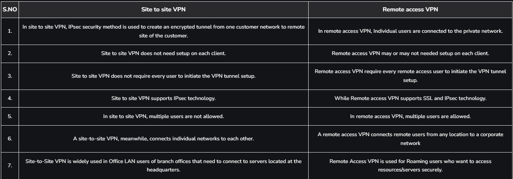

### Configure and verify access control lists !!! (IMPORTANT)

#### Setting up a practice lab

Create a packet tracer lab as shown in the following image.

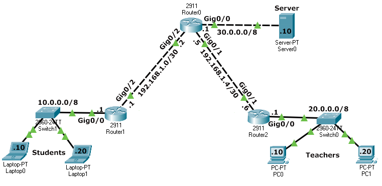

Configure IP addresses as shown in the above image and enable RIPv2 protocol for routing and test connectivity between sections. To test connectivity between sections, you can use the ping command.

The following image shows how to use the **ping** command to test connectivity between **Laptop1** and **Server0**.

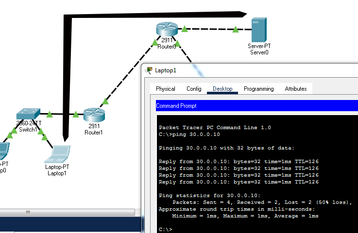

If all end devices can access each other, the lab is ready for practice. If you have a connectivity-related issue or can't replicate this lab, you can download and use the following pre-created lab.

Download Packet Tracer Lab with Initial Configuration

#### Objectives/requirements
Create and implement a standard access list that blocks the Students section from accessing the Server section.

#### **Understanding requirements**
The Students section uses IP subnet 10.0.0.0/8. All packets originating from this section have an IP address from this subnet. If we create a standard ACL with a deny statement for this subnet, all packets having an IP address from this subnet in their source address will be dropped.

### Selecting location and direction for the ACL
A router's interface uses the ACL to filter traffic passing through it. An incorrectly implemented ACL can block entire traffic passing through it. Before creating and implementing an ACL, we have to select the correct interface and the correct direction for the ACL.

In our network, we have seven locations where we can implement the ACL. The following image shows these locations and the direction in which they can be used to filter traffic.

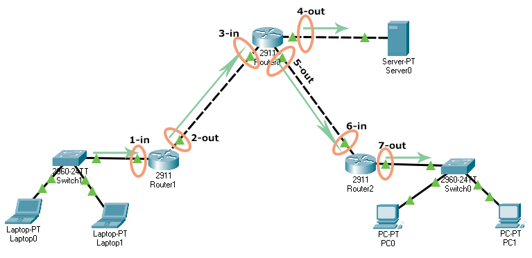

The following table lists the above locations and the effect of the ACL on each location.

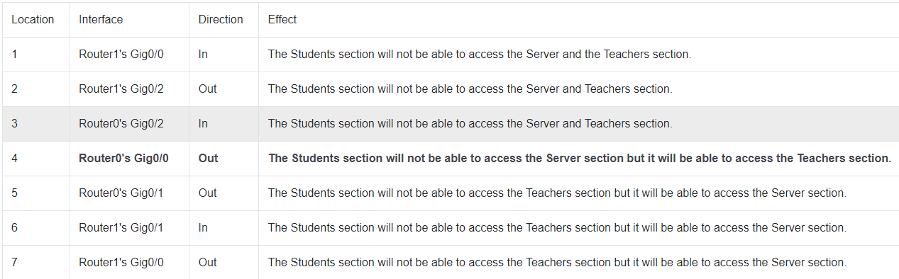

As you can see in the above table, the correct location for our ACL is Router0's Gig0/0 and the correct direction is the out.

### Standard ACL configuration commands

We have two commands to create a standard access list. These commands are '**access-list**' and 'ip **access-list**'. The '**ip access-list**' command has an advantage over the 'access-list' command. It allows us to update or modify statements. We have already learned how to use the 'access-list' command to create a standard access list in the previous part of this tutorial. In this part, let’s use the '**ip access-list**' command.

The 'ip access-list' is a global configuration mode command. To create a standard access list, it uses the following syntax.
```
Router(config)# ip access-list standard ACL_#
```
In the above syntax, the ACL_# is the name or number of the standard ACL. When you hit the enter key after entering this command, the command prompt changes and you enter standard ACL configuration mode.
```
Router(config-std-acl)#
```
In standard ACL configuration mode, you can use the following syntax to create statements.
```
Router(config)# ip access-list standard ACL_name
Router(config-std-acl)# permit|deny source_IP_address [wildcard_mask]
```
An ACL does nothing until it is applied to an interface. To apply a standard ACL to an interface, enter the interface configuration mode of the interface and use the following command.
```
Router(config)# interface type [slot_#]port_#
Router(config-if)# ip access-group ACL_# in|out
```
Once an ACL is activated on an interface, the interface processes all packets through it.

### Creating a standard ACL
Access the command prompt of Router0 and run the following commands.
```
Router>
Router>enable
Router#configure terminal
Enter configuration commands, one per line. End with CNTL/Z.
Router(config)#ip access-list standard BlockStudents
Router(config-std-nacl)#deny 10.0.0.0 0.255.255.255
Router(config-std-nacl)#permit any
Router(config-std-nacl)#exit
Router(config)#interface gigabitethernet 0/0
Router(config-if)#ip access-group BlockStudents out
Router(config-if)#exit
Router(config)#exit
Router#
```
Let's discuss the above commands. We used the first two commands to enter global configuration mode. The next command creates a standard ACL named BlockStudents. In ACL configuration mode, we added two statements. The first statement denies all traffic from the 10.0.0.0/8 subnet. The second statement allows all other traffic. We used the next commands to exit ACL configuration mode and enter interface configuration mode. The next command applies the BlockStudents ACL in the out direction. The last two commands exit interface configuration mode and global configuration mode, respectively.

The following image shows how to run the above commands on the command prompt of the router.

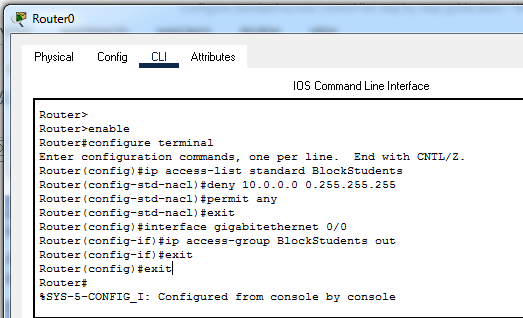

### Verifying
To verify the ACL, we can test connectivity between sections. The Students section should not be able to access the Server section but it should be able to access the Teachers section. The Teachers section should be able to access both the Server and the Students section. You can use the ping command to test connectivity. The following image shows this testing.

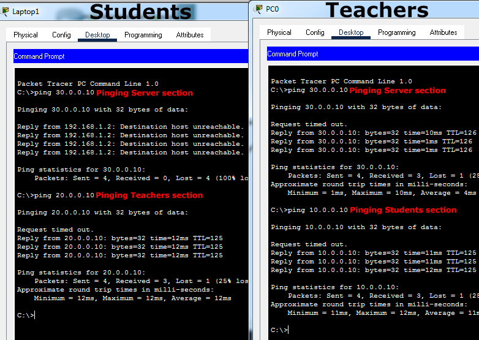

Configured Packet Tracer Lab
The following link provides the configured packet tracer lab of this example.

Download Packet Tracer Lab with ACL Configuration

### Modifying /updating a standard ACL statement
To modify or update a standard ACL statement, use the following steps.

* Use the 'show access-lists' command to view the sequence number of the statement.
* Enter standard ACL configuration mode
* Delete the existing statement with the 'no [sequence number]' command
* Insert the modified, updated, or the new statement with the sequence number of the old statement
Let's take an example. Suppose, instead of blocking the entire subnet we only want to block a single host (10.0.0.10/8) from the Students section. For this, access the CLI prompt of Router0 and run the following commands.

```
Router>
Router#show access-lists
Standard IP access list BlockStudents
10 deny 10.0.0.0 0.255.255.255
20 permit any
Router#configure terminal
Enter configuration commands, one per line. End with CNTL/Z.
Router(config)#ip access-list standard BlockStudents
Router(config-std-nacl)#no 10
Router(config-std-nacl)#10 deny 10.0.0.10 0.0.0.0
Router(config-std-nacl)#exit
Router(config)#exit
Router#
Router#show access-lists
Standard IP access list BlockStudents
10 deny host 10.0.0.10
20 permit any
Router#
```

Let's understand the above commands.

First, we checked the sequence number of the statement that we had used to block the entire Students section. As we can in the above output, the sequence number of the statement is 10. After it, we entered the ACL configuration mode of the ACL. In ACL configuration mode, we deleted the current statement with the 'no sequence_number_of_statement' command. In the end, we inserted the new statement at the place of the existing statement.

Since the ACL is already active on the interface, the interface starts using the new statement as soon as it is added. To verify the change, send ping requests again from the blocked host and the allowed host. The following image shows this testing.

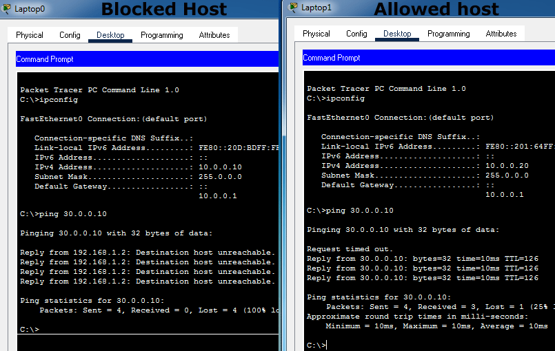

### Updated Packet Tracer Lab
The following link provides the updated packet tracer lab of this example.

Download updated Packet Tracer Lab with ACL Configuration

### Deleting a standard ACL
To delete a standard ACL, use the following command in global configuration mode.
```
Router(config)no ip access-list standard ACL_#
```
Replace ACL_# with the ACL name or number.

The following command deletes the BlockStudents ACL.
```
Router(config)no ip access-list standard BlockStudents
```
That's all for this tutorial. In the next tutorial, we will learn how to use a standard access list to secure VTY lines on a router.

### Configure Layer 2 security features (DHCP snooping, dynamic ARP inspection, and port security)

### Differentiate authentication, authorization, and accounting concepts

### Describe wireless security protocols (WPA, WPA2, and WPA3)

### Configure WLAN using WPA2 PSK using the GUI