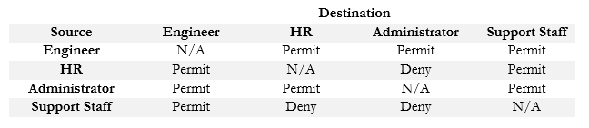

# Automation and Programmabillty 

## Tabela Of Content

6.1 [Explain how automation impacts network management]()

6.2 [Compare traditional networks with controller-based networking]()

6.3 [Describe controller-based and software defined architectures (overlay, underlay, and fabric)]()
6.3.a [Separation of control plane and data plane]()
6.3.b [North-bound and south-bound APIs]()

6.4 [Compare traditional campus device management with Cisco DNA Center enabled device management]()

6.5 [Describe characteristics of REST-based APIs (CRUD, HTTP verbs, and data encoding)]()

6.6 [Recognize the capabilities of configuration management mechanisms Puppet, Chef, and Ansible]()

6.7 [Interpret JSON encoded data]()

## Explain how automation impacts network management

**Network automation** is the process of automating the provisioning, orchestration, and management of network and their services. There are lots of benefits network automation can offer. It allows network operations to be automated, which reduces human-to-machine interaction and, therefore, greatly reduces the chance of human error such as typos.

Network automation can also save time and manual labor because it provides Zero Touch Provisioning (ZTP) that configures network devices automatically without someone needing to configure it locally, hence reducing the operational expenditures, especially for service providers and enterprises.

Finally, one of the more important benefits of network automation is guarantee consistency in your configurations. With automation, you can create a script and then instruct the controller to deploy that to the devices wherein each device receives the same configuration. This ensures that you are familiar with the configuration of each device, and it also means minimal configuration errors because the administrator is not typing the same configuration commands over and over on each device. It also greatly helps in troubleshooting and in generating reports.

 

### Traditional Network Management
With traditional networking, you can only manage network devices one at a time using SSH to the command line. This process is time-consuming, labor-intensive, and prone to human error. While this can work well in smaller networks, it does not work well in a large enterprise and does not also scale very well.

Traditional Network Monitoring Systems (NMS) such as SolarWinds, CiscoWorks, and Cisco Prime Infrastructure have also been available for a long time and use protocols such as SNMP and Netflow to gather information reports on the state of the network. While SNMP uses MIB and OID to collects useful data and can also be used to push configuration to devices, it does not build for real-time programmatic access and has limited functionality.

SNMP also has security concerns and can be complex to implement and operate. These are the main challenges of traditional Networks:

* Scalability Issues
* Management Complexity
* Slower Issue Resolution
 

### Controller-Based Networks
A Controller-based network uses controller software or appliance to automate network operations. Software-defined networking uses a controller for network automation. It allows you to centrally manage your network device’s configuration and enable programs to automatically configure and operate networks through the power of Application Programming Interfaces (APIs).

Intelligent network automation through a controller-based network provides ease of management to your network than traditional networking because all of the configuration settings can be easily managed in the GUI of the controller.

SD-Access is Cisco’s solution for network automation that replaces traditional network management. It offers a single point of automation, orchestration, and management of networks through the Cisco DNA Center controller. SD-Access has two key components:

* Cisco Campus Fabric Solution- it is a network virtualization overlay built on top of the network underlay.
* Cisco DNA Center – SDN controller for centralized management and NMS.
 

        NOTE
        Controllers can also provide central aggregation points for monitoring and data analytics for more visibility and easier troubleshooting, particularly on a large network enterprise.
        

### Network Automation Tools
Multiple methods can be used to automate network management – Python scripts, NETCONF, RESTCONF, Ansible, Puppet, SDN, Cisco DNA Center, etc. However, not all methods are supported by all devices so you should choose which is most suitable for your environment.

Network configuration management tools provide an automated method to execute and monitor changes to our networks. Some tools even offer network automation frameworks wherein a library of commands and workflows are already provided. If such changes do occur, it either reconfigures the device or informs the network engineers to make the change. There are two types of configuration management tools:

* agent-based tools – need the installation of a code (agent) on the managed device, such as Puppet, Saltstack, and Chef.
* agentless tools – does not need the installation of any code (agent) on them, such as Ansible, Saltstack SSH, and Puppet Bolt.
 

#### Cisco DNA Center
The Cisco Digital Network Architecture (DNA) Center is an SDN controller that is used to support Cisco’s Software-Defined Access for network automation. The DNA Center provides centralized management on your system, automates configuration changes, and performs analysis of the devices

Cisco DNA Center Assurance is a tool for monitoring and network management. It monitors traffic statistics, the health status of the network, and an overview of all issues in the network, It also correlates issues and provides recommendations on what may cause such network issues to help you assist in diagnosing and troubleshooting.

Cisco DNA Center also enhances network visibility use that visibility to improve performance, It enables proactive prediction of network-related and security-related risks by using telemetry to improve the performance of the network.


## Compare traditional networks with controller-based networking

There are two types of networking environments: traditional networking environments and controller-based networking environments. In this tutorial, we will compare both and understand the main differences between them.

#### Traditional networking environments
In traditional networking environments, we individually configure and manage each network device. For example, if we have 10 routers in our network, we need to configure and manage them separately.

Configuring and managing each network device is a tedious task. Since we configure each device manually by entering commands, there is also a possibility of mistakes.

With traditional networking environments, we take the following actions for each network device over the lifetime of the device:

* We install the network device (such as a router or a switch) into the network.
* We make the initial configuration of the device. The initial configuration allows the device to perform its functions in the network.
* We monitor the overall performance of the device and events that occur on the device. For this, we can use network management protocols such as SNMP (Simple Network Management Protocol) and NetFlow.
* Over time, we modify and update the configuration as per the requirements of the network.
* We upgrade the operating system on the device as needed.
At first glance, the above-listed tasks may not seem like a lot of work. But if we have to repeat these tasks with each device on the network, it becomes an enormous task.


For example, if we want to update the IOS, we have to take the following steps.

* Backup the running configuration and old IOS
* Add the new IOS and configure the device to use the new IOS to boot
* Restore the running configuration from the backup
To update the IOS on all routers, we have to perform the above-listed tasks 30 (3 steps x 10 routers) times.

To make the situation more complex, for each configuration change we want to make, we need to log into the router. Logging into the router is not as easy as logging into the PC. To log in to the router, we need to access the router through a console connection or remote protocols like Telnet and SSH. After making changes, we must have to disconnect the device. We have to repeat this process on each device whenever we want to make changes.

### Key points:-
* Administrators manage all devices independently. To manage them, they have to establish a new connection each time. They also have to terminate the connection after making the changes.
* Administrators manually make all changes. Manual configuration is prone to configuration errors.
* It uses the blacklisting security model. In this model, everything is allowed unless you disallow it.

### Controller-based networking environments


Controller-based networking uses automation technologies to apply configuration changes to multiple devices at the same time. It uses the controller software or device that automates configuration changes on the network and manages the deployment of configuration changes to multiple devices simultaneously.

It actively monitors the network for changes. When we add a new device to the network, it automatically applies the initial configuration to the device, without needing our intervention.

We can use automation for many tasks. For example, we can use it to manage IOS images on devices. Once configured, it actively checks the developer's site for new versions. If the new version is available, it automatically takes the backup of the existing version on the device and replaces it with the new version. All this process is done automatically without our intervention. We also don't need to visit the devices.

Another use of automation is task scheduling. We can schedule specific tasks or operations on the device and automate troubleshooting procedures if there is a problem with the device.

### Key points: -
* Administrators manage all devices collectively. To manage them, they use the controller software or appliance.
* Administrators only need to configure the controller software or appliance. The controller software or appliance manages all devices automatically based on their configuration.
* Since the controller configures all devices, the chances of configuration errors are zero unless the administrator configures the controller device incorrectly.
* It uses the whitelisting security model. In this model, everything is blocked unless you allow it. It enhances the network's security.
* It reduces network costs. Since the maximum work is done by the controller software or appliance and a company needs only one or two administrators to manage the controllers, it does not need to hire many administrators.
* It saves time. With traditional networking, administrators need to manually configure all devices which takes too much time.
* It provides consistency in configurations. Administrators create the script and then instruct the controller to deploy that to the devices. This way all devices receive the same configuration.

## Describe controller-based and software defined architectures (overlay, underlay, and fabric)

This tutorial explains the Software-Defined Networking and its components, such as the underlay network, the overlay network, and the SDN fabric.

There are two types of networking: traditional networking and controller-based networking . In traditional networking, we individually configure and manage each network device. For example, if we have ten routers in our network, we must configure and manage them separately.

In Controller-based networking, we configure and manage devices from a central location. We use a controller software or an SDN device that automates configuration changes on the network and manages the deployment of configuration changes to multiple devices simultaneously.

Since we use software for applying and managing configuration changes to devices on the network, it is also known as ***Software-Defined Networking (SDN)***.

An SDN controller centralizes the control of the networking devices. Based on the network's requirements, administrators can configure the level of the control. For example, they can configure the controller to perform all control plane functions, replacing the devices’ distributed control plane. Alternatively, they can configure it to monitor the ongoing work of the distributed data, control, and management planes on the network devices, without changing how those operate.

There are three ways to implement an SDN.

* You can install it as software on a server available on the network.
* You can use an SDN device. An SDN device contains the controller in it.
* You can install it on the cloud as a remote controller.
No matter how we install or implement the controller device or software, it uses various tools such as Puppet, Chef, and Ansible to manage and automate changes on the network.

SDN provides a graphical overview of the network. It allows us to manage a network device directly from the GUI screen. To manage a device, we select it on the SDN screen and change its settings. The SDN then applies those changes to that device. With SDN, we don't need to physically visit devices to manage them. We can manage them directly from the SDN screen.

### SDN Architecture
Unlike traditional networking which uses a flat architecture, SDN uses layered architecture. It divides the network into two layers; underlay and overlay. Let us understand both layers in detail.

### Underlay Network
It is the bottom layer. It contains all regular network components, such as routers and switches. To build an SDN environment, first, we have to configure appropriate protocols and features on all network devices to enable access and network communication. It means we have to configure IP addresses on all interfaces and enable routing between all routers. We must use an open standard protocol such as OSPF, BGP, or IS-IS as the routing protocol.

### Overlay network
It is the upper layer. It builds on the top of the underlay network. It includes the virtual networks created on top of the underlay network that uses virtual technologies such as VRF (virtual routing and forwarding), MPLS VPN(multiprotocol label switching virtual private network), and VXLAN (Virtual Extensible LAN).

### Differences between underlay and overlay networks
The following table compares the underlay and overlay networks and lists their differences.


### SDN Fabric
The SDN fabric includes all the components that make up the SDN network. It is made up of the physical network devices that make the underlay network and are controlled by the SDN controller. In other words, it is a combination of both underlay and overlay networks.


### Separation of control plane and data plane

Prerequisite – Introduction to Router and Types of Routing 1. Control Plane : In Routing control plane refers to the all functions and processes that determine which path to use to send the packet or frame. Control plane is responsible for populating the routing table, drawing network topology, forwarding table and hence enabling the data plane functions. Means here the router makes its decision. In a single line it can be said that it is responsible for How packets should be forwarded. 2. Data Plane : In Routing data plane refers to all the functions and processes that forward packets/frames from one interface to another based on control plane logic. Routing table, forwarding table and the routing logic constitute the data plane function. Data plane packet goes through the router and incoming and outgoing of frames are done based on control plane logic. Means in single line it can be said that it is responsible for moving packets from source to destination. It is also called as Forwarding plane.
Difference between Control Plane and Data Plane :


### North-bound and south-bound APIs

In Software Defined Networking (SDN), Northbound and Southbound APIs are used to describe how interfaces operate between the different planes - data plane, control plane and application plane.

 

Southbound interfaces define the way the SDN controller should interact with the data plane (aka forwarding plane) to make adjustments to the network, so it can better adapt to changing requirements.  OpenFlow is a well-known southbound interface.  With OpenFlow, entries can be added and removed to the internal flow-table of switches and potentially routers to make the network more responsive to real-time traffic demands.

 

Northbound interfaces define the way the SDN controller should interact with the application plane.  Applications and services are things like load-balancers, firewalls, security services and cloud resources. The idea is to abstract the inner-workings of the network, so that application developers can ‘hook’ into the network and make changes to accommodate the needs of the application without having to understand exactly what that means for the network.


## Compare traditional campus device management with Cisco DNA Center enabled device management

**Cisco DNA or Cisco Digital Network Architecture** is Cisco’s software-defined architecture controller.  Cisco DNA is managed from the Cisco DNA Center.

We should be careful not to use **Cisco DNA Center** with an operational legacy network because it might reconfigure existing equipment, which would cause disruptions. 

We use Cisco DNA as a controller in a network that uses SDA or as a controller to manage a traditional network.  We can install Cisco DNA and then gradually migrate our network.  A Cisco DNA Center Appliance comes preinstalled with the Cisco DNA Center application.

We can connect to the Cisco DNA Controller via

* The Controller’s GUI
* A script that accesses the controller’s REST API
* A third-party app that accesses the controller via a REST API
* A script that accesses a third-party app via a REST API (which in turn accesses the controller via a REST API)


The Cisco DNA Controller has a Northbound REST API and many Southbound APIs.  We use the northbound API and the GUI access the Controller and make changes to the network.

The southbound API can configure traditional devices over Telnet, SSH, or SNMP.  It can configure newer devices via NETCONF and RESTCONF.  More and more Cisco devices support NETCONF and RESTCONF.

On a traditional network, we can create ACLs to filter traffic.  An ACL contains several rules, and the router applies each rule in order.  As our network grows, we might add more and more rules.  When there are dozens or hundreds of rules, it becomes difficult to edit or remove a single rule.

With Cisco DNA, we just create security policies.  We define what types of devices can communicate, and what they’re allowed to communicate with.  We don’t have to worry about their IP addresses.  We don’t have to analyse the logic behind each ACL.  Cisco DNA modifies the SDA fabric to reflect the policies we create.  We can manage each policy separately without having to worry about how it affects other policies.

We can do this by creating users and groups.  A user is a single individual.  We can add a user to one or more groups.  Each group is assigned specific policies.  For example, the administrator group might have full access to the entire network.  Users in the HR group have access to personnel records.  Users in the engineering group have access to engineering documents.

Cisco calls these groups scalable groups and each group is assigned a scalable group tag, or SGT.  We create a grid that specifies which groups can send traffic.



Now, when a device tries to send traffic, the ingress node first contacts the Cisco DNA Center.  The Cisco DNA Center figures out which user is sending the traffic and what group he belongs to.  Then it pulls up the appropriate policy.  If the traffic is permitted, then the DNA Center tells the edge node that it can create a tunnel between itself and the destination edge node.  If the traffic is not permitted, the DNA Center does not permit the tunnel to be created.

For example, if a member of the Support Staff group wants to send a message to a device in the Engineering group, it would be permitted.  If a member of the Support Staff group wants to send a message to a device in the HR or Administrator group, it would be denied.

The benefit of using a group is that we are now basing security on the role of a user instead of the physical device connection.  When devices can be shared by multiple users, providing security based on the physical device does not make sense.

The predecessor to Cisco DNA was Cisco Prime Infrastructure, or PI. 

* PI allows us to manage all the network from a “single pane of glass”.  That means we can manage the network from a single control panel instead of having to log in to each device separately. 
* PI also manages the entire enterprise’s LAN, WAN, and device inventory. 
* PI can determine a network’s entire topology.  Cisco DNA can work with PI to obtain the data that PI discovered so that DNA does not have to rescan the network.
* Uses Telnet, SSH, CDP and LLDP to configure and manage traditional devices
* Allows us to install, configure and monitor devices
* Allows us to configure QoS
* Allows us to manage Wi-Fi and wired networks
* Maintains images of network operating systems through the Software Image Management or SWIM
* Allows plug and play configuration of new network devices.  If we connect a new device, PI automatically configures it

PI is a software application that can be purchased and installed on your server or can be purchased as part of a separate physical appliance.

Cisco DNA supports SDA, whereas PI does not.  But Cisco DNA is missing some of PI’s management features.  Cisco DNA is still under development and will eventually contain all of the features included in PI.  Some of Cisco DNA’s features

* EasyQoS allows us to manage Quality of Service through a graphical user interface
* Encrypted traffic analysis can detect malware inside encrypted traffic by looking for patterns and signatures
* Client health check allows us to view the health of any connected client.  It provides a quality score from zero to ten.  This feature might be known as Device360 or Client360.
* Network Time Travel allows us to go back in time and see how a client was performing.  If we’re troubleshooting an issue, Network Time Travel allows us to return to the conditions that * created the issue.
* Path Trace shows us the path a packet travels from the source to the destination.  We can use this to detect latency and inefficient network layouts.  It also shows us any ACLs that would interrupt the transmission.

## Describe characteristics of REST-based APIs (CRUD, HTTP verbs, and data encoding)

APIs allow programs to exchange data. Some APIs are for inter-program communications within a single operating system (OS). Other APIs are available to programs that run on other computers. These APIs must define the networking protocol. Many are based on REST.

REST is an architecture style for designing web service applications.

REST API: A REST API is an API that works on top of the HTTP protocol. It defines a set of functions developers can use to perform requests and receive responses through HTTP. The REST API (or RESTful API) is one of the Northbound APIs supported by NSO, and the client can operate NSO using HTTP(S). The REST API itself is used not only in NSO but also in other products, and because it is easy to call from Javascript, it is often used in web portals and so on.

The token is used to authenticate you to the restful API service. Restful API does not support authorization. An API can be considered RESTful if it has the following features.

1. Client/Server: The client handles the front end, and the server handles the back end. Either can be replaced independently of the other.

2. Stateless: No client data is stored on the server between requests. The session state is stored on the client.

3. Cacheable: Clients can cache responses to improve performance.

REST APIs and HTTP: The creators of REST-based APIs often choose HTTP because HTTP’s logic matches some of the concepts defined more generally for REST APIs. HTTP uses the same principles as REST it operates with a client/server model; it uses a stateless operational model; and it includes headers that clearly mark objects as cacheable or not cacheable. It also includes verbs - words that dictate the desired action for a pair HTTP Request and Reply – which matches how applications like to work.

Software CRUD Actions and HTTP Verbs

The software industry uses a memorable acronym - CRUD - for the four primary actions performed by an application. Those actions are

1. Create: Allows the client to create some new instances of variables and data structures at the server and initialize their values as kept at the server

2. Read: Allows the client to retrieve (read) the current value of variables that exist at the server, storing a copy of the variables, structures, and values at the client.

3. Update: Allows the client to change (update) the value of variables that exist at the server

4. Delete: Allows the client to delete from the server different instances of data variables

For instance, if using the northbound REST API of a DNA controller, “Cisco Software-Defined Access (SDA),” you might want to create something new, like a new security policy. From a programming perspective, the security policy exists as a related set of configuration settings on the DNA controller, internally represented by variables. To do that, a REST client application would use a create action, using the DNA Center RESTful API, that created variables on the DNA Controller via the DNA Center REST API. The concept of creating new configuration at the controller is performed via the API using a create action per the CRUD generic acronym. Other examples of CRUD actions include a check of the status of that new configuration (a read action), an update to change some specific setting in the new configuration (an update action), or an action to remove the security policy definition completely (a delete action).

HTTP uses verbs that mirror CRUD actions. HTTP defines the concept of an HTTP request and reply, with the client sending a request and with the server answering back with a reply. Each request/reply lists an action verb in the HTTP request header, which defines the HTTP action. The HTTP messages also include a URI, which identifies the resource being manipulated for this request. As always, the HTTP message is carried in IP and TCP, with headers and data, as represented in below fig.


## Recognize the capabilities of configuration management mechanisms Puppet, Chef, and Ansible

### Ansible

It is an automation platform that is capable of deployment of applications, configuration and monitoring management, security management, and automating cloud provisioning and deployment. It works with python programming language and YAML data format. Ansible is an agentless tool, which means there is no software or agent that needs to be installed on the client machines. Being agentless allows the user to push configuration to one of the network devices on the network.

Ansible uses SSH as a remote communication protocol, and it can support Windows Remote Management as well. It uses push models to get the configurations from network devices. Push model means no agent software on the nodes. We can manage any device by using Ansible. Since it is agentless, any device can be an Ansible Controller on the network.

        NOTE
        The configuration files of Ansible, which are written in YAML format, are called Playbook.
        

### Chef

It is an open-source configuration management tool that is designed for compliance automation, configuration automation, and management of networks and servers. An agent is required to be installed on network devices that the Chef is managing. Chef’s client pulls configurations from the server, and those configurations are in Ruby DSL (Domain Specific Language). Ruby is the programming/configuration language used in Chef. The Chef Server is the device that manages all the nodes on the network, while Chef Client is the node that the chef server is managing.

        NOTE
        The collection of codes or files in Chef is called Cookbook. Recipe is the code being deployed on making configuration changes, and Chef Workstation is where users interact with the management tools for network configuration and create codes/instructions.
 

### Puppet

Puppet, on the other hand, typically uses an agent-based architecture (same as Chef) for managing the network. The tool capabilities also support both agent and agentless architecture. When using agentless architecture, the external agent should be placed in between the node and the controller (Puppet Master), and the external agent will use SSH to communicate with the node (network device). The Puppet Master machine is the device that manages all the nodes on the network, while Puppet Agent is the node that the chef server is managing. Puppet’s client pulls configurations from the server, and those configurations are in Puppet DSL.

        NOTE
        The collection of codes or files in Puppet is called Module. Manifest is the code being deployed on making configuration changes, and Puppet Console is where users interact with a configuration management tool to create a block of code or instruction.

## Interpret JSON encoded data

JSON is the abbreviation of JavaScript Object Notation. It is a lightweight data interchange format that is user fiendly and easy readable by human or computers. So, you can easily guess the parameters used in a JSON file. Beside this, to learn the parameters used in JSON will improve your knowledge in this area. So, here, we will focus on JSON parameters and we will learnInterpret JSON Encoded Data.

SON Key:Value Pairs
 

JSON Key:Value Pairs are defined with one column. These two values are divided with a colon. Here, the first part is the Key and the second part is Value. Key is the name of the Value and the Value part is the value of the key as its name implies.

As you can see below, there are four Key:Value pair. In the first Key:Value pair, Key is Heros and the Value of it is a Array (List).

 
```
{

“Heros”: [

{

“name”: “Aragorn”,

“race”: “Human”,

“role”: “King”

}

]

}
```


The other three Key:Value pairs are the members of the first Key:Value pair Value. Here, Keys are name, race and role. And Values are Aragorn, Human, King.

 

All these Key: Value pairs are in the curly brankets. And if we use multiple Key:Value pairs, we use a comma at the end of each one.

 

In JSON, Keys are always string. Beside, Values can be in different types. These types are:

 

Text
Numeric
Object
Array
 

A text value includes a string while a numeric value includes a number. We can use text in double quotes and numeric with single quotes.

 

JSON Objects
 Objects are the series of Key-Value pairs. In other words a collection of Key-Value pair. The similar structure in Python with Objects are Dictionaries. Curly brackets {} are used at the beginning and at the end of Objects. If there are multiple key:value pairs, they are separated by a comma.

 

We can also use such an example in our network automation:

```
{

“Routers”: {

“hostname”: “Backbone-1”,

“mng_ip_address” : “192.168.0.1”,

“mng_subnet_mask” : “255.255.255.0”

}

}
```

Here, we use an Object in other words, in Python language, a Dictionary.

 

Here, let’s also give a Python Dictionary Example. There is a Python Dictionary example below:

 

“routers”:{“hostname”:”Backbone-1“, “mng_ip_address”:”192.168.0.1“, “mng_subnet_mask”:”255.255.255.0“}

 

JSON Arrays
Arrays are the ordered list of values. In Python, the similar data strcuture is Lists. Square brackets [] are jssued with arrays. Below, you can find an Array (List) example.

```
{

“Routers”: [

“Backbone-1“,

“Backbone-2“,

“Edge-1“,

“Edge-2”

]

}
```
In network operation one of the most used programming language is Python. So, JSON objects and arrays are converted to Python language and generally called with the names in Python. In Python objects are called dictionaries and arrays are called lists.


