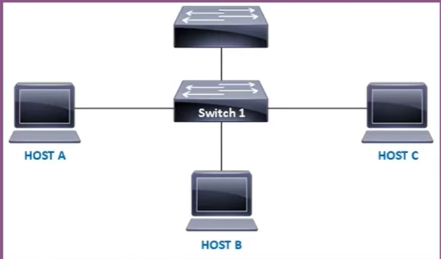

# Exam 1 

Source video: https://www.youtube.com/watch?v=idmO3yK4Ojo&t=341s

1. You have the following topology in your network and Drame Flooding attack just ended. Just after attack you
connect a new host on the network (host C) and start sending trafick to host A, what happens and what you can do to prevent your enviroment from this to happening again? 

* a) The swich 1 will forward the trafic just to host A.  
* b)
* c)
* d)
* e) 

2. 