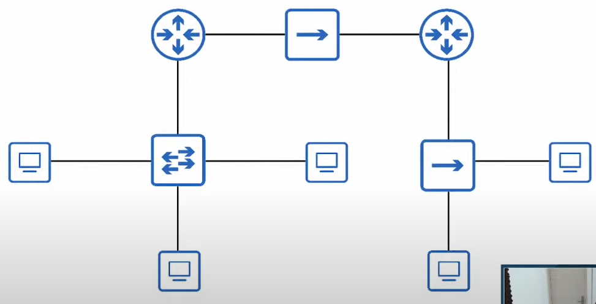

# Exam 3 

Source video: https://www.youtube.com/watch?v=HNArR-wIQlk&t=1948s

1. PC1 sends a frame. The destination MAC address is PC3's MAC address. However, PC2 also recives the frame. What is the name of this kind of frame? 

* a) Brodcast frame
* b) Unicast frame
* c) Unknown unicast frame
* d) Flood frame

2. How many collision domains are in this network?

* a) 9
* b) 6
* c) 4
* d) 3 